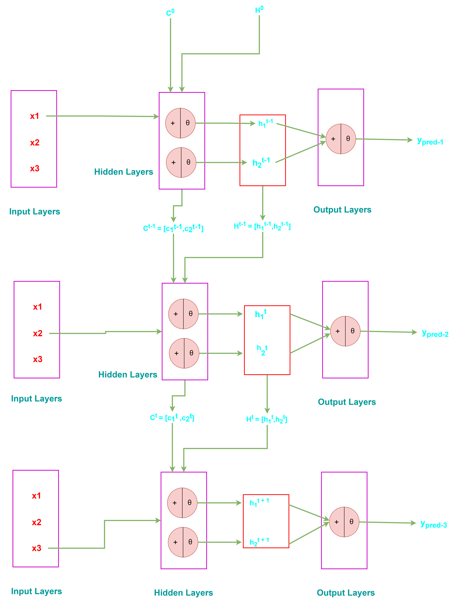
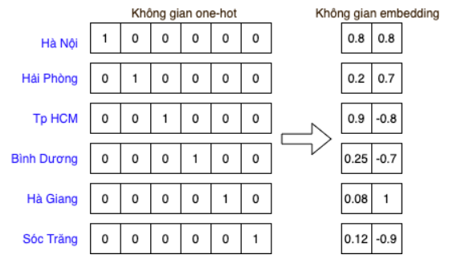
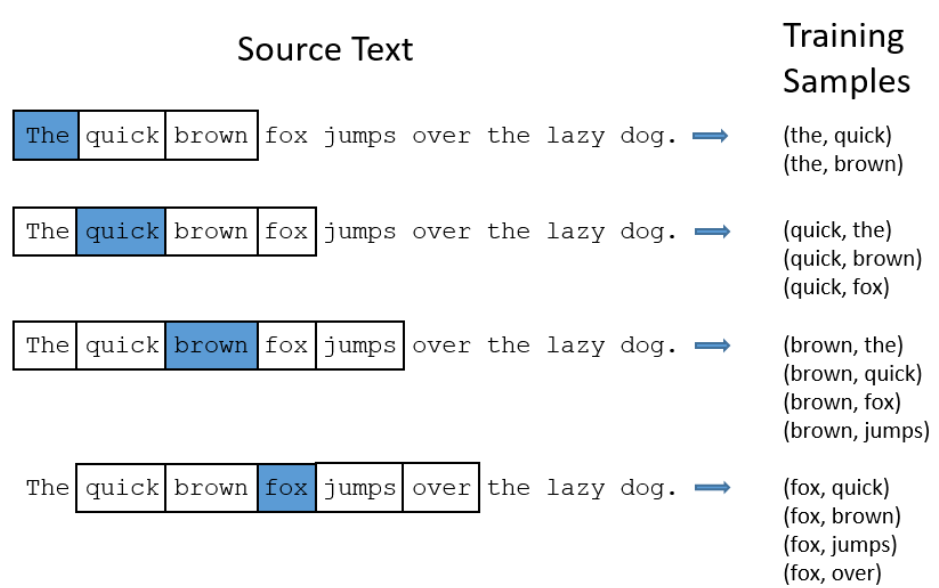
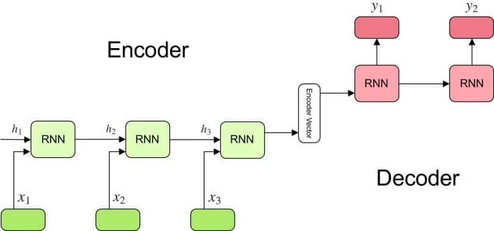
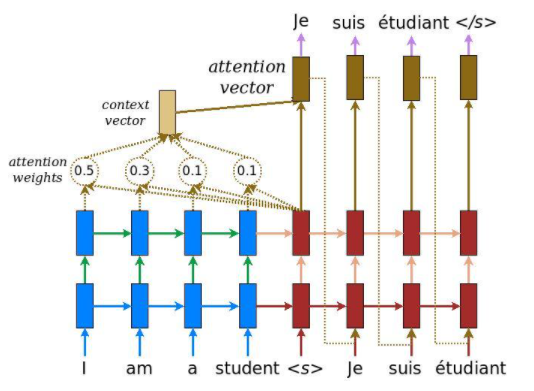
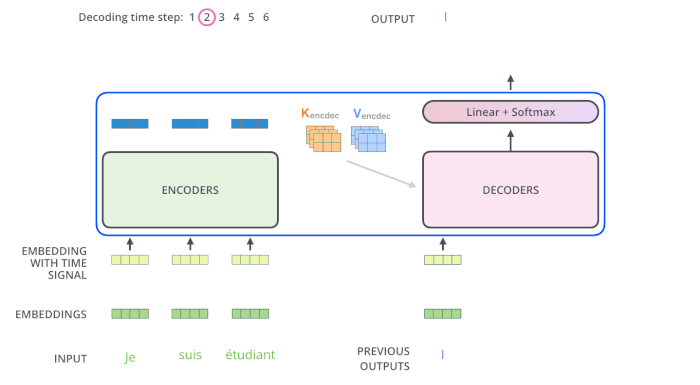

# Mô hình Transformer

## Mục lục

## 1. Sơ lược về Machine Learning và Deep Learning

### 1.1. Machine Learning

- **Khái niệm**

  - Machine Learning là một nhánh của AI, trong đó các máy tính được lập trình để học từ dữ liệu mà không cần lập trình cụ thể cho từng tác vụ.

  - Thường được dùng trong các lĩnh vực dự đoán, phân tích đối với các **dữ liệu có cấu trúc** (dữ liệu được tổ chức dưới dạng bảng).

- **Cách hoạt động**

  - Dựa trên các thuật toán thống kê và mô hình toán học.

  - Các tính năng (features) quan trọng trong dữ liệu phải được trích xuất thủ công bởi con người.

  - Mô hình học từ các đặc trưng này để dự đoán hoặc phân loại.

- **Phân loại**

  - **Học có giám sát (Supervised Learning)**: Dự đoán giá nhà, phân loại email (spam/non-spam).

    - Thuật toán: Hồi quy tuyến tính (Linear Regression), SVM, KNN.

  - **Học không giám sát (Unsupervised Learning)**: Phân cụm khách hàng.

    - Thuật toán: K-Means, DBSCAN.

  - **Học tăng cường (Reinforcement Learning)**: Trò chơi cờ vua, robot học cách di chuyển.

### 1.2. Deep Learning

- **Khái niệm**

  - Deep Learning là **một nhánh con của Machine Learning**, sử dụng mạng nơ-ron nhân tạo (**Artificial Neural Networks**) với nhiều lớp (deep layers), để học trực tiếp từ dữ liệu mà không cần sự can thiệp thủ công của con người.

  - Thường được sử dụng trong các yêu cầu dịch thuật, nhận diện ảnh (video), sinh văn bản, tạo ảnh.

  - Và dữ liệu thường là **dữ liệu không có cấu trúc** (không thể biểu diễn dưới dạng bản; ví dụ sách báo, âm thanh, hình ảnh,.....).

- **Cách hoạt động**

  - Mô hình tự động trích xuất các đặc trưng quan trọng từ dữ liệu.

  - Xây dựng từ các lớp mạng nơ-ron (neural network), trong đó mỗi lớp học các đặc trưng khác nhau của dữ liệu.

- **Phân loại**

  - Nhận diện ảnh, xử lý video: Mạng nơ-ron tích chập (CNN).

  - Xử lý chuỗi, dịch máy: Mạng nơ-ron hồi tiếp (RNN).

  - xử lý ngôn ngữ tự nhiên (NLP): **Transformer**, RNN.

  - Tạo ảnh giả: GAN (Generative Adversarial Networks).

**Như vậy**, ta có thể thấy _Mô hình Transformer_ thuộc lĩnh vực Deep Learning nơi xử dụng các mạng nơ-ron để xử lý dữ liệu.

<br/>
<br/>

## 2. Tìm hiểu về cách hoạt động của "Mạng nơ-ron nhân tạo" (Artificial Neural Networks - ANN)

Mạng nơ-ron nhân tạo là một mô hình lấy cảm hứng từ **cấu trúc của bộ não con người**, bao gồm các "nơ-ron" nhân tạo kết nối với nhau để xử lý thông tin.

### 2.1. Cấu trúc của một mạng nơ-ron

Mạng nơ-ron cơ bản thường gồm **ba thành phần chính**:

- **Tầng đầu vào (Input Layer)**: Nhận dữ liệu đầu vào từ bên ngoài (ví dụ: hình ảnh, văn bản, số liệu).

- **Tầng ẩn (Hidden Layers)**: là các lớp nơ-ron được sắp kết tiếp nhau. Xử lý và học các đặc trưng phức tạp từ dữ liệu.

- **Tầng đầu ra (Output Layer)**: là lớp nơ-ron cuối cùng. Tạo ra kết quả cuối cùng (ví dụ: phân loại, dự đoán).

Mỗi tầng bao gồm một tập hợp các "nơ-ron" (neurons) được kết nối với nơ-ron ở tầng trước và sau.

### 2.2. Cơ chế mạng nơ-ron hoạt động:

- **Ý tưởng hàm số**

  - Cấu trúc của mạng nơ-ron được biểu diễn dưới dạng một **hàm số** $\textbf{y = f(x)}$ - nơi một tham số đầu vào $x$ (tầng đầu vào) đi vào một hàm số $f$ (tầng ẩn) nào đó để cho đầu ra là một giá trị $y$ (tầng đầu ra).

  - Hàm số $y = f(x)$ đơn giản nhất là hàm số tuyến tính bậc 1 (**Linear Function**). Khi hàm số ở dạng bậc 1 thì mối quan hệ giữa x và y là mối quan hệ tuyến tính:

    

  - Khi hiểu diễn hàm số $y = ax + b$ ở **dạng đồ thị graph** thay vì không gian tọa độ 2 chiều:

    .png>)

  - Về ý nghĩa của **đồ thị hàm bậc 1** bên trên:

    - Input đầu vào sẽ là tham số $x$ nhân với một hệ số $a$ sau đó cộng với một hạng tử tự do là $b$ để cho Output đầu ra là $y$.

  - Mở rộng vấn đề khi có **nhiều hơn một input đầu vào** và có một output đầu ra:

    .png>)

  - Như hình trên ta thấy có 3 input đầu vào là $x_1,x_2,x_3$ và chỉ có một output đầu ra là $y$. Thì ra sẽ có công thức biểu diễn là: $$y = w_1x_1 + w_2x_2 + w_3x_3 + w_0$$

  - Với $w_1,w_2,w_3$ ($w$ - weight) là các trọng số và $w_0$ là hạng số tự do. $x$ và $y$ có ý nghĩa như hàm bậc 1.

  - $w_0$ được biểu diễn bên trên nhân với 1 do hạng số nào nhân với 1 cũng bằng chính nó.

  - Từ đó ta có tổng thức tổng quát của **hàm có $n$ input đầu vào** là:

    .png>)

  - Công thức $$y = \sum_{i=1}^{n} w_ix_i + w_0$$

  - Với $w_i$ như đã nói ở trên là các trọng số, thể hiện mối liên kết giữa input đầu vào và output đầu ra, **có bao nhiêu input đầu vào $x_i$ thì sẽ có bấy nhiêu trọng số $w_i$**.

  - $w_0$ là một trọng số đặt biệt do không liên kết với bất kỳ input đầu vào nào hết. Và thường được biểu diễn nhân với 1 vì trọng số nào nhân với 1 cũng bằng chính nó. Ngoài ra, $w_0$ còn có tên gọi khác là hệ số **bias**.

  - **$w_i$ và $w_0$ có mối quan hệ trực tiếp đến giá trị input đầu vào. Một giá trị input đầu vào có quan trọng hay không đều phụ thuộc vào trọng số $w$ và hệ số tự do $w_0$.**

  - Trong một số tài liệu, người ta có thể rút gọn công thức tổng quát bên trên bằng cách **thêm một input đầu vào $x_0$ nữa và $x_0$ này sẽ luôn có giá trị bằng 1**. Lúc này công thức tổng quát sẽ được biểu diễn lại là: $$y = \sum_{i=0}^{n} w_ix_i \hspace{0.8cm} với \ x_0 = 1$$

  - **Như vậy**, hàm số tuyến tính bậc 1 là hàm số đơn giản nhất được dùng để biểu diễn mối quan hệ giữa input đầu vào $x$ và output đầu ra $y$. Còn đối với các hàm phi tuyến tính (Non-Linear Function) là các hàm mà mối quan hệ giữa input $x$ và output $y$ không phải là bậc $1$ nữa mà bậc $n+1$ (bậc 2, 3,...).

  - Hoặc là một phân thức mà nó có thể kết hợp với một hàm mũ như ví dụ bên dưới:

    

  - Hàm $$\theta(x) = \frac{1}{1+e^{-x}}$$ được gọi là hàm **Sigmoid**

  - Trong lĩnh vực AI, các hàm phi tuyến như hàm Sigmoid được gọi là hàm kích hoạt (**Activation function**). Thật ra không phải hàm phi tuyến nào cũng là hàm kích hoạt, nhưng **đã là hàm kích hoạt thì chắc chắn nó là một hàm phi tuyến**.

  - Hàm phí tuyến được dùng để biểu diễn mối quan hệ phức tạp giữa input $x$ và output $y$.

  - Và hàm **Sigmoid** là một trong những hàm kích hoạt đời đầu.

- **Như vậy**, hàm tuyến tính (**Linear Function**) là những hàm được dùng để biểu diễn **mối quan hệ đơn giản** giữa input đầu vào và output đầu ra. Trong khi đó hàm phi tuyến tính (**Non-Linear Function**) là những hàm được dùng để **biểu diễn mối quan hệ phức tạp** giữa input đầu vào và output đầu ra.

- Và khi kết hợp giữa hàm tuyến tính và phi tuyến tính vào với nhau, ta sẽ có một nơ-ron.

  

  - Một nơ-ron là sự kết hợp giữa một hàm phi tuyến tính và một hàm tuyến tính. $$y_{pred} = \theta (\sum_{i=0}^{n}w_ix_i)$$

  - Nó có thể vừa xử lý, học hỏi các mối quan hệ đơn giản vừa xử lý học hỏi cả các mối quan hệ phức tạp.

- Vậy giờ bây giờ ta có nhiều hàm số như vậy, các hàm số này nhận cùng các giá trị input đầu vào và cho ra các giá trị output đầu ra khác nhau. Lúc đó ta sẽ có một **Layer**.

  

  - **Layer** về bản chất là tập hợp của nhiều nơ-ron. Các nơ-ron này đều nhận giá trị input đầu vào giống nhau nhưng lại có trọng số ($w_i$) khác nhau dẫn đến output đầu ra của các nơ-ron này cũng sẽ khác nhau.

  - **Lưu ý**: các nơ-ron trong cùng một Layer sẽ không có sự gắn kết (kết nối với nhau) trực tiếp với nhau.

  .png>)

- Giờ ta sẽ sắp thêm các Layer khác nằm song song và kết nối với nhau. Lúc này ta sẽ có một mạng nơ-ron nhân tạo (**Artificial Neural Network**).

  

  - **Lưu ý**: **Artificial Neural Network** (mạng nơ-ron nhân tạo) là tên gọi được dùng để phân biệt với mạng nơ-ron thật sự nằm trong trí óc của con người. Sau này để đơn giản hơn người ta thường lượt bỏ từ "Artificial" đi và chỉ gọi đơn giản là Neural Network.

  - Một Neural Network có bao nhiêu Layer Neural cũng được.

  - Các giá trị output của nơ-ron thuộc layer trước sẽ làm các giá trị input cho các nơ-ron thuộc layer phía sau.

  - Các Layer Neural được xem là tầng ẩn (Hidden Layers).

  - Ví dụ về một mạng nơ-ron được dùng trong bài toán nhận diện ảnh:

    

  - Trong ví dụ trên, ảnh sẽ được lưu dưới dạng dữ liệu mảng với mỗi giá trị trong mảng tượng trưng cho giá trị màu của các pixel. Nếu là ảnh đen trắng thì mỗi pixel sẽ được lưu dưới dạng mảng 2 chiều, còn nếu là ảnh màu thì mỗi pixel sẽ được lưu dưới dạng mảng ba chiều (R,G,B).

  - Và các giá trị đó sẽ là dữ liệu đầu vào cho tầng **Input Layer**.

  - Các hidden layer ban đầu sẽ thực hiện các tính toán đơn giản trước (lấy ra các đặc điểm đặc trưng cơ bản của ảnh). Các Hidden Layer gần cuối Ouput đầu ra sẽ thực hiện các tính toán phức tạp hơn (lấy ra các đặc điểm đặc trưng nhất) để cho ra kết quả đúng.

### 2.3. Tóm lại:

- Mỗi nơ-ron sẽ gồm có **2 phần**:

  - Hàm nhận dữ liệu đầu vào (hàm tuyến tính)

  - Hàm kích hoạt để xem giá trị đó có được truyền sang các nơ-ron kế tiếp hay không (hàm phi tuyến)

- Hàm nhận giá trị đầu vào sẽ được biểu diễn như sau: $$y = \sum_{i=1}^{n} w_ix_i + w_0$$ hoặc $$y = \sum_{i=1}^{n} w_ix_i + b \  (bias)$$

  - Với:

    - $y$: là giá trị hàm số được tính toán dựa trên giá trị $x$ đầu vào.

    - $x_i$: là các giá trị input đầu vào.

    - $w_i$: là trọng số (weight), gắn với mỗi giá trị đầu vào. Có bao nhiêu giá trị $x_i$ đầu vào thì sẽ có bấy nhiêu $w_i$. Và $w_i$ thể hiện mức độ quan trọng đối với giá trị $x_i$ đầu vào ($w_i$ càng lớn thì dữ liệu đó càng quan trọng).

    - $w_0$ (hoặc $b$): là hệ số tự do (trong một số tài liệu gọi là hệ số bias). Được dùng để điều chỉnh đường quyết định để mô hình có thể học được nhiều dữ liệu hơn trước khi qua hàm quyết định.

      

- Sau khi hàm nhận giá trị đầu vào $y$ tính toán xong sẽ được truyền vào hàm quyết định (**Activation function**) để xem giá trị đó có được tiếp tục truyền cho các nơ-ron kế tiếp hay không:

  - Hàm kích hoạt **Sigmoid**: $$\theta(y) = \frac{1}{1+e^{-y}}$$

    hay: $$y_{pred} = \frac{1}{1+e^{-y}}$$

  - Với:

    - $y_{pred}$ hay $\theta(y)$: là giá trị output đầu ra của một nơ-ron. Và có giá trị $y_{pred} \in (0,1)$.

    - $y$: là giá trị của hàm nhận giá trị đầu vào được tính toán theo dữ liệu $x$ đã nhắc đến bên trên.

- Sau khi trải qua hàm nhận giá trị đầu vào và hàm kích hoạt để cho ra $y_{pred}$. Các output $y_{pred}$ của nơ-ron trong cùng layer này sẽ truyền tiếp cho các nơ-ron thuộc layer kế tiếp để tiếp tục thực hiện lại các bước tính toán. Lúc này, các giá trị output $y_{pred}$ của layer nơ-ron trước sẽ là giá trị input cho các layer nơ-ron kế.

- Và các tính toán bên trong nơ-ron kế tiếp cũng được thực hiện y như vậy (trải qua hàm nhận giá trị đầu vào $y$ sau đó đến hàm kích hoạt $y_{pred}$).

- Cho đến khi dữ liệu đến tầng đầu ra (Output Layers).

- **Tầng đầu ra output cũng là một lớp nơ-ron** (cũng có hàm tính đầu vào và hàm kích hoạt) nhưng vì nó là lớp nơ-ron cuối cùng nên được gọi là tầng Output Layers.

<br/>
<br/>

## 3. Hàm mất mát (Loss Function)

### 3.1. Khái niệm

- **Hàm mất mát (Loss Function)** là một công cụ đo lường mức độ chênh lệch giữa đầu ra dự đoán của mô hình và giá trị thực tế (ground truth).

- Nói cách khác, **hàm mất mát giúp xác định mô hình của bạn hoạt động tốt hay không**, bằng cách tính toán một con số thể hiện mức lỗi.

- **Giá trị thể hiện mức lỗi có lớn hay không thường phụ thuộc vào các trọng số ($w$) và hệ số tự do ($w_0$) ở input đầu vào**. Do như đã nói bên trên, $w$ và $w_0$ có quan hệ trực tiếp đến giá trị input đầu vào.

- Sau khi có được giá trị thể hiện mức lỗi, ta sẽ thực hiện "**Lan truyền ngược (Backpropagation)**" để điều chỉnh các trọng số và hệ số tự do sau cho mức lỗi thấp nhất có thể.

### 3.2. Cơ sở hình thành hàm mất mát

- **Kiến thức khoảng cách Euclidean**

  - Khoảng cách Euclidean là một cách đo khoảng cách ngắn nhất giữa hai điểm trong không gian Euclidean (không gian thông thường mà chúng ta sống, như 2D hoặc 3D). Nó **được tính dựa trên định lý Pythagoras**.

  - Giả sử chúng ta có 2 điểm $A$ và $B$ trong không gian 2 chiều (tọa độ $x,y$) như sau:

    - $A(3,4)$

    - $B(0,0)$

    - Thì khoảng cách Euclidean được tính bằng công thức: $$d(A,B) = \sqrt{(3-0)^2 + (4-0)^2} = 5$$

  - Đối với trong không gian 3 chiều ($x,y,z$)

    - $A(1,2,3)$

    - $B(4,6,8)$

    - Thì khoảng cách Euclidean được tính bằng công thức: $$d(A,B) = \sqrt{(1-4)^2 + (2-6)^2 + (3-8)^2} \approx 7.07$$

  - Từ đó ta có **công thức tổng quát khoảng cách Euclidean trong $n$ chiều**: $$d(A,B) = \sqrt{ \sum_{i=1}^{n} (x_i-y_i)^2}$$

- **Hàm mất mát MSE - Mean Squared Error**

  - Đây là một trong những hàm mất mát đầu tiên được sử dụng, phổ biến trong các bài toán hồi quy.

  - Hàm MSE dựa trên khoảng cách Euclidean bình phương nhưng **bỏ qua bước lấy căn bậc hai**. Thay vào đó, nó lấy trung bình bình phương độ lệch giữa giá trị thực và giá trị dự đoán.

  - Từng bước xây dựng:

    - Giả sử ta có 2 giá trị output đầu ra $y_{pred}$ và $y_{true}$. Với:

      - $y_{pred}$ - là giá trị output mà mô hình (nơ-ron) ta tính toán được.

      - $y_{true}$ - là giá trị output đúng mà ta mong đợi cho kết quả chạy của mô hình (nơ-ron).

    - Để tính được sai số giữa $y_{pred}$ và $y_{true}$ thì ta thực hiện phép tính trừ:$$Sai \ số = y_{true} - y_{pred}$$

    - Để đảm bảo kết quả sai số là số dương, ta tiến hành bình phương 2 vế: $$(Sai \ số)^2 = (y_{true} - y_{pred})^2$$

    - Mở rộng công thức ra với $n$ giá trị output đầu ra, ta có công thức tổng quát:$$(Sai \ số)^2 = \sum_{i=1}^{n} (y_{true,i} - y_{pred,i})^2$$

    - **Lấy trung bình sai số bình phương**: Để chuẩn hóa mất mát cho toàn bộ tập dữ liệu, lấy trung bình tổng sai số bình phương: $$(Sai \ số)^2 = \frac{1}{n} \sum_{i=1}^{n} (y_{true,i} - y_{pred,i})^2$$

  - Từ đó ta có **công thức hàm mất mát MSE - Mean Squared Error**: $$L (Loss) = \frac{1}{n} \sum_{i=1}^{n} (y_{true,i} - y_{pred,i})^2$$

    - $L$: giá trị của hàm mất mát (Loss).

    - $n$: số lượng dữ liệu trong tập huấn luyện.

    - $y_{pred,i}$: giá trị thực tế của điểm dữ liệu thứ $i$.

    - $y_{true,i}$: giá trị mong muốn của mô hình tại điểm thứ $i$.

    $\rightarrow$ Hàm mất mát là một hàm phi tuyến tính.

<br/>
<br/>

## 4. Lan truyền ngược (Backpropagation)

### 4.1. Khái niệm

- **Lan truyền ngược (Backpropagation)** là một thuật toán dùng để tối ưu hóa các mạng nơ-ron nhân tạo bằng cách tính toán và lan truyền ngược độ lỗi (error) từ đầu ra về phía các trọng số đầu vào. Đây là một phần cốt lõi trong quá trình huấn luyện của mạng nơ-ron.

- Nó là việc từ giá trị output $y_{pred}$ ta sẽ thực hiện việc tính ngược lại (đi ngược lại) để tính toán **điều chỉnh các trọng số $w_i$ và hệ số tự do $w_0$ sao cho giá trị của hàm mất mát là thấp nhất** qua các lớp nơ-ron. Sau cho giá trị $y_{pred}$ gần với giá trị mà ta mong muốn $y_{true}$.

### 4.2. Quá trình lan truyền ngược

- Quá trình lan truyền ngược diễn ra theo 2 giai đoạn chính:

  - **Giai đoạn 1**: Lan truyền xuôi (Forward Propagation)

    - Là quá trình mà các dữ liệu $x$ đi từ tầng dữ liệu đầu vào vào các nơ-ron để thực hiện các tính toán thông qua **hàm tính dữ liệu đầu vào và hàm kích hoạt** để cho ra giá trị output $y_{pred}$ như đã nói bên trên: $$y_{pred} = \theta \ \left(\sum_{i=1}^{n} w_ix_i + w_0 \right)$$

    - Sau khi có được giá trị $y_{pred}$, ta tiến hành **tính hàm mất mát $L$** giữa giá trị đầu ra thực tế của mô hình là $y_{pred}$ và giá trị đầu ra mong muốn là $y_{true}$. $$L (Loss) = \frac{1}{n} \sum_{i=1}^{n} (y_{true,i} - y_{pred,i})^2$$

  - **Giai đoạn 2**: Lan truyền ngược (Backpropagation)

    - **Nhắc lại kiến thức đạo hàm**

      - Hồi xưa, để biết được một hàm số $y$ có đồ thị đang đi lên hay đi xuống (đồ thị tăng hay giảm) ta thường dùng đạo hàm $f'(y)$ để xét.

      - Như ví dụ, xét đồ thị hàm số $y=x^2$:

        - Ta có đạo hàm của $f'(y) = 2x$

          - Tại $x=0$ thì $y=0$.

          - Tại $x=1$ thì $y=2$.

          $\rightarrow$ Hàm số $y=x^2$ là một đồ thị hàm số tăng.

    - Đối với hàm số nhiều biến $f(x,y,...)$ thì ta xét đồ thị tăng hay giảm bằng **Gradient**.

    - **Gradient** là tập các vector chứa tất cả các đạo hàm riêng của hàm đó đối với từng biến. Gradient chỉ hướng của độ dốc lớn nhất và độ lớn của nó cho biết tốc độ thay đổi nhanh nhất của hàm.

    - Công thức của **Gradient** theo hàm $f(x,y)$: $$\nabla f(x,y) = \left( \frac{\partial f}{\partial x}, \frac{\partial f}{\partial y} \right)$$

      - $\frac{\partial f}{\partial x}$ là đạo hàm $f$ theo biến $x$.

      - $\frac{\partial f}{\partial y}$ là đạo hàm $f$ theo biến $y$.

    - **Độ dốc** là chỉ điểm mà đồ thị gốc $f(x)$ bắt đầu dốc lên hay dốc xuống. Được xem xét thông qua đạo hàm như sau:

      - Nếu $f'(x) > 0$: Đồ thị $f(x)$ đang đi lên nếu di chuyển theo trục $x$.

      - Nếu $f'(x) < 0$: Đồ thị $f(x)$ đang đi xuống nếu di chuyển theo trục $x$.

      - Nếu $f'(x) = 0$: Đồ thị $f(x)$ có điểm dừng (có thể là điểm cực đại, cực tiểu, hoặc điểm uốn).

    - **Độ dốc trong đồ thị nhiều biến** sẽ phức tạp hơn. Với công thức **Gradient** theo hàm $f(x,y)$: $$\nabla f(x,y) = \left( \frac{\partial f}{\partial x}, \frac{\partial f}{\partial y} \right)$$

      Với giá trị $x,y$ tùy chọn:

      - Nếu $\frac{\partial f}{\partial x} > 0$ thì đồ thị $f(x,y)$ sẽ có chiều đi lên nếu di chuyển theo trục $x$.

      - Nếu $\frac{\partial f}{\partial x} < 0$ thì đồ thị $f(x,y)$ sẽ có chiều đi xuống nếu di chuyển theo trục $x$.

      - Tương tự đối với $\frac{\partial f}{\partial y}$ di chuyển theo trục $y$.

      - Nếu $\nabla f(x,y) = 0$ thì đồ thị $f(x,y)$ có thể đạt giá trị cực đại hoặc cực tiểu.

    - **Hướng của gradient** là hướng mà hàm $f(x,y)$ thay đổi nhanh nhất.

    - **Độ lớn của gradient** là **tốc độ thay đổi của hàm** theo hướng đó. Có công thức tính: $$\left| \nabla f(x,y) \right| = \sqrt{\left(\frac{\partial f}{\partial x}\right)^2 + \left(\frac{\partial f}{\partial y}\right)^2}$$

      - Nếu $\left| \nabla f(x,y) \right|$ càng lớn thì độ dốc của $f(x,y)$ sẽ thay đổi nhanh tại đó.

    - Ví dụ hàm số $f(x,y) = x^2y + y^3$. Tính Gradient: $$\nabla f(x,y) = \left( 2xy, \ x^2 + 3y \right)$$

      - Tại điểm $(1,1)$: $$\nabla f(1,1) = (2,4)$$

        - Ý nghĩa: Tại điểm $(1,1)$, đồ thị sẽ từ từ hướng lên (dốc lên) điểm $(2,4)$ nếu di chuyển theo cả 2 chiều trục $x$ và $y$ (hướng của Gradient là $(2,4)$).

          - $\frac{\partial f}{\partial x} = 2 > 0$: nếu di chuyển theo trục $x$ thì đồ thị $f(x,y)$ sẽ dốc lên.

          - $\frac{\partial f}{\partial y} = 4 > 0$: nếu di chuyển theo trục $y$ thì đồ thị $f(x,y)$ sẽ dốc lên.

        - Độ lớn của Gradient: $$\left| \nabla f(1,1) \right| = \sqrt{2^2 + 4^2} \approx 4.47$$

          - $4.47$ biểu thị rằng nếu ta di chuyển theo hướng gradient từ $(1,1)$ đến $(2,4)$ thì giá trị của hàm $f(x,y)$ sẽ tăng nhanh nhất (dốc lên nhanh nhất) với tốc độ $4.47$ đơn vị mỗi bước.

      - Ví dụ hàm số $f(x) = x^2$. Tính Gradient: $$\nabla f(x) = \left(2x\right)$$

        - Tại điểm $x=0$: $$\nabla f(0) = (0)$$

          thì đồ thị $f(x)$ sẽ đạt giá trị cực tiểu hoặc cực đại.

        - Tại điểm $x=1$: $$\nabla f(1) = (2)$$

          thì đồ thị $f(x)$ sẽ dốc lên nếu di chuyển theo trục $x$.

        - Và độ lớn Gradient sẽ là $$\left| \nabla f(1) \right| = \sqrt{2^2} = 2$$

          - Với $\left| \nabla f(1) \right| = 2$ thì độ dốc của hàm $f(x)$ thay đổi là tương đối nhỏ (với tốc độ khoảng $2$ đơn vị mỗi bước).

  - **Tính Gradient của hàm mất mát L(Loss) để biết mức độ thay đổi thông qua từng tham số $w_i$ và $w_0$**

    - Khi huấn luyện mạng nơ-ron, mục tiêu của chúng ta là **tối ưu hóa các tham số (trọng số và bias) sao cho hàm mất mát $L$ trở nên nhỏ nhất (giảm độ dốc và tốc độ thay đổi độ dóc của hàm $L$)**. Để làm được điều này, chúng ta cần tính gradient của L đối với từng tham số và sử dụng gradient descent để điều chỉnh các tham số.

    - Ta xem các trọng số và bias là các biến $x,y$ cần xem xét tùy chỉnh sao cho độ dốc của hàm mất mát là nhỏ nhất: $$\nabla f(w_i,w_0) = \left( \frac{\partial L}{\partial w_i},\frac{\partial L}{\partial w_0} \right)$$

    - Do $L$ phụ thuộc vào $w_i$ thông qua nhiều lớp trung gian, ta sử dụng quy tắc chuỗi (chain Rule): $$\frac{\partial L}{\partial w_i} = \frac{\partial L}{\partial y_{pred}} \times \frac{\partial y_{pred}}{\partial y} \times \frac{\partial y}{\partial w_i}$$

    - Tương tự với $w_0$: $$\frac{\partial L}{\partial w_0} = \frac{\partial L}{\partial y_{pred}} \times \frac{\partial y_{pred}}{\partial y} \times \frac{\partial y}{\partial w_0}$$

    - Giả sử ta sử dụng công thức **hàm kích hoạt Sigmoid** và **hàm mất mát MSE**. Công thức $\frac{\partial L}{\partial w_i}$ sẽ là: $$\frac{\partial L}{\partial w_i} = \frac{2}{n} (y_{pred} - y_{true}) \times y_{pred}(1-y_{pred}) \times x_i$$ và $$\frac{\partial L}{\partial w_0} = \frac{2}{n} (y_{pred} - y_{true}) \times y_{pred}(1-y_{pred})$$

  - **Ý nghĩa khi tính $\frac{\partial L}{\partial w_i}$**

    - Hàm $L(Loss)$ là một hàm phi tuyến, nên khi vẽ ra sẽ có các điểm uống lượng trên đồ thị.

    - Và các điểm uống lượng đó chính là tác động của trọng số và hệ số bias tạo ra.

    - Việc tính đạo hàm giữa hàm mất mát $L$ theo trọng số $w$ sẽ giúp ta **thấy được mức độ uống lượng của hàm mất mát tại điểm đó có lớn hay không**. Từ đó thực hiện việc tối ưu các trọng số và hệ số bias phù hợp để giúp mô hình dự đoán chính xác hơn (giảm giá trị của hàm mất mát về mức thấp nhất có thể).

  - **Cập nhật trọng số và bias**

    - Sử dụng thuật toán **Gradient Descent** - một thuật toán tối ưu hóa các trọng số $w_i$ và bias $w_0$, các tham số được cập nhật bằng cách di chuyển theo hướng ngược lại của gradient để giảm giá trị hàm mất mát $L$:

    - Cập nhật trọng số $w_i$: $$w_i^{new} = w_i^{old} - \eta . \frac{\partial L}{\partial w_i}$$

    - Cập nhật trọng số $w_0$: $$w_0^{new} = w_0^{old} - \eta . \frac{\partial L}{\partial w_0}$$

    - Trong đó, **$\eta$ là tốc độ học (Learning Rate)**.

      - Tốc độ học $\eta$ là một hệ số quyết định mức độ thay đổi của trọng số $w_i$ trong mỗi bước cập nhật trong quá trình huấn luyện.

      - Nếu tốc độ học quá lớn, mô hình có thể vượt quá điểm tối ưu và không hội tụ (convergence). Nếu tốc độ học quá nhỏ, quá trình huấn luyện sẽ rất chậm và có thể dừng lại trước khi đạt được kết quả tối ưu.

      - Cách hoạt động của tốc độ học:

        - Nếu độ dốc $\frac{\partial L}{\partial w_i}$ lớn:

          - Khi gradient lớn, mô hình cần phải thay đổi mạnh mẽ để đạt được sự cải thiện nhanh chóng.

          - Tuy nhiên, nếu tốc độ học $\eta$ quá lớn, mô hình có thể "nhảy" qua các giá trị tối ưu và không hội tụ, hoặc đi đến một điểm không tối ưu.

        - Nếu độ dốc $\frac{\partial L}{\partial w_i}$ nhỏ:

          - Khi gradient nhỏ, sự thay đổi cần thiết là rất nhỏ, và nếu tốc độ học quá lớn, mô hình sẽ di chuyển quá nhanh, bỏ qua các điểm tối ưu tiềm năng.

          - Nếu tốc độ học quá nhỏ, mô hình sẽ hội tụ rất chậm.

      - Khi nào nên tăng hay giảm tốc độ học ($\eta$)?

        - Khi độ dốc $\frac{\partial L}{\partial w_i}$ lớn:

          - Nếu gradient lớn, mô hình có thể cập nhật trọng số nhanh chóng. Nếu tốc độ học $\eta$ vẫn ở mức hợp lý, việc cập nhật sẽ tiến nhanh về điểm tối ưu.

          - Tăng tốc độ học có thể hữu ích nếu mô hình đang chậm cập nhật và cần di chuyển nhanh hơn để hội tụ.

        - Khi độ dốc $\frac{\partial L}{\partial w_i}$ nhỏ:

          - Khi gradient nhỏ, mô hình chỉ cần thay đổi một chút để tối ưu hóa. Nếu $\eta$ quá lớn, mô hình có thể nhảy qua điểm tối ưu.

          - Giảm tốc độ học có thể là cần thiết khi mô hình đang quá nhạy với các cập nhật, và cần di chuyển chậm lại để tìm được điểm tối ưu tốt hơn.

      - **Điểm tối ưu (Optimal Point)** là giá trị của các tham số mô hình (trọng số $w_i$, bias $w_0$...) **sao cho hàm mất mát $L$ đạt giá trị thấp nhất (tối thiểu)**.

      - Khi hàm mất mát $L$ đạt giá trị thấp nhất và không thể thấp hơn được nữa qua các bước huấn luyện, ta gọi đó là **hội tụ**. Là thứ mà ta mong muốn đạt được trong việc huấn luyện mô hình.

      - Đôi khi hàm mất mát $L$ trải qua các điểm có giá trị thấp nhưng lại không phải là điểm hội tụ (tức là giá trị của hàm mất mát tại điểm đó không phải là nhỏ nhất) thì cái đó được gọi là các **điểm cực tiểu cục bộ**.

      - Nơi có nhiều điểm cực tiểu cục bộ nằm cách nhau một khoảng nhỏ được gọi **là thung lũng**.

<br/>
<br/>

## 5. Cơ chế hoạt động của mạng nơ-ron nhiều lớp

### 5.1. Khái niệm

- Như đã đề cập ở ["Cấu trúc của một mạng nơ-ron"](#21-cấu-trúc-của-một-mạng-nơ-ron), một lớp nơ-ron là tập hợp các nơ-ron riêng lẻ nằm cùng một lớp với nhau và cùng thực hiện một tính toán gì đó giống nhau, nhưng các nơ-ron trong lớp đó không có sự liên kết với nhau mà sự liên kết đó chỉ diễn ra giữa lớp nơ-ron này và lớp nơ-ron khác.

  

- Các lớp nơ-ron được xem là các tầng ẩn (Hidden Layers): Xử lý và học các đặc trưng phức tạp từ dữ liệu.

- Và giá trị đầu ra của lớp này lại là giá trị đầu vào của lớp sau nó.

### 5.2. Cơ chế hoạt động và sự kết nối giữa các lớp nơ-ron

- **Cơ chế hoạt động của một lớp nơ-ron**

  - Về bản chất, các nơ-ron trong cùng một lớp không có sự kết nối với nhau (mỗi nơ-ron hoạt động riêng lẻ và không liên quan gì đến nhau).

  - Giả sử ta có mô hình bên dưới:

    

    - Trong hình trên ta có 3 dữ liệu đầu vào $x_1,x_2,x_3$ và ta có công thức của dữ liệu đầu ra $y_{pred}$ là:

      $$y_{pred-1} = \theta \left( w_1x_1 + w_2x_2 + w_3x_3  + b_1 \right)$$

      $$y_{pred-2} = \theta \left( w_5x_1 + w_6x_2 + w_7x_3 + b_2   \right)$$

      - Và 2 giá trị output đầu ra là $y_{pred-1},y_{pred-2}$ sẽ là giá trị input đầu vào của tầng output:

      $$y_{pred-3} = \theta \left( w_8.y_{pred-1} + w_8.y_{pred-2} + b_3   \right)$$

      - **Lưu ý**: **trọng số và bias ở các nơ-ron là khác nhau** thì mô hình mới tìm được các đặc trưng.

    - Vậy, từ 3 dữ liệu đầu vào $x_1,x_2,x_3$ qua lớp layer nơ-ron đã cho ra 2 giá trị đầu ra $y_{pred-1},y_{pred-2}$.

- **Sự kết nối giữa các lớp nơ-ron**

  - Như ta thấy bên trên, 2 lớp nơ-ron (một lớp thuộc Hidden Layer và một lớp thuộc Output Layers) sẽ liên kết với nhau như sau.

    .png>)

    - Như ta thấy, kết quả ouput đầu ra $y_{pred-1}$ và $y_{pred-2}$ của nơ-ron phía trước sẽ là giá trị input đầu vào của lớp nơ-ron phía sau. Và mọi tính toán trong nơ-ron phía sau tương tự như các nơ-ron trước nó.

    $$y_{pred-3} = \theta \left( w_4 . y_{pred-1} + w_5 . y_{pred2} + b_2 \right)$$

### 5.3. Tóm lại

- Trong mô hình nếu có nhiều lớp mạng nơ-ron thì giá trị đầu ra output của lớp nơ-ron trước đó là giá trị input đầu vào của lớp nơ-ron kết tiếp.

- **Trọng số $w_i$ và hệ số bias $b_i$ ở các nơ-ron là khác nhau** ngay cả khi các nơ-ron đó nằm chung một layer.

<br/>
<br/>

## 6. Thuật toán tối ưu từ Gradient Descent

- **Khái niệm**

  - Gradient Descent (GD) là một thuật toán tối ưu cơ bản được sử dụng để tìm các giá trị tối ưu của tham số (trọng số và bias) trong mạng nơ-ron bằng cách giảm thiểu giá trị của hàm mất mát.

  - Từ Gradient Descent, nhiều biến thể và thuật toán tối ưu khác đã được phát triển để tăng hiệu quả và độ chính xác.

  - Và đây là thuật toán Gradient Descent gốc: $$w_i^{new} = w_i^{old} - \eta . \frac{\partial L}{\partial w_i}$$ với $$\frac{\partial L}{\partial w_i} = \frac{2}{n} (y_{pred} - y_{true}) \times y_{pred}(1-y_{pred}) \times x_i$$ $$(n \ là \ số \ tập \ dữ \ liệu)$$

### 6.1. Nhắc lại cơ chế lan truyền ngược

- Như ta đã biết, lan truyền ngược gồm có 2 giai đoạn diễn ra:

  **Giai đoạn 1**: Lan truyền xuôi

  .png>)

  Đây là những gì xảy ra bên trong giữa 2 lớp nơ-ron.

  .png>)

  Với $$y_{pred} = \theta \left( \sum_{i=1}^{n} w_ix_i + w_0 \right) \ với \ \theta \ là \ hàm \ kích \ hoạt \ Sigmoid$$

  Sau khi có được giá trị đầu ra $y_{pred}$ của tầng Output Layers, giả sử $y_{true}$ là giá trị mà ta mong đợi kết quả đầu ra dự đoán mô hình. Ta có công thức tính sự mất mát giữa $y_{pred}$ và $y_{true}$ trên $n$ dữ liệu input đầu vào: $$L (Loss) = \frac{1}{n} \sum_{i=1}^{n} (y_{true,i} - y_{pred,i})^2$$

  **Giai đoạn 2**: Lan truyền ngược (cập nhật trọng số và bias)

  - Sau khi có được giá trị của hàm mất mát $L$. Ta tiến hành tính Gradient giữa hàm mất mát $L$ và các trọng số $w$: $$\frac{\partial L}{\partial w_i} = \frac{2}{n} (y_{pred} - y_{true}) \times y_{pred}(1-y_{pred}) \times x_i$$ và $$\frac{\partial L}{\partial w_0} = \frac{2}{n} (y_{pred} - y_{true}) \times y_{pred}(1-y_{pred})$$

  - Sau đó áp dụng thuật toán tối ưu **Gradient Descent** để tiến hành cập nhật các trọng số:

    $$w_i^{new} = w_i^{old} - \eta . \frac{\partial L}{\partial w_i}$$

- Trong một lần học của mô hình sẽ diễn ra 2 giai đoạn như trên. Số lần học càng nhiều thì việc tối ưu các trọng số sẽ càng tốt với mục đích làm giảm giá trị mất mát đầu ra cho đến khi không giảm được nữa.

### 6.2. Thuật toán tối ưu Stochastic Gradient Descent (SGD)

- Đối với Gradient Descent thông thường, việc cập nhật trọng số sẽ diễn ra cho toàn bộ n giá trị input đầu vào. Nhưng đối với SGD, cập nhật chỉ diễn ra cho 1 giá trị input đầu vào (truyền lần lượt các giá trị input vào mô hình huấn luyện).

- Đây là thông thường:

  .png>)

  - Tất cả dữ liệu input đầu vào $x$ sẽ được truyền đồng thời vào mô hình huấn luyện.

  - Nên khi xong, ta phải cập nhật toàn bộ trọng số của các giá trị input đầu vào ở các lớp.

- Khi sử dụng thuật toán SGD:

  .png>)

  - Ta truyền lần lượt các giá trị input $x_{i}$ vào mô hình. Sau khi trải qua 2 giai đoạn lan truyền xuôi và lan truyền ngược (cập nhật trọng số) trên dữ liệu $x_{i}$ thì ta lại tiếp tục truyền giá trị input $x_{i+1}$ vào mô hình để tiếp tục huấn luyện.

  .png>)

  - Và cứ như thế cho đến hết tập dữ liệu input $x$ là xong một lần học của mô hình.

- Trong thuật toán SGD, do mỗi lần chỉ huấn luyện trên một tập dữ liệu input đơn lẻ $x$ nên các công thức hàm mất mát $L$ hay tính Gradient không cần phải chia cho $n$ tập dữ liệu vì lúc này $n = 1$. $$L (Loss) =  (y_{true} - y_{pred})^2$$ và tính Gradient của hàm $L$ so với $w$: $$\frac{\partial L}{\partial w_i} = 2 \times (y_{pred} - y_{true}) \times y_{pred}(1-y_{pred}) \times x$$ và $$\frac{\partial L}{\partial w_0} = 2 \times (y_{pred} - y_{true}) \times y_{pred}(1-y_{pred})$$

- Thuật toán tối ưu SGD cập nhật trọng số **trong mỗi lớp nơ-ron** $$w_i^{new} = w_i^{old} - \eta . \frac{\partial L}{\partial w_i}$$

- **Lưu ý**:

  - **SGD chỉ cập nhật trọng số cho một dữ liệu input $x$ đơn lẻ** chứ không phải là toàn tập dữ liệu input.

  - Giả sử có tập dữ liệu input đầu vào $x_{1}, x_{2}, ...x_{i},x_{i+1}$ thì khi áp dụng SGD, mỗi dữ liệu đơn lẻ $x_i$ sẽ phải trải qua 2 giai đoạn đoạn (Lan truyền xuôi và Lan truyền ngược - cập nhật trọng số) hoàn tất xong mới tới dữ liệu $x_{i+1}$ kế tiếp.

  - SGD giúp tăng khả năng thoát khỏi các điểm cực tiểu cục bộ và nhanh vì chỉ cần một mẫu dữ liệu trong tập. Nhưng điều đó cũng khiến Gradient dễ bị dao động lớn.

### 6.3. Thuật toán tối ưu Mini-Batch Gradient Descent

- Thực ra thuật toán này nằm giữa Gradient Descent thông thường và SGD để thể hiện sự cân bằng.

- Nó thực hiện tối ưu trên nguyên tắc chia tập dữ liệu input đầu vào thành các nhóm dữ liệu nhỏ hơn (batch).

- Thay vì SGD có $batch = 1$ (tức chỉ có từng dữ liệu đơn lẻ) thì Mini-Batch có thể có các batch có số lượng khác nhau tùy người lập trình viên chia nhỏ (có thể là $batch = \frac{Tập \ input \ đầu \ vào}{2},\ batch = 2, \ batch = 3,...)$.

- Và các tính toán về việc cập nhật trọng số cũng y như Gradient Descent thông thường, nhưng khác ý nghĩa ngay chỗ $n$ lúc này không phải là số lượng toàn tập dữ liệu input mà là số lượng của batch.

<br/>
<br/>

## 7. Ma trận trọng số dữ liệu đầu vào $W_x$ và Ma trận trọng số trạng thái $W_h$

### 7.1. Ma trận trọng số dữ liệu đầu vào $W_x$

- Trong các ví dụ lý thuyết trên ta chỉ đơn giản nói về mối liên tương quan giữa trọng số $w$ và dữ liệu input đầu vào.

- Trọng số $w$ và hệ số bias $b$ thể hiện mức độ quan trọng của dữ liệu input $x$ trong quá trình huấn luyện. Có bao nhiêu dữ liệu input $x$ thì sẽ có bấy nhiêu trọng số $w$ tương ứng. Thể hiện qua công thức dưới đây: $$y_{pred} = \theta \left(\sum_{i=1}^{n} w_ix_i + w_0\right)$$

  - $y_{pred}$ ở trên được xem như là kết quả giá trị đầu ra của một nơ-ron. Sau khi giá trị của hàm tính dữ liệu đầu vào đi qua hàm kích hoạt $\theta$ (có thể Sigmoid, Tanh,....)

  - Trong các kiến trúc mạng RNN, LSMT,... giá trị đầu ra của nơ-ron đó có thể được ký hiệu là $h$ - Tượng trưng cho giá trị trạng thái của hidden layers; nhầm phân biệt với ký hiệu của giá trị dự đoán sau cùng của output layer.

- Ma trận trọng số $W_x$ là gì ?

  - **Ma trận trọng số chính là một ma trận tập hợp các trọng số của hidden layer đối với các biến $x$ đầu vào từng nơ-ron**.

  - Giả sử ma trận $W_x$ có $m \times n$ chiều thì **$m$ thể hiện số no-ron có trong hidden layer hiện tại (hoặc số giá trị đầu ra của hidden layer) và $n$ chính là thể hiện đặc trưng của kiểu dữ liệu đầu vào nơ-ron**.

  - Nói cách khác, ma trận $W_x$ là ma trận mà ta muốn biến đổi (phản chiếu) đặc trưng dữ liệu đầu vào hidden layer thành dữ liệu có đặc trưng khác qua phép nhân ma trận.

    - Giả sử ta có ma trận đầu vào $X$.

    - Công thức tính giá trị đầu ra của hidden layer sẽ được tính như sau: $$H = W_x \times X + W_b$$ với:

      - $W_x$ là ma trận trọng số $w$

      - $W_b$ là ma trận trọng số bias $b$.

      - $H$ là ma trận chứa các giá trị đầu ra của hidden layer.

  - Để hiểu hơn ta có thể xem sơ đồ dưới đây:

.png>)

- Xem từng ma trận có trong sơ đồ:

.png>)

- Như ta thấy trong sơ đồ trên, tập dữ liệu đầu vào có dạng $$X = \left[ [a_1,a_2], [a_3,a_4] \right]$$ với $x_1 = [a_1,a_2]$ và $x_2 = [a_3,a_4]$

  $\rightarrow$ Dữ liệu $x_1, x_2$ có đặc trưng là một mảng 1 chiều gồm 2 phần tử bên trong. Và tập $X$ có đặc trưng là một mảng $2 \times 2$.

- Lớp hidden đầu tiên, ta thiết kế có 3 nơ-ron bên trong nó. Và mỗi nơ-ron trong lớp đó sẽ nhận 2 dữ liệu đầu vào của tập $X$ là $x_1$ và $x_2$.

  - Do $x_1$ và $x_2$ có đặc trưng là một mảng có 2 phần tử nên khi truyền vào nơ-ron cần có 4 trọng số tương ứng với 4 giá trị và một hệ số bias.

  - Giá trị đầu ra của nơ-ron đầu tiên sẽ được tính như sau: $$h_{11} = Sigmoid(w_1a_1 + w_2a_2 + w_3a_3 + w_4a_4 + b_1)$$

  - Tương tự với giá trị đầu ra của nơ-ron 2 và 3: $$h_{12} = Sigmoid(w_5a_1 + w_6a_2 + w_7a_3 + w_8a_4 + b_2)$$ $$h_{13} = Sigmoid(w_9a_1 + w_{10}a_2 + w_{11}a_3 + w_{12}a_4 + b_3)$$

  - Trọng số của các biến đầu vào trong từng nơ-ron là khác nhau.

  - Từ đó ta có được ma trận trọng số $W_x$ của hidden layer đầu tiên là một **mảng $3 \times 4$ với $3$ là tượng trưng số nơ-ron (hoặc số giá trị đầu ra) của hidden layer và $4$ là đặc trưng của dữ liệu biến đầu vào $x$.**

  - Và có thể biểu diễn thành phép nhân ma trận như sau: $$H_{3 \times 1} = W_{3 \times 4} \times X_{4 \times 1} \ + B_{3 \times 1}$$

- Ý nghĩa tương tự với các ma trận trọng số của các hidden layer sau:

  .png>)

  - Như ta thấy giá trị đầu ra của hidden trước là $H=[h_{11},h_{12},h_{13}]$ với đặc trưng các giá trị $h_{1i}$ chỉ là một số đơn lẻ.

  - Lớp hidden thứ 2 gồm có 2 nơ-ron bên trong nó. Và mỗi nơ-ron sẽ nhận 3 giá trị đầu vào từ hidden layer trước cho ra.

  - Các giá trị đầu ra của hidden layer thứ 2 là: $$h_{21} = Sigmoid(w_{13}h_{11} + w_{14}h_{12} + w_{15}h_{13} + b_5)$$ $$h_{22} = Sigmoid(w_{16}h_{11} + w_{17}h_{12} + w_{18}h_{13} + b_6)$$

  - Từ đó ta có được ma trận trọng số $W_x$ của hidden layer thứ 2 là một **mảng $2 \times 3$ với $2$ là tượng trưng số nơ-ron (hoặc số giá trị đầu ra) của hidden layer và $3$ là đặc trưng của dữ liệu biến đầu vào $x$.**

  - Ta cũng có thể biểu diễn thành phép nhân ma trận như sau: $$H_{2 \times 1} = W_{2 \times 3} \times X_{3 \times 1} \ + B_{2 \times 1}$$

### 7.2. Ma trận trọng số trạng thái $W_h$

- Về bản chất, ma trận trọng số trạng thái cũng giống như ma trận trọng số của biến đầu vào, là tập hợp các trọng số được dùng để kết nối các giá trị đầu ra của hidden layer trước $H_{t-1}$ với giá trị đầu ra hidden layer hiện tại $H_t$.

- Cũng như tính chất trọng số $w$ của tập $X$ với mỗi nơ-ron sẽ có các bộ trọng số khác nhau. Thì với mỗi kết nối các trạng thái hidden layers sẽ có các bộ trọng số khác nhau. Như $W_h$ kết nối giữa $H_0$ và $H_1$ có bộ giá trị khác với $W_x$ kết nối giữa $H_1$ và $H_2$.

- Trong các kiến trúc mạng nơ-ron hồi tiếp RNN, LSMT,... thì ma trận trọng số trạng thái mới được nhắc đến nhiều cho cơ chế hoạt động hồi tiếp (xử lý trạng thái mới dựa trên dữ liệu trạng thái cũ kết hợp với dữ liệu đầu vào).

- Đây là công thức được sử dụng trong cấu trúc mạng nơ-ron hồi tiếp RNN: $$H_t = W_x \times X \ + W_h \times H_{t-1} + W_b$$

  - $H_t$: Ma trận trạng thái chứa các giá trị đầu ra của nơ-ron trong hidden layee tại thời điểm $t$.

  - $W_x$ là ma trận trọng số $w$ của biến dữ liệu đầu vào.
  - $W_b$ là ma trận trọng số bias $b$.

  - $W_h$: là ma trận trọng số trạng thái kết nối giữa trạng thái đang tính hiện tại $H_t$ với trạng thái trước đó $H_{t-1}$.

  - $H_{t-1}$: là ma trận chứa các giá trị đầu ra của hidden layer tại thời điểm $t-1$.

### 7.3. Phân biệt ký hiệu các giá trị đầu vào hidden layer

- Trong các cấu trúc mạng FNN (Feedforward Neural Network) hay còn gọi là mạng NN thông thường, các giá trị được truyền thẳng từ Input Layer qua các Hidden Layers cho đến khi ra kết quả dự đoán cuối cùng từ Output Layers.

  - Có thể xem các giá trị đầu ra của hidden layer trước là các giá trị $x$ đầu vào của hidden layer sau:

    .png>)

    - Như trong sơ đồ trên, $y_{pred-1}$ và $y_{pred-2}$ là kết quả đầu ra của hidden layer đầu tiên.

    - Về bản chất, $y_{pred-1}$ và $y_{pred-2}$ có thể được xem là biến đầu vào $x$ của hidden layer thứ 2.

    - $pred$ ở đây là viết tắt của $predict \ - \ dự \ đoán$.

    - Trong quá trình vẽ lại luồng hoạt động của FNN, bạn nên sử dụngký hiệu $h$ cho các kết quả đầu ra của các hidden layer, nhằm phân biệt ký hiệu kết quả đầu ra cuối cùng của mô hình.

      .png>)

- Trong các cấu trúc mạng hồi tiếp (RNN,LSMT,...). Ký hiệu $h$ cho các kết quả đầu ra của hidden layers được sử dụng nhiều hơn để phần biệt với biến giá trị đầu vào $x$ của tập huấn luyện.

  

<br/>
<br/>

## 8. Xây dựng ví dụ cơ bản về mạng nơ-ron bằng ngôn ngữ Python

### 8.1. Đề bài

- Xây dựng một mô hình mạng nơ-ron cơ bản giải quyết bài toán cộng với tập dữ liệu:

  - input = [[1, 1], [2, 2], [2, 3], [3, 3]]

  - ouput_true = [ 2, 4, 5, 6]

- Giải thích: giả sử với giá trị input[0] = [1, 1] thì kết quả output mong muốn mô hình đoán được là output_true = 2. Vì phép toán cộng $1+1 = 2$.

### 8.2. Ý tưởng giải quyết bài toán

- **Các công thức sử dụng:**

  - **Hàm tính giá trị đầu vào**: $$y = \sum_{i=1}^{n} w_ix_i + w_0$$

  - **Hàm kích hoạt**: Sử dụng hàm **Sigmoid** $$\theta(x) = \frac{1}{1+e^{-x}}$$

  - **Hàm mất mát $L (Loss)$**: Sử dụng hàm MSE $$L (Loss) = \frac{1}{n} \sum_{i=1}^{n} (y_{true,i} - y_{pred,i})^2$$

  - **Lan truyền ngược:**

    - Gradient của hàm $L$ với trọng số $w_i$: $$\frac{\partial L}{\partial w_i} = \frac{2}{n} (y_{pred} - y_{true}) \times y_{pred}(1-y_{pred}) \times x_i$$

    - Gradient của hàm $L$ với hệ số bias: $$\frac{\partial L}{\partial w_0} = \frac{2}{n} (y_{pred} - y_{true}) \times y_{pred}(1-y_{pred})$$

    - Cập nhất trọng số và hệ số bias: $$w_i^{new} = w_i^{old} - \eta . \frac{\partial L}{\partial w_i}$$ và $$w_0^{new} = w_0^{old} - \eta . \frac{\partial L}{\partial w_0}$$

  - **Mô hình ta gồm các tầng như sau**:

    - **Input layer**: gồm 4 giá trị ($x_1,x_2,x_3,x_4$) và mỗi giá trị có cấu trúc là một mảng gồm 2 phần tử $x=[value_1,value_2]$.

      $\rightarrow$ Nên các trọng số $w$ cũng phải có dạng mảng 2 phần tử, $w = [w_{value1},w_{value2}]$

    - **Hidden Layers**: 1 layer neural và bên trong layer đó có 1 nơ-ron. (Tùy người lập trình).

    - **Output Layer**: 1 layer neural có một 1 nơ-ron bên trong. Nhận 4 giá trị từ hidden layers.

### 8.3. Code

- Chi tiết code xem tại [ANN_Example](../Documents/ANN_Example.ipynb)

<br/>
<br/>

## 9. Xử lý chuỗi và dữ liệu tuần tự

### 9.1. Xử lý dữ liệu tuần tự trong mạng nơ-ron hồi tiếp (RNN)

**Mạng nơ-ron hồi tiếp (RNN)** là một loại mạng nơ-ron nhân tạo dùng để xử lý dữ liệu tuần tự, như văn bản, chuỗi thời gian, âm thanh hoặc video. Khác với mạng nơ-ron thông thường (Feedforward Neural Network - FNN), RNN có các kết nối hồi tiếp, giúp lưu trữ thông tin từ các bước trước đó để sử dụng trong các bước sau.

### 9.1.1. Kiến trúc của RNN

- Trong kiến trúc mạng NN thông thường:

  .png>)

- Trong kiến trúc mạng RNN:

  

- So sánh giữa cấu trúc NN thông thường và cấu trúc mạng RNN.

  - Trong cấu trúc mạng NN thông thường

    - Các dữ liệu $x_i$ trong tập input đầu vào sẽ được truyền cùng lúc vào các lớp Hidden Layers để huấn luyện và cho ra kết quả cuối cùng thông qua Output Layers.

    - **Các Hidden Layers không có kết nối với nhau**.

    - Không có **sự nhớ về trạng thái đầu ra của Hidden Layers trước đó.**

    - Dữ liệu đầu vào của lớp hidden tại thời điểm $t$ là tập dữ liệu đầu vào của input layer hoặc giá trị đầu ra của lớp nơ-ron trước nó trong cùng một thời điểm $t$.

  - Trong cấu trúc mạng RNN:

    - Các dữ liệu $x_i$ trong tập input đầu vào sẽ được **truyền lần lượt theo thứ tự** vào các lớp Hidden Layers.

    - Các **Hidden Layers được kết nối với nhau để nhớ trạng thái huấn luyện trước đó.**

    - **Dữ liệu đầu vào của lớp hidden tại thời điểm $t$ là dữ liệu $x$ trong tập Input Layer kết hợp với kết quả đầu ra của lớp hidden được xử lý trước đó tại thời điểm $t - 1$.**

### 9.1.2. Cơ chế hoạt động của mạng RNN

- Giả sử ta có tập input đầu vào là $X= \{x_1,x_2,...,x_n\}$ được dùng để huấn luyện cho mô hình.

- **Giả sử trong mô hình RNN chỉ có một Hidden Layer và chỉ có một nơ-ron thuộc hidden layer đó.**

- Trạng thái đầu tiên của mạng RNN là $\bf h_0$.

  - Các trạng thái của huấn luyện của mô hình RNN ở các lớp hidden layer được ký hiệu là trạng thái $h$.

  - Các trạng thái $\bf h_t$ được hình thành tại thời điểm $t$ dựa trên cơ cở các trạng thái huấn luyện của hidden thời điểm $t-1$ trước đó $\bf h_{t-1}$.

  - Bước đầu tiên trong quá trình truyền thông tin qua mạng RNN là khởi tạo trạng thái ẩn $h_0$. Đây có thể là **một vector chứa các giá trị 0 hoặc giá trị ngẫu nhiên**.

- **Tại mỗi thời điểm $t$ chỉ có một dữ liệu $x_i \in X$ được vào xử lý ở hidden layers**, đây cũng là cơ chế khác biệt của cấu trúc mạng RNN so với mạng NN thông thường là có thể truyền cùng lúc nhiều tập dữ liệu $x$.

- Tại thời điểm $t=1$

  - Dữ liệu $x_1$ làm dữ liệu đầu vào cho các Hidden Layers.

  - Trạng thái khởi tạo đầu tiên là $h_0$.

  - Như vậy, nơ-ron sẽ nhận 2 dữ liệu đầu vào $x_1$ và $h_0$.

  - Như đã nói bên trên, một nơ-ron sẽ có 2 thành phần "**Hàm tính toán giá trị đầu vào**" và "**Hàm kích hoạt**":

    - Hàm tính toán giá trị đầu vào sẽ được tính như sau: $$y_1=W_hh_0 + W_xx_1 + b_h$$

      - $W_h$: là ma trận trọng số kết nối trạng thái hidden layer được xử lý trước đó, ở đây là trạng thái được khởi tạo ban đầu $h_0$ với trạng thái hiện tại là $h_1$.

      - $W_x$: là ma trận trọng số của dữ liệu đầu vào $x_1$.

      - $b_h$: là trọng số bias tại thời điểm $t$.

    - Hàm kích hoạt được sử dụng trong nơ-ron của cấu trúc RNN thường là hàm **Tanh** hoặc **RLeU** là: $$h_1=tanh(y_1)$$ hay $$h_1=tanh(W_hh_0 + W_xx_1 + b_h)$$

    - Và đó cũng là công thức tính trạng thái $h_1$ của hidden layer tại thời điểm $t=1$

- Tại thời điểm $t=2$

  - Dữ liệu $x_2$ làm dữ liệu đầu vào cho các Hidden Layers.

  - Trạng thái hidden trước đó là $h_1$.

  - Như vậy, nơ-ron sẽ nhận 2 dữ liệu đầu vào $x_2$ và $h_1$.

  - Công thức tính $h_2$ là: $$h_2=tanh(W_hh_1 + W_xx_2 + b_h)$$

    - $W_h$: là ma trận trọng số kết nối trạng thái hidden trước đó $h_1$ với trạng thái hiện tại là $h_2$.

    - $W_x$: là ma trận trọng số của biến đầu vào $x_2$.

- Tương tự với thời điểm $t=3$, $t=4$, . . .

  $$h_3=tanh(W_hh_2 + W_xx_3 + b_h)$$

  $$h_4=tanh(W_hh_3 + W_xx_4 + b_h)$$

  $$...$$

- **Công thức tổng quát để tính giá trị trạng thái $h_t$** của hidden tại thời điểm $t$ $$h_t=tanh(W_hh_{t-1} + W_xx_i + b_h)$$

  - $W_h$: là ma trận trọng số kết nối trạng thái $h_{t-1}$ và $h_t$. (kết nối trạng thái hidden được xử lý trước đó vói trạng thái hiện tại).

  - $W_x$: là ma trận trọng số của dữ liệu đầu vào $x_i$ tại thời điểm t.

  - $b_h$: là trọng số bias.

- **Lưu ý**:

  - $W_h$ và $W_x$ không khác nhau qua các thời điểm $t$. (giá trị không đổi qua các thời điểm $t$). Trừ khi chúng được cập nhật bởi "**lan truyền ngược**".

  - $W_h$ chỉ khác nhau thông qua các trạng thái ẩn kết nối với nhau.

    - $W_h$ kết nối giữa trạng thái $h_0$ và $h_1$ sẽ khác với $W_h$ kết nối giữa $h_1$ và $h_2$.

### 9.1.3. Mở rộng vấn đề về cơ chế hoạt động của mạng RNN với nhiều hidden layer

- **Vấn đề:**

  - Giả sử ta có một tập dữ liệu input $X = [ x_1=[a_1,a_2],\ x_2=[a_3,a_4]]$

  - Ta có cấu trúc mạng RNN được xây dựng bao gồm:

    - 2 Hidden layers và 1 Ouput Layer.

    - Hidden Layer đầu tiên: có 2 nơ-ron bên trong.

    - Hidden Layer thứ hai: có 3 nơ-ron bên trong.

    - Ouput Layer: có 1 nơ-ron bên trong.

  - Sử dụng hàm kích hoạt **tanh**.

- **Phân tích các ma trận trọng số $W_x,W_h,W_b$:**

  - Tập dữ liệu $X$ có dữ liệu $x_1,x_2$. Và mỗi dữ liệu $x_i$ có 2 đặc trưng.

    - $x_1=[a_1,a_2]$

    - $x_2=[a_3,a_4]$

  - Tại mỗi thời điểm $t$, chỉ có một dữ liệu trong tập $X$ vào lớp hidden layer.

  - Hidden Layer đầu tiên có **2 nơ-ron** và là Hidden Layer tiếp nhận các giá trị đầu vào của tập $X$ mà mỗi dữ liệu $x_i$ có **2 đặc trưng**. Nên:

    - $W_x(1)$ là ma trận có $2 \times 2$ chiều.

    - $W_b(1)$ là ma trận có $2 \times 1$ chiều.

    - Ma trận trạng thái $H_0$ được khởi tạo là một mảng $H_0(1) = [0,0]$ để phù hợp với 2 nơ-ron.

    - Ma trận trọng số trạng thái $W_h(1)$ kết nối trạng thái $H_0(1)$ với trạng thái tại thời điểm $t$ là ma trận có dạng $2 \times 2$ chiều. (vì ma trận trạng thái $H_0(1)$ có 2 đặc trưng và lớp hidden có 2 nơ-ron)

    - Công thức tính ma trận trạng thái $H(1)$ tại thời điểm $t$: $$H^{t}(1)_{2 \times 1} = Tanh \left( W_x(1)_{2 \times 2} \times x^i_{2 \times 1} \ + W_h(1)_{2 \times 2} \times H^{t-1}_{2 \times 1} \ + B(1)_{2 \times 1} \right)$$

  - Hidden Layer thứ hai có **3 nơ-ron** và là hidden layer tiếp nhận các giá trị đầu ra của hidden layer phía trước:

    - Hidden layer phía trước cho ra **3 giá trị** $H(1) = [h_1,h_2,h_3]$ và mỗi giá trị chỉ đơn thuần là một số.

    - $W_x(2)$ là ma trận có $3 \times 3$ chiều.

    - $W_b(2)$ là ma trận có $3 \times 1$ chiều.

    - Ma trận trạng thái $H_0$ được khởi tạo là một mảng $H_0(2) = [0,0,0]$ để phù hợp với 3 nơ-ron.

    - Ma trận trọng số trạng thái $W_h(0)$ kết nối trạng thái $H_0(2)$ với trạng thái tại thời điểm $t$ là ma trận có dạng $3 \times 3$ chiều. (vì ma trận trạng thái $H_0(2)$ có 3 đặc trưng và lớp hidden có 3 nơ-ron)

    - Công thức tính ma trận trạng thái $H(2)$ tại thời điểm $t$: $$H^{t}(2)_{3 \times 1} = Tanh \left(W_x(2)_{3 \times 2} \times H^t(1)_{2 \times 1} \ + W_h(2)_{3 \times 3} \times H^{t-1}_{3 \times 1} \ + B(2)_{3 \times 1}\right)$$

  - Lớp Output Layer có một nơ-ron và là lớp trả kết quả dự đoán của mô hình nên không cần các ma trận trọng số trạng thái $W_h$ nữa:

    - Có 1 nơ-ron trong Output Layer.

    - Lớp output nhận 3 giá trị $H(2)=[h_1,h_2,h_3]$ được trả ra từ hidden layer thứ hai.

    - $W_x(3)$ có dạng $1 \times 3$.

    - $W_b(3)$ có dạng $1 \times 1$.

    - Công thức tính giá trị đầu ra của Output Layer tại thời điểm t: $$y^t_{pred}=W_x(3)_{1 \times 3} \times H^t(2)_{3 \times 1} + B(3)_{1 \times 1}$$

- Dưới đây là mô tả luồng hoạt động mô hình RNN bên trên với tập dữ liệu $X$:

  - Tại thời điểm $t=1$: dữ liệu $x_1$ sẽ đi vào hidden layers.

    .png>)

    - **Lớp hidden đầu tiên** sẽ nhận 2 input đầu vào là $x_1 = [a_1,a_2]$ và $H_0=[0,0]$.

      - Hàm kích hoạt cho giá trị đầu ra của hidden đầu sẽ là: $$H^{1}(1)_{2 \times 1} = Tanh \left( W_x(1)_{2 \times 2} \times x_{1_{2 \times 1}} \ + W_h(1)_{2 \times 2} \times H^{0}_{2 \times 1} \ + B(1)_{2 \times 1} \right)$$

      - $H^1(1)$ sẽ là ma trận chứa 2 kết quả đầu ra của hidden đầu tiên tại thời điểm $t=1$. $$H^1(1) = [h_{11},h_{12}]$$

      - Được tính như sau: $$h_{11} = Tanh \left( w_{11}a_{1} \ + w_{12}a_{2} \ + w_{h_{11}} \times 0 \ + w_{h_{12}} \times 0 \ + b_{11} \right)$$ $$h_{12} = Tanh \left( w_{13}a_{1} \ + w_{14}a_{2} \ + w_{h_{13}} \times 0 \ + w_{h_{14}} \times 0 \ + b_{12} \right)$$

    - **Lớp hidden layer thứ hai** sẽ nhận 2 input đầu vào là $H^1(1) = [h_{11},h_{12}]$ và $H_0 = [0,0,0]$

      - Các giá trị đầu ra của hidden thứ hai sẽ được tính theo công thức dưới đây: $$H^{1}(2)_{3 \times 1} = Tanh \left(W_x(2)_{3 \times 2} \times H^1(1)_{2 \times 1} \ + W_h(2)_{3 \times 3} \times H^{0}_{3 \times 1} \ + B(2)_{3 \times 1}\right)$$

      - $H^{1}(2)_{3 \times 1}$ sẽ là ma trận chứa các giá trị đầu ra của hidden thứ hai tại thời điểm $t = 1$ $$H^1(2) = [h_{21},h_{22},h_{23}]$$

      - Và các giá trị trong mảng được tinh như sau: $$h_{21} = Tanh \left( w_{21}h_{11} \ + w_{22}h_{12} \ + w_{h_{21}} \times 0 \ + w_{h_{22}} \times 0 \ + w_{h_{23}} \times 0 \ + b_{21} \right)$$ $$h_{22} = Tanh \left( w_{23}h_{11} \ + w_{24}h_{12} \ + w_{h_{24}} \times 0 \ + w_{h_{25}} \times 0 \ + w_{h_{26}} \times 0 \ + b_{22} \right)$$ $$h_{23} = Tanh \left( w_{25}h_{11} \ + w_{26}h_{12} \ + w_{h_{27}} \times 0 \ + w_{h_{28}} \times 0 \ + w_{h_{29}} \times 0 \ + b_{23} \right)$$

    - **Lớp Output Layer** sẽ nhận 1 input đầu vào là $H^1(2) = [h_{21},h_{22},h_{23}]$, do là lớp cuối cùng cho kết quả dự đoán đầu ra của mô hình nên không cần ma trận trạng thái $H_0$ nữa.

      - Các giá trị đầu ra của Ouput Layer ở thời điểm $t=1$ sẽ được tính theo công thức dưới đây: $$y^1_{pred}=W_x(3)_{1 \times 3} \times H^1(2)_{3 \times 1} + B(3)_{1 \times 1}$$ hay $$y^1_{pred}=w_{31}h_{21} \ + w_{32}h_{22} \ + w_{33}h_{23} \ + b_{31}$$

    - **Kết thúc các tính toán tại $t=1$** với dữ liệu $x_1$. Ta có:

      - Ma trận trạng thái của hidden layer 1 tại thời điểm $t=1$: $$H^1(1) = [h_{11},h_{12}]$$

      - Ma trận trạng thái của hidden layer 2 tại thời điểm $t=1$: $$H^1(2) = [h_{21},h_{22},h_{23}]$$

      - Kết quả dự đoán cuối của mô hình tại thời điểm $t=1$: $$y^1_{pred}$$

  - Tại thời điểm $t=2$: dữ liệu $x_2$ sẽ đi vào hidden layers.

    .png>)

    - Các bước tính toán sẽ diễn ra y như $t=1$. Chỉ khác ở trạng thái $H_{t-1}$.

    - **Lớp hidden đầu tiên** sẽ nhận 2 input đầu vào là $x_2 = [a_3,a_4]$ và $H^1(1) = [h_{11},h_{12}]$.

      - Hàm kích hoạt cho giá trị đầu ra sẽ là: $$H^{2}(1)_{2 \times 1} = Tanh \left( W_x(1)_{2 \times 2} \times x_{2_{2 \times 1}} \ + W_h(1)_{2 \times 2} \times H^{1}(1)_{2 \times 1} \ + B(1)_{2 \times 1} \right)$$

      - $H^2(1)$ sẽ là ma trận chứa 2 kết quả đầu ra của hidden đầu tiên tại thời điểm $t=2$. $$H^2(1) = [h_{13},h_{14}]$$

      - Được tính như sau: $$h_{13} = Tanh \left( w_{11}a_{3} \ + w_{12}a_{4} \ + w_{h_{11}} \times h_{11} \ + w_{h_{12}} \times h_{12} \ + b_{11} \right)$$ $$h_{14} = Tanh \left( w_{13}a_{3} \ + w_{14}a_{4} \ + w_{h_{13}} \times h_{11} \ + w_{h_{14}} \times h_{12} \ + b_{12} \right)$$

    - **Lớp hidden layer thứ hai** sẽ nhận 2 input đầu vào là $H^2(1) = [h_{13},h_{14}]$ và $H^1(2) = [h_{21},h_{22},h_{23}]$

      - Các giá trị đầu ra của hidden thứ hai sẽ được tính theo công thức dưới đây: $$H^{2}(2)_{3 \times 1} = Tanh \left(W_x(2)_{3 \times 2} \times H^2(1)_{2 \times 1} \ + W_h(2)_{3 \times 3} \times H^{1}(2)_{3 \times 1} \ + B(2)_{3 \times 1}\right)$$

      - $H^{2}(2)_{3 \times 1}$ sẽ là ma trận chứa các giá trị đầu ra của hidden thứ hai tại thời điểm $t = 1$: $$H^2(2) = [h_{24},h_{25},h_{26}]$$

      - Và các giá trị trong mảng được tinh như sau: $$h_{24} = Tanh \left( w_{21}h_{13} \ + w_{22}h_{14} \ + w_{h_{21}} \times h_{21} \ + w_{h_{22}} \times h_{22} \ + w_{h_{23}} \times h_{23} \ + b_{21} \right)$$ $$h_{25} = Tanh \left( w_{23}h_{13} \ + w_{24}h_{14} \ + w_{h_{24}} \times h_{21} \ + w_{h_{25}} \times h_{22} \ + w_{h_{26}} \times h_{23} \ + b_{22} \right)$$ $$h_{26} = Tanh \left( w_{25}h_{13} \ + w_{26}h_{14} \ + w_{h_{27}} \times h_{21} \ + w_{h_{28}} \times h_{22} \ + w_{h_{29}} \times h_{23} \ + b_{23} \right)$$

    - **Lớp Output Layer** sẽ nhận 1 input đầu vào là $H^2(2) = [h_{24},h_{25},h_{26}]$, do là lớp cuối cùng cho kết quả dự đoán đầu ra của mô hình nên không cần ma trận trạng thái $H_1$ nữa.

      - Các giá trị đầu ra của Ouput Layer ở thời điểm $t=2$ sẽ được tính theo công thức dưới đây: $$y^2_{pred}=W_x(3)_{1 \times 3} \times H^2(2)_{3 \times 1} + B(3)_{1 \times 1}$$ hay $$y^2_{pred}=w_{31}h_{24} \ + w_{32}h_{25} \ + w_{33}h_{26} \ + b_{31}$$

    - **Kết thúc các tính toán tại $t=2$** với dữ liệu $x_2$. Ta có:

      - Ma trận trạng thái của hidden layer 1 tại thời điểm $t=2$: $$H^2(1) = [h_{13},h_{14}]$$

      - Ma trận trạng thái của hidden layer 2 tại thời điểm $t=2$: $$H^2(2) = [h_{24},h_{25},h_{26}]$$

      - Kết quả dự đoán cuối của mô hình tại thời điểm $t=1$: $$y^2_{pred}$$

  - **Kết luận**:

    .png>)

    - **Ta có công thức tổng quát để tính ma trận trạng thái đầu ra của một lớp hidden $a$ tại thời điểm $t$**: $$H^t(a) = Tanh \left( W_x \times x^t_i \ + W_h(a) \times H^{t-1}(a) \ + B \right)$$ Trong đó:

      - $H^t(a)$: là ma trận chứa các giá trị trạng thái đầu ra của hidden $a$ tại thời điểm $t$.

      - $H^{t-1}(a)$: là ma trận chứa các giá trị trạng thái đầu ra của hidden $a$ tại thời điểm $t-1$.

      - $B$: là ma trận trọng số bias của hidden $a$.

      - $W_x$: là ma trận trọng số đối với các biến $x$ đầu vào (hoặc đôi khi là các giá trị đầu ra của hidden layer đứng trước nó trong cùng thời điểm $t$ như ví dụ bên trên).

      - $W_h(a)$: là ma trận trọng số được dùng để kết nối các trạng thái đầu ra tại thời điểm $t-1$ và thời điểm $t$ hiện tại. Kết nối ma trận $H^t(a)$ và ma trận $H^{t-1}(a)$.

      - $x^t_i$ : là các giá trị trong tập input đầu vào $X$ được đưa vào mô hình huấn luận theo thời gian.

    - **Công thức hàm kích hoạt Tanh:** $$Tanh(x) = \frac{e^x - e^{-x}}{e^x + e^{-x}}$$ và đạo hàm của $Tanh$ theo biến $x$ là: $$\frac{d}{dx} Tanh(x)=1-tanh^{2}(x)$$

      - Hàm tanh chuyển đổi giá trị $x$ thành một giá trị nằm trong khoảng $[1,1]$.

      - Đạo hàm cho biết tốc độ thay đổi của hàm tanh tại $x$, giúp điều chỉnh quá trình lan truyền ngược trong mạng nơ-ron, giúp giảm hiện tượng vanishing gradient

    - **Công thức trên áp dụng với lớp hidden layer đầu tiên tiếp nhận các giá trị đầu vào của tập $X$**. Từ lớp hidden thứ hai trở đi. Công thức đó được biểu diễn lại như sau: $$H^t(a) = Tanh \left( W_x \times H^t(a-1) \ + W_h(a) \times H^{t-1}(a) \ + B \right)$$

      - $H^t(a-1)$ : là ma trận chứa các giá trị đầu ra của hidden layer trước đó trong cùng một thời điểm $t$.

      - Nó tương tự như cấu trúc mạng NN thông thường. Giá trị đầu ra của hidden layer trước là giá trị đầu vào của hidden layer đứng sau nó.

    - **Lưu ý:**

      - **Cả 2 ma trận $H^t(a)$ và $H^{t-1}(a)$ đều là ma trận chứa kết quả đầu ra của hidden layer $a$ nhưng chỉ khác thời điểm $t$.**

      - Để tính được ma trận $H^t(a)$ bạn cần ma trận $H^{t-1}(a)$. **Cả 2 ma trận đều là kết quả đầu ra của một hidden $a$ nhưng chỉ khác thời điểm $t$**. Bạn không thể lấy ma trận $H^{t-1}(b)$ để tính $H^t(a)$ được vì tuy khác thời điểm $t$ nhưng chúng không cùng là một trạng thái đầu ra của một hidden layer.

    - **Công thức tính giá trị dữ đoán đầu ra của Output Layer là**: $$y_{pred}^t = W_y \times H^t + b_yy$$

      - $y_{pred}^t$ : là kết quả dự đoán, là giá trị đầu ra của output layer tại thời điểm $t$.

      - $W_y$: là ma trận trọng số cho giá trị đầu vào output layer.

      - $H^t$ : là ma trận chứa các giá trị đầu ra của lớp no-ron cuối cùng trong hidden layer (hidden layer tiếp xúc với output layer).

      - $b_y$ : là hệ số bias của lớp output. Thường lớp output trong RNN chỉ có một nơ-ron được dùng để tổng hợp các giá trị đầu ra từ hidden layer để đưa ra dự đoán cuối cùng.

    - **Tại sau không có hàm kích hoạt cho giá trị đầu ra của Output Layer như mạng NN thông thường ?**

      - Trong cấu trúc mạng NN thông thường, giá trị đầu ra của Output Layer được tính như sau: $$y_{pred} = \theta (W_y \times H + b_y)$$ với $\theta$ là hàm kích hoạt.

      - Trong cấu trúc mạng RNN, **đối với các bài toán hồi quy được dùng để dự đoán giá trị thực**, ví dụ: dự báo thời tiết, giá cổ phiếu. Ta cần giá trị $y_{pred}$ có thể thể nhận bất kỳ giá trị nào để mở rộng quá trình học. Khi đó, ta không cần hàm kích hoạt, vì thêm hàm như ReLU hoặc sigmoid có thể giới hạn miền giá trị đầu ra không mong muốn.

      - **Đối với các bài toán phân loại, cần tính xác suất đối với các trường hợp**, thì ta mới cần hàm kích hoạt để đảm bảo giá trị đầu ra nằm trong khoảng $[0,1]$. Khi đó công thức đầu ra của bài toán dạng này trong cấu trúc mạng RNN được biểu diễn như sau: $$y_{pred}^t = Tanh (W_y \times H^t + b_y)$$

    - Và dưới đây là mô tả tổng quát luồng hoạt động:

      .png>)

### 9.1.4. Các dạng cấu trúc mạng RNN

- Để có thể phân biệt các dạng cấu trúc mạng RNN thì cần **so sánh mối tương quan giữa số lượng dữ liệu đầu vào của Input Layer và số lượng giá trị đầu ra của Output Layer**.

- Như trong phần "**Mở rộng vấn đề**", ta có tập $X = [x_1,x_2]$ được dùng để huấn luyện, sau quá trình huấn luyện ta có được 2 kết quả đầu ra $Y=[y^{1}_{pred},y^2_{pred}]$ lần lượt tại 2 thời điểm $t=1$ và $t=2$.

  $\rightarrow$ Như vậy dạng RNN bên trên là dạng "**ManyToMany**", tức là có $n$ dữ liệu đầu vào cho ra $n$ kết quả đầu ra.

- Dưới đây là tổng hợp các dạng cấu trúc mạng RNN:

  - **OneToOne**

    - Có 1 dữ liệu đầu vào cho ra $1$ kết quả đầu ra.

      .png>)

  - **OneToMany**

    - Có $1$ dữ liệu đầu vào cho ra $n$ kết quả đầu ra.

      .png>)

  - **ManyToOne**

    - Có $n$ dữ liệu đầu vào cho ra $1$ kết quả đầu ra.

      .png>)

  - **ManyToMany**

    - Có $n$ dữ liệu đầu vào cho ra $n$ kết quả đầu ra.

      .png>)

### 9.1.5. Backpropagation Through Time (BPTT)

- **Backpropagation Through Time (BPTT)** là một phiên bản mở rộng của thuật toán lan truyền ngược (Backpropagation) được sử dụng để huấn luyện mạng nơ-ron hồi quy (Recurrent Neural Networks - RNNs).

- Về bản chất, các thao tác cũng tưởng tự như lan truyền ngược của cấu trúc mạng NN thông thường. Nhưng đối với mạng RNN, ta cần phải tính toán và cập nhật thêm ma trận trọng số trạng thái $W_h$.

- Dưới đây là quy trình lan truyền ngược "BPTT" và cập nhật trọng số:

#### 1. Lan tryền xuôi

- **Ta có công thức tính các giá trị đầu ra của các hidden layer trong RNN theo thời gian $t$ được tính như sau**: $$H^t = f \left( W_x \times x^t_i \ + W_h \times H^{t-1} \ + B \right)$$

  - $H^t$: là ma trận chứa các giá trị trạng thái đầu ra của hidden tại thời điểm $t$.

  - $H^{t-1}$: là ma trận chứa các giá trị trạng thái đầu ra của hidden tại thời điểm $t-1$.

  - $B$: là ma trận trọng số bias của hidden.

  - $W_x$: là ma trận trọng số đối với các biến $x$ đầu vào (hoặc đôi khi là các giá trị đầu ra của hidden layer đứng trước nó trong cùng thời điểm $t$ như ví dụ bên trên).

  - $W_h$: là ma trận trọng số được dùng để kết nối các trạng thái đầu ra tại thời điểm $t-1$ và thời điểm $t$ hiện tại. Kết nối ma trận $H^t$ và ma trận $H^{t-1}$.

  - $x^t_i$ : là các giá trị trong tập input đầu vào $X$ được đưa vào mô hình huấn luận tại thời điểm t.

  - $f$: là hàm kích hoạt, có thể là hàm Tanh hay ReLU.

- Với mỗi giá trị đầu ra $h_i^t$ của hidden layer trong $H^t$ được tính như sau: $$h^t_i = f \left( W_x \times x^t_i \ + W_h \times h^{t-1}_i \ + b_i \right)$$

- Đối với các hidden layer thứ 2 trở đi (các hidden layer không tiếp xúc với input layer), **giá trị $x^t_i$ là các giá trị đầu ra của hidden layer trước đó trong cùng một thời điểm $t$**.

- **Công thức tính giá trị đầu ra của Output Layer tại thời điểm $t$**: $$y_{pred}^t= W_y \times H^t \ + b_y$$

  - $y_{pred}^t$ : là giá trị đầu ra của output layer tại thời điểm $t$, là kết quả dự đoán của mô hình.

  - $W_y$ : là ma trận trọng số cho giá trị đầu vào output layer, các giá trị đầu vào đó là giá trị đầu ra của hidden layer trước đó.

  - $H^t$ : là ma trận chứa các giá trị đầu ra của lớp hidden cuối cùng trong tầng hidden layers (hidden layer trước output layer).

  - $b_y$ : là hệ số bias của lớp output. Thường lớp output trong RNN chỉ có một nơ-ron được dùng để tổng hợp các giá trị đầu ra từ hidden layer để đưa ra dự đoán cuối cùng.

- Sau khi tính toán xong các $H^t$ và $y_{pred}^t$. Ta tiến hành tính sự mất mát của các giá trị dự đoán $y_{pred}^t$ với giá trị đúng $y_{true}$. Công thức hàm mất mát $L$ tổng của cả mô hình: $$L_{tổng} = \sum_{t=1}^{T}L^t(y_{pred}^t \ , y_{true}^t)$$

  - Với mỗi $L^t$ là sự mất mát giữa giá trị dự đoán đầu ra $y_{pred}^t$ với giá trị đúng $y_{true}^t$ tại mỗi thời điểm $t$. Công thức hàm mất mát **MSE**: $$L^t (Loss) = \frac{1}{n} \sum_{i=1}^{n} (y_{true}^t - y_{pred}^t)^2$$

  - Do tại mỗi thời điểm $t$, chỉ có 2 dữ liệu $x^t_i$ và $H^{t-1}$ vào hidden layer nên công thức bên trên sẽ là: $$L^t= \frac{1}{2} (y_{true}^t - y_{pred}^t)^2$$ hay $$L_{tổng} = \frac{1}{2} \sum_{t=1}^{T}(y_{true}^t - y_{pred}^t)$$

#### 2. Lan truyền ngược

- Cũng như lan truyền ngược gốc, mục đích của lan truyên ngược là tính gradient giữa hàm mất mát $L$ với các ma trận trọng số $W$ để thấy được độ dóc trong quá trình huấn luyện qua đó điều chỉnh các trọng số để giá trị hàm mất mát nhỏ nhất có thể.

- Trong cấu trúc mạng RNN có tất cả 4 ma trận trọng số chính trong quá trình huấn luyện là $W_x, W_h, W_b$ và $W_y$ (trọng số các giá trị đầu vào của output layer).

- Và nhiệm vụ của ta là tính: $$\frac{\partial L}{\partial W_x},\frac{\partial L}{\partial W_h},\frac{\partial L}{\partial W_b},\frac{\partial L}{\partial W_y},\frac{\partial L}{\partial b_y}$$

  - **Các tính toán gradient đối với hidden layers**: $$\frac{\partial L}{\partial W_x},\frac{\partial L}{\partial W_h},\frac{\partial L}{\partial W_b}$$

  - Các tính toán gradient đối với output layer: $$\frac{\partial L}{\partial W_y},\frac{\partial L}{\partial b_y}$$

- Do trong cấu trúc RNN, **các lớp hidden có thêm các giá trị trạng thái ở thời điểm trước nên việc tính toán phân tách riêng giữa hidden layer và output layer**.

- **Tính gradient hàm mất mất với ma trận trọng số của các hidden layer $\frac{\partial L}{\partial W_x}$**

  - Ta có công thức (áp dụng quy tắc đạo hàm chuỗi Chain Rule): $$\frac{\partial L_{tổng}}{\partial W_x} = \sum_{t=1}^{T} \left( \frac{\partial L^t}{\partial y_{pred}^t} \times \frac{\partial y_{pred}^t}{\partial H^t} \times \frac{\partial H^t}{\partial W_x} \right)$$

  - Tính gradient $\frac{\partial L^t}{\partial y_{pred}^t}$:

    - Ta có: $$L^t= \frac{1}{2} (y_{true}^t - y_{pred}^t)^2$$

    - Nên: $$\frac{\partial L^t}{\partial y_{pred}^t} = (y_{true}^t - y_{pred}^t)$$

  - Tính gradient $\frac{\partial y_{pred}^t}{\partial H^t}$:

    - Ta có: $$y_{pred}^t= W_y \times H^t \ + b_y$$

    - Nên: $$\frac{\partial y_{pred}^t}{\partial H^t} = W_y$$

  - Tính gradient $\frac{\partial H^t}{\partial W_x}$:

    - Ta có: $$H^t = f \left( W_x \times x^t_i \ + W_h \times H^{t-1} \ + B \right)$$

    - Nên: $$\frac{\partial H^t}{\partial W_x} = f'(W_x \times x_i^t \ + W_hH^{t-1} \ + B) \times \left( x_i^t \right)^T$$

      - $f'(...)$ : à đạo hàm của hàm kích hoạt (ví dụ ReLU, tanh, sigmoid) theo từng phần tử.

      - $\left( x_i^t \right)^T$ : là chuyển vị của $x_i^t$, giúp gradient có đúng kích thước.

  - Cuối cùng ta có công thức: $$\frac{\partial L_{tổng}}{\partial W_x} = \sum_{t=1}^{T} \left( (y_{true}^t - y_{pred}^t) \times W_y \times f'(W_x \times x_i^t \ + W_hH^{t-1} \ + B) \times \left( x_i^t \right)^T \right)$$

  - Nếu ta sử dụng hàm kích hoạt $f$ là hàm **Tanh** thì ta có công thức như sau: $$\frac{\partial L_{tổng}}{\partial W_x} = \sum_{t=1}^{T} \left( (y_{true}^t - y_{pred}^t) \times W_y \times \left( 1-(H^t)^2 \right) \times \left( x_i^t \right)^T \right)$$

- **Tính gradient hàm mất mát với ma trận trọng số đầu ra $\frac{\partial L}{\partial W_y}$**

  - Ta có công thức (áp dụng quy tắc đạo hàm chuỗi Chain Rule): $$\frac{\partial L_{tổng}}{\partial W_y} = \sum_{t=1}^{T} \left( \frac{\partial L^t}{\partial y_{pred}^t} \times \frac{\partial y_{pred}^t}{\partial W_y} \right)$$

  - Tính $\frac{\partial L^t}{\partial y_{pred}^t}$

    - Ta có: $$L^t= \frac{1}{2} (y_{true}^t - y_{pred}^t)^2$$

    - Nên: $$\frac{\partial L^t}{\partial y_{pred}^t} = (y_{true}^t - y_{pred}^t)$$

  - Tính $\frac{\partial y_{pred}^t}{\partial W_y}$

    - Ta có: $$y_{pred}^t= W_y \times H^t \ + b_y$$

    - Nên: $$\frac{\partial y_{pred}^t}{\partial W_y} = (H^t)^T \hspace{1cm} (H^t)^T \ là \ ma \ trận \ chuyển \ vị \ của \ ma \ trận \ H^t$$

  - Tổng hợp lại công thức ta có: $$\frac{\partial L_{tổng}}{\partial W_y} = \sum_{t=1}^{T} \left( (y_{true}^t - y_{pred}^t) \times (H^t)^T \right)$$

- **Tính gradient hàm mất mát với ma trận trọng số bias $\frac{\partial L}{\partial W_b}$**

  - Ta có công thức (áp dụng quy tắc đạo hàm chuỗi Chain Rule): $$\frac{\partial L_{tổng}}{\partial W_x} = \sum_{t=1}^{T} \left( \frac{\partial L^t}{\partial y_{pred}^t} \times \frac{\partial y_{pred}^t}{\partial H^t} \times \frac{\partial H^t}{\partial W_b} \right)$$

  - Tính $\frac{\partial L^t}{\partial y_{pred}^t}$

    - Ta có: $$L^t= \frac{1}{2} (y_{true}^t - y_{pred}^t)^2$$

    - Nên: $$\frac{\partial L^t}{\partial y_{pred}^t} = (y_{true}^t - y_{pred}^t)$$

  - Tính $\frac{\partial y_{pred}^t}{\partial H^t}$:

    - Ta có: $$y_{pred}^t= W_y \times H^t \ + b_y$$

    - Nên: $$\frac{\partial y_{pred}^t}{\partial H^t} = W_y$$

  - Tính $\frac{\partial H^t}{\partial W_b}$:

    - Ta có: $$H^t = f \left( W_x \times x^t_i \ + W_h \times H^{t-1} \ + B \right)$$

    - Nên: $$\frac{\partial H^t}{\partial W_b} = f'(W_x \times x_i^t \ + W_hH^{t-1} \ + B) \times I$$

      - $f'(...)$ : à đạo hàm của hàm kích hoạt (ví dụ ReLU, tanh, sigmoid) theo từng phần tử.

      - $I$ : là ma trận đơn vị để đảm bảo gradient có đúng kích thước.

  - Cuối cùng ta có công thức: $$\frac{\partial L_{tổng}}{\partial W_b} = \sum_{t=1}^{T} \left( (y_{true}^t - y_{pred}^t) \times W_y \times f'(W_x \times x_i^t \ + W_hH^{t-1} \ + W_b) \times I \right)$$

  - Nếu ta sử dụng hàm kích hoạt $f$ là hàm **Tanh** thì ta có công thức như sau: $$\frac{\partial L_{tổng}}{\partial W_b} = \sum_{t=1}^{T} \left( (y_{true}^t - y_{pred}^t) \times W_y \times \left( 1-(H^t)^2 \right) \times I \right)$$

- **Tính gradient hàm mất mát với hệ số bias của output layer** $\frac{\partial L_{tổng}}{\partial b_y}$

  - Ta có công thức (áp dụng quy tắc đạo hàm chuỗi Chain Rule): $$\frac{\partial L_{tổng}}{\partial b_y} = \sum_{t=1}^{T} \left( \frac{\partial L^t}{\partial y_{pred}^t} \times \frac{\partial y_{pred}^t}{\partial b_y} \right)$$

  - Tính $\frac{\partial L^t}{\partial y_{pred}^t}$

    - Ta có: $$L^t= \frac{1}{2} (y_{true}^t - y_{pred}^t)^2$$

    - Nên: $$\frac{\partial L^t}{\partial y_{pred}^t} = (y_{true}^t - y_{pred}^t)$$

  - Tính $\frac{\partial y_{pred}^t}{\partial b_y}$

    - Ta có: $$y_{pred}^t= W_y \times H^t \ + b_y$$

    - Nên: $$\frac{\partial y_{pred}^t}{\partial b_y} = 1$$

  - Tổng hợp lại công thức ta có: $$\frac{\partial L_{tổng}}{\partial b_y} = \sum_{t=1}^{T} \left( (y_{true}^t - y_{pred}^t) \right)$$

- **Tính gradient hàm mất mát với ma trận trọng số kết nối các trạng thái của hidden layer** $\frac{\partial L}{\partial W_h}$

  - Ta có công thức (áp dụng quy tắc đạo hàm chuỗi Chain Rule): $$\frac{\partial L_{tổng}}{\partial W_h} = \sum_{t=1}^{T} \left( \frac{\partial L^t}{\partial y_{pred}^t} \times \frac{\partial y_{pred}^t}{\partial H^t} \times \frac{\partial H^t}{\partial W_h} \right)$$

  - Tính gradient $\frac{\partial L^t}{\partial y_{pred}^t}$:

    - Ta có: $$L^t= \frac{1}{2} (y_{true}^t - y_{pred}^t)^2$$

    - Nên: $$\frac{\partial L^t}{\partial y_{pred}^t} = (y_{true}^t - y_{pred}^t)$$

  - Tính gradient $\frac{\partial y_{pred}^t}{\partial H^t}$:

    - Ta có: $$y_{pred}^t= W_y \times H^t \ + b_y$$

    - Nên: $$\frac{\partial y_{pred}^t}{\partial H^t} = W_y$$

  - Tính gradient $\frac{\partial H^t}{\partial W_h}$:

    - Ta có: $$H^t = f \left( W_x \times x^t_i \ + W_h \times H^{t-1} \ + B \right)$$

    - Nên: $$\frac{\partial H^t}{\partial W_h} = f'(W_x \times x_i^t \ + W_hH^{t-1} \ + B) \times \left( H_i^{t-1} \right)^T$$

      - $f'(...)$ : à đạo hàm của hàm kích hoạt (ví dụ ReLU, tanh, sigmoid) theo từng phần tử.

      - $\left( H_i^{t-1} \right)^T$ : là ma trận chuyển vị của $H_i^{t-1}$, giúp gradient có đúng kích thước.

  - Cuối cùng ta có công thức: $$\frac{\partial L_{tổng}}{\partial W_h} = \sum_{t=1}^{T} \left( (y_{true}^t - y_{pred}^t) \times W_y \times f'(W_x \times x_i^t \ + W_hH^{t-1} \ + B) \times \left( H_i^{t-1} \right)^T \right)$$

  - Nếu ta sử dụng hàm kích hoạt $f$ là hàm **Tanh** thì ta có công thức như sau: $$\frac{\partial L_{tổng}}{\partial W_h} = \sum_{t=1}^{T} \left( (y_{true}^t - y_{pred}^t) \times W_y \times \left( 1-(H^t)^2 \right) \times \left( H_i^{t-1}\right)^T \right)$$

<br/>
<br/>

- **Tổng hợp lại các công thức tính gradient:**

  - **Gradient với Output Layer**:

    - Tính gradient hàm mất mát $L$ với ma trận trọng số đầu vào $W_y$: $$\frac{\partial L_{tổng}}{\partial W_y} = \sum_{t=1}^{T} \left( (y_{true}^t - y_{pred}^t) \times (H^t)^T \right)$$

      - $\left( H^{t} \right)^T$ : là ma trận chuyển vị của $H^{t}$, giúp gradient có đúng kích thước.

    - Tính gradient hàm mất mát $L$ với trọng số bias $b_y$: $$\frac{\partial L_{tổng}}{\partial b_y} = \sum_{t=1}^{T} \left( (y_{true}^t - y_{pred}^t) \right)$$

  - **Gradient với Hidden Layers:**

    - Tính gradient hàm mất mát $L$ với ma trận trọng số $W_x$ (nếu hàm kích hoạt là Tanh): $$\frac{\partial L_{tổng}}{\partial W_x} = \sum_{t=1}^{T} \left( (y_{true}^t - y_{pred}^t) \times W_y \times \left( 1-(H^t)^2 \right) \times \left( x_i^t \right)^T \right)$$

      - $\left( x_i^{t} \right)^T$ : là ma trận chuyển vị của $x_i^{t}$, giúp gradient có đúng kích thước.

    - Tính gradient hàm mất mát $L$ với ma trận trọng số $W_h$ (nếu hàm kích hoạt là Tanh): $$\frac{\partial L_{tổng}}{\partial W_h} = \sum_{t=1}^{T} \left( (y_{true}^t - y_{pred}^t) \times W_y \times \left( 1-(H^t)^2 \right) \times \left( H_i^{t-1}\right)^T \right)$$

      - $\left( H_i^{t-1} \right)^T$ : là ma trận chuyển vị của $H_i^{t-1}$, giúp gradient có đúng kích thước.

    - Tính gradient hàm mất mát $L$ với ma trận trọng số bias $W_b$ (nếu hàm kích hoạt là Tanh): $$\frac{\partial L_{tổng}}{\partial W_b} = \sum_{t=1}^{T} \left( (y_{true}^t - y_{pred}^t) \times W_y \times \left( 1-(H^t)^2 \right) \times I \right)$$

      - $I$ : là ma trận đơn vị để đảm bảo gradient có đúng kích thước.

<br/>

- Sau khi tính các gradient cần thiết, ta tiến hành cập nhật các ma trận trọng số sao cho giá trị hàm mất mát tối thiểu nhất bằng công thức sau: $$M_{old}=M_{new} - \eta \frac{\partial L}{\partial M}$$

  - $M$: là ma trận trọng số mà ta cần cập nhật. $M \in [W_x,W_h,W_b,W_y,b_y]$.

  - $\eta$: là tốc độ học. (đã giải thích ở phần [lan truyền ngược](#42-quá-trình-lan-truyền-ngược))

- Từ công thức chung trên ta có thế công thức gradient vào:

  - Cập nhật ma trận $W_x$: $$W^{old}_x=W^{new}_x - \eta \sum_{t=1}^{T} \left( (y_{true}^t - y_{pred}^t) \times W_y \times \left( 1-(H^t)^2 \right) \times \left( x_i^t \right)^T \right)$$

  - Cập nhật ma trận $W_h$: $$W^{old}_h=W^{new}_h - \eta \sum_{t=1}^{T} \left( (y_{true}^t - y_{pred}^t) \times W_y \times \left( 1-(H^t)^2 \right) \times \left( H_i^{t-1}\right)^T \right)$$

  - ...

<br/>

### 9.1.6. Các hạn chế trong cấu trúc mạng RNN

Mạng nơ-ron hồi quy (Recurrent Neural Network - RNN) là một kiến trúc mạnh mẽ để xử lý dữ liệu chuỗi và dữ liệu thời gian. Tuy nhiên, RNN vẫn gặp nhiều hạn chế, đặc biệt khi xử lý các chuỗi dài và các bài toán phức tạp. Dưới đây là các vấn đề chính trong RNN:

#### **1. Vanishing Gradient (Gradient Tiêu Biến)**

- **Hiện tượng:**

  - Khi sử dụng Backpropagation Through Time (BPTT) để huấn luyện RNN, gradient được tính ngược từ thời điểm cuối về đầu.

  - Nếu chuỗi dữ liệu quá dài, **các gradient giảm dần về 0**, làm cho các trọng số cập nhật rất nhỏ.

  - Điều này khiến RNN gặp khó khăn khi học được các mối quan hệ xa trong chuỗi dữ liệu.

- **Nguyên nhân:**

  - Gradient của mỗi bước lan truyền ngược phụ thuộc vào đạo hàm của hàm kích hoạt.

  - **Khi sử dụng hàm Sigmoid hoặc Tanh**, đạo hàm của chúng có giá trị trong khoảng $(0,1)$, khiến gradient giảm dần theo cấp số nhân khi truyền ngược qua nhiều bước.

- **Hậu quả:**

  - RNN chỉ có thể học được mối quan hệ gần giữa các thời điểm gần nhau, mà không thể nhớ lâu hơn.

  - Điều này làm giảm hiệu quả của RNN trong các bài toán như dịch máy, tổng hợp văn bản, phân tích ngữ cảnh trong văn bản dài.

#### **2. Exploding Gradient (Gradient Bùng Nổ)**

- **Hiện tượng**

  - Khi huấn luyện RNN, đôi khi gradient có thể trở nên quá lớn, dẫn đến việc các trọng số cập nhật tăng vọt và làm cho mô hình mất ổn định.

- **Nguyên nhân**

  - Gradient của mỗi bước lan truyền ngược là **tích của nhiều ma trận**.

  - Nếu ma trận có trị riêng lớn hơn 1, gradient có thể tăng nhanh theo cấp số nhân.

- **Hậu quả**

  - Mô hình dao động mạnh, không hội tụ.

  - Trọng số trở nên cực kỳ lớn, có thể dẫn đến lỗi NaN (Not a Number).

#### **3. Không Xử Lý Tốt Quan Hệ Dài Hạn**

- **Hiện tượng**

  - RNN gặp khó khăn trong việc học các mối quan hệ xa trong chuỗi dữ liệu, đặc biệt khi $T$ (độ dài chuỗi) lớn.

- **Nguyên nhân**

  - Gradient tiêu biến làm mất thông tin quan trọng khi truyền qua nhiều bước thời gian.

  - Không có cơ chế lưu trữ thông tin quan trọng từ các bước thời gian trước.

- **Hậu quả**

  - Trong bài toán ngôn ngữ, mô hình không nhớ được ngữ cảnh ở xa, khiến câu văn trở nên rời rạc.

  - Trong bài toán dự báo chuỗi thời gian, mô hình không tận dụng được dữ liệu xa trong quá khứ.

#### **4. Không Hỗ Trợ Tính Toán Song Song**

- **Hiện tượng**

  - Trong RNN, trạng thái ẩn $H_t$ của một thời điểm phụ thuộc vào trạng thái trước đó $H_{t-1}$ .

  - Điều này khiến việc huấn luyện RNN không thể thực hiện song song, dẫn đến thời gian huấn luyện chậm.

- **Hậu quả**

  - Mất nhiều thời gian để huấn luyện mô hình, đặc biệt với dữ liệu chuỗi dài.

  - Các phần cứng như GPU không thể tận dụng tối đa sức mạnh tính toán.

<br/>
<br/>

## 9. Xử lý chuỗi và dữ liệu tuần tự (2)

### 9.1.1. LSTM (Long Short-Term Memory) - Biến thể của cấu trúc mạng nơ-ron hồi tiếp RNN.

- **LSTM là một loại RNN đặc biệt có bộ nhớ dài hạn**, giúp nó giữ được thông tin quan trọng trong thời gian dài và tránh vấn đề vanishing gradient (mất dần gradient) khi đào tạo mạng sâu.

- **LSTM ra đời khắc phục các hạn chế của RNN:**

  **1. Vanishing Gradient (Gradient biến mất)**

  - **Vấn đề**

    - Khi RNN lan truyền ngược (Backpropagation Through Time - BPTT), **gradient bị giảm dần về 0 khi chuỗi quá dài**.

    - Kết quả: RNN không thể học được các mối quan hệ xa trong chuỗi dữ liệu, chỉ nhớ được ngữ cảnh ngắn hạn.

  - **LSTM khắc phục như thế nào ?**

    - Sử dụng **cổng quên (Forget Gate) và cổng nhớ (Memory Cell)** giúp duy trì thông tin lâu dài.

    - Gradient không bị mất vì LSTM kiểm soát dòng chảy thông tin qua các cổng điều chỉnh.

  **2. Exploding Gradient (Gradient bùng nổ)**

  - **Vấn đề**

    - Ngược lại, nếu gradient quá lớn (do các trọng số lớn), nó có thể phát nổ và gây sai lệch trong quá trình huấn luyện.

    - Điều này làm mô hình học quá mạnh vào vài mẫu dữ liệu, dẫn đến overfitting.

  - **LSTM khắc phục như thế nào ?**

    - Hàm kích hoạt tanh + Cổng điều chỉnh giúp kiểm soát giá trị gradient, tránh trường hợp bùng nổ.

    - Nếu cần, có thể dùng gradient clipping để giới hạn giá trị tối đa của gradient.

- Bên dưới đây là sơ đồ luồng hoạt động của RNN so với LSTM:

  - **RNN**:

    

  - **LSTM**:

    

- Trong cấu trúc mạng LSTM sẽ có thêm một ma trận $C$, được gọi là ma trận trạng thái bộ nhớ. Ma trận này sẽ được tính toán trong các hidden layers và chỉ được sử dụng nội bộ giữa các hidden layer ở các thời điểm $t$ khác nhau.

- Trong cùng một thời điểm $t$, chỉ có ma trận trạng thái $H$ được lan truyền tới các hidden layer để thực hiện các tính toán tiếp theo.

- Còn ma trận $C$ chỉ được sử dụng ở các thời điểm $t$ khác nhau. Ma trận này sẽ xem thông tin nào là quan trọng để giữ lại và truyền đi xa hơn, thông tin không quan trọng sẽ bị lượt bỏ.

<br/>

### 9.1.2. Cấu trúc cơ bản của LSTM

- Giả sử ta có tập input đầu vào $X=[x_1,x_2,...,x_i,x_{i+1}]$ được dùng để huấn luyện mô hình.

- Ma trận trạng thái $H^{t}$ chứa các giá trị đầu ra của hidden layer được xử lý ở thời điểm $t$.

- **Ma trận trạng thái bộ nhớ $C^{t}$ (cell state) chứa các giá trị ghi nhớ ẩn trong lớp hidden layer**. Đây là ma trận được dùng để xử lý xem thông tin nào là quan trọng để có thể giữa lại và truyền đi xa hơn, đồng thời lược bỏ các thông tin bớt quan trọng. Đây cũng là biến thể đặc trưng của LSTM so với RNN.

- Và tất nhiên cũng như RNN, cần khởi tạo các ma trận $H^{0}$ và $C^{0}$ ở thời điểm $t=0$.

- **Cũng giống như cấu trúc RNN, tại các thời điểm $t$ chỉ có một dữ liệu $x_i$ đi vào mô hình huấn luyện.**

- **Giả sử mô hình chỉ có một hidden layer (1 nơ-ron bên trong) và 1 output layer (1 nơ-ron bên trong). Dưới đây là luồng hoạt động của cấu trúc LSTM.**

- **Thời điểm $t=1$**

  - **Lớp hidden sẽ nhận 3 giá trị đầu vào:**

    - $x_1 \in X$: giá trị đơn lẻ trong tập input đầu vào.

    - $H^0$: là ma trận trạng thái, chứa các giá trị đầu ra của hidden layer được xử lý ở thời điểm $t-1$. Do đây là thời điểm đầu tiên nên cần phải khởi tạo một ma trận $H^0$. (giống bên RNN).

    - $C^0$: là ma trận bộ nhớ, chứa các giá trị ghi nhớ ẩn trong hidden layer được xử lý ở thời điểm $t-1$. Do đây là thời điểm đầu tiên nên cần phải khởi tạo một ma trận $C^0$.

  - **Tính toán của nơ-ron trong hidden layer:**

    **Bước 1: Tính toán cổng quên (Forget Gate)**

    - Mục đích của cổng quên là quyết định thông tin nào trong trạng thái bộ nhớ cũ $C^{t-1}$ cần được giữ lại hoặc loại bỏ.

    - Công thức: $$f^1= \sigma \left( W_f \times [H^{0},x_1] + b_f \right)$$

    - Trong đó:

      - $[H^{0},x_1]$ là phép nối (concatenation) của $H^{0}$ và $x_1$.

      - $W_f$ là ma trận trọng số của cổng quên.

      - $b_f$ à bias của cổng quên.

      - $\sigma$ là hàm sigmoid, giúp kết quả nằm trong khoảng $[0,1]$; giá trị gần 0 nghĩa là “quên” hoàn toàn, gần 1 nghĩa là “giữ lại” thông tin.

    **Bước 2: Tính Cổng Đầu Vào (Input Gate) và Ứng viên Bộ Nhớ Mới**

    - **Mục đích là xác định thông tin mới từ đầu vào $x^t_i$ và trạng thái ẩn trước đó $H^{t-1}$ để bổ sung vào bộ nhớ**.

    - **Công thức tính cổng đầu vào $i^1$**: $$i^1= \sigma \left( W_i \times [H_{0},x_1] + b_i \right)$$

      - **Giải thích**: $i^t$ quyết định phần nào của thông tin mới sẽ được đưa vào cập nhật bộ nhớ. Giá trị của $i^t$ nằm trong khoảng $[0,1]$.

      - $[H^{0},x_1]$ là phép nối (concatenation) của $H^{0}$ và $x_1$.

      - $W_i$ là ma trận trọng số của cổng đầu vào.

      - $b_i$ à bias của cổng đầu vào.

    - **Công thức tính ứng viên bộ nhớ mới $g^1$**: $$g^1 = Tanh \left( W_g \times [H^{0},x_1] + b_g \right)$$

      - **Giải thích**: $g^t$ là thông tin được tạo ra từ đầu vào và trạng thái ẩn cũ sau khi được xử lý qua hàm tanh (giới hạn giá trị trong khoảng $[−1,1]$), nhằm đảm bảo giá trị ứng viên có tính phi tuyến và cân bằng.

      - $[H^{0},x_1]$ là phép nối (concatenation) của $H_{0}$ và $x_1$.

      - $W_g$ là ma trận trọng số của ứng viên bộ nhớ.

      - $b_g$ à bias của ưng viên bộ nhớ.

    **Bước 3: Tính ma trận trạng thái bộ nhớ $C^1$**

    - LSTM kết hợp thông tin cũ và thông tin mới để cập nhật trạng thái bộ nhớ.

    - Công thức: $$C^1=f^1 \odot C^0 + i^1 \odot g^1$$

    - Trong đó:

      - $\odot$ : là phép nhân từng phần (element-wise multiplication).

      - $f^1 \odot C^0$ : là phần thông tin cũ được “giữ lại” (theo mức độ quyết định của cổng quên).

      - $i^1 \odot g^1$ : là phần thông tin mới được bổ sung (theo mức độ quyết định của cổng đầu vào).

    - Giá trị của $C^1$ chứa thông tin từ quá khứ **được điều chỉnh bởi cả cổng quên và cổng đầu vào**.

    **Bước 4: Tính cổng đầu ra (Output gate) và ma trận trạng thái của hidden layer $H^1$**

    - Cổng đầu ra quyết định thông tin nào từ bộ nhớ $C^1$ sẽ được xuất ra như trạng thái ẩn $H^1$, là đầu ra của LSTM tại thời điểm $t = 1$.

    - **Cổng đầu ra (Output gate) - $o^1$** : $$o^1= \sigma \left( W_o \times [H_{0},x_1] + b_o \right)$$

      - Giải thích: $o^1$ xác định mức độ thông tin từ bộ nhớ $C^1$ được chuyển sang trạng thái ẩn.

    - Ma trận trạng thái ẩn $H^1$: $$H^1=o^1 \ \odot \ tanh(C^1)$$

      - Giải thích: Trạng thái ẩn $H^1$ được tính bằng cách áp dụng hàm tanh lên bộ nhớ $C^1$ (để đưa các giá trị về khoảng $[−1,1]$), sau đó nhân với $o^1$ (giúp lựa chọn phần thông tin cần xuất ra).

- Tại thời điểm $t=2$, các thao tác cũng diễn ra y như bên trên:

  - **Lớp hidden sẽ nhận 3 giá trị đầu vào:**

    - $x_2 \in X$

    - $H^1$: là ma trận trạng thái, chứa các giá trị đầu ra của hidden layer được xử lý ở thời điểm $t-1$.

    - $C^1$: là ma trận bộ nhớ, chứa các giá trị ghi nhớ ẩn trong hidden layer được xử lý ở thời điểm $t-1$.

  - **Tính toán của nơ-ron trong hidden layer:**

    **Bước 1: Tính toán cổng quên (Forget Gate)**

    - Công thức: $$f^2= \sigma \left( W_f \times [H^{1},x_2] + b_f \right)$$

    **Bước 2: Tính Cổng Đầu Vào (Input Gate) và Ứng viên Bộ Nhớ Mới**

    - **Công thức tính cổng đầu vào $i^2$**: $$i^2= \sigma \left( W_i \times [H^{1},x_2] + b_i \right)$$

    - **Công thức tính ứng viên bộ nhớ mới $g^2$**: $$g^2 = Tanh \left( W_g \times [H^{1},x_2] + b_g \right)$$

    **Bước 3: Tính ma trận trạng thái bộ nhớ $C^1$**

    - Công thức: $$C^2=f^2 \odot C^1 + i^2 \odot g^2$$

    **Bước 4: Tính cổng đầu ra (Output gate) và ma trận trạng thái của hidden layer $H^1$**

    - **Cổng đầu ra (Output gate) - $o^2$** : $$o^2= \sigma \left( W_o \times [H^{1},x_2] + b_o \right)$$

    - Ma trận trạng thái ẩn $H^2$: $$H^2=o^2 \ \odot \ tanh(C^2)$$

- Tương tự với các $t=3,4,5,...$

<br/>

- **Như vậy, ta rút ra được luồng hoạt động cơ bản của cấu trúc mạng LSTM như sau:**

- **Tại một thời điểm $t$**

  - **Lớp hidden sẽ nhận 3 giá trị đầu vào:**

    - $x_i^t \in X$: giá trị đơn lẻ trong tập input đầu vào tại thời điểm $t$.

    - $H^{t-1}$: là ma trận trạng thái, chứa các giá trị đầu ra của hidden layer được xử lý ở thời điểm $t-1$.

    - $C^{t-1}$: là ma trận bộ nhớ, chứa các giá trị ghi nhớ ẩn trong hidden layer được xử lý ở thời điểm $t-1$.

  - **Tính toán của nơ-ron trong hidden layer:**

    **Bước 1: Tính toán cổng quên (Forget Gate)**

    - Mục đích của cổng quên là quyết định thông tin nào trong trạng thái bộ nhớ cũ $C^{t-1}$ cần được giữ lại hoặc loại bỏ.

    - Công thức: $$f^t= \sigma \left( W_f \times [H^{t-1},x_i^t] + b_f \right)$$

    - Hoặc bạn cũng có thể biểu diễn công thức đó thành: $$f^t= \sigma \left( W_{x-f} \times x_i^t \ + W_{h-f} \times H^{t-1} + b_f \right)$$

    - Trong đó:

      - $[H^{t-1},x_i^t]$ là phép nối (concatenation) của $H^{t-1}$ và $x^{t}_i$.

      - $W_f$ là ma trận trọng số của cổng quên. Là kết quả của phép nối giữa ma trận $W_{x-f}$ (ma trận dành cho giá trị $x^t_i$ của cổng quên $f$) và ma trận $W_{h-f}$ (ma trận dành cho $H^{t-1}$ của cổng quên $f$) $$W_f = [W_{x-f},W_{h-f}]$$

      - $b_f$ à bias của cổng quên.

      - $\sigma$ là hàm sigmoid, giúp kết quả nằm trong khoảng $[0,1]$; giá trị gần 0 nghĩa là “quên” hoàn toàn, gần 1 nghĩa là “giữ lại” thông tin.

    **Bước 2: Tính Cổng Đầu Vào (Input Gate) và Ứng viên Bộ Nhớ Mới**

    - **Mục đích là xác định thông tin mới từ đầu vào $x^t_i$ và trạng thái ẩn trước đó $H^{t-1}$ để bổ sung vào bộ nhớ**.

    - **Công thức tính cổng đầu vào $i^t$**: $$i^t= \sigma \left( W_i \times [H^{t-1},x_i^t] + b_i \right)$$ hoặc bạn cũng có thể biểu diễn nó thành: $$i^t= \sigma \left( W_{x-i} \times x_i^t \ + W_{h-i} \times H^{t-1} + b_i \right)$$

      - **Giải thích**: $i^t$ quyết định phần nào của thông tin mới sẽ được đưa vào cập nhật bộ nhớ. Giá trị của $i^t$ nằm trong khoảng $[0,1]$.

      - $[H^{t-1},x_i^t]$ là phép nối (concatenation) của $H_{0}$ và $x_1$.

      - $W_i$ là ma trận trọng số của cổng đầu vào. Là kết quả của phép nối giữa ma trận $W_{x-i}$ (ma trận dành cho giá trị $x^t_i$ của cổng đầu vào $i$) và ma trận $W_{h-i}$ (ma trận dành cho $H^{t-1}$ của cổng đầu vào $i$) $$W_i = [W_{x-i},W_{h-i}]$$

      - $b_i$ à bias của cổng đầu vào.

    - **Công thức tính ứng viên bộ nhớ mới $g^t$**: $$g^t = Tanh \left( W_g \times [H^{t-1},x_i^t] + b_g \right)$$ hoặc bạn cũng có thể biểu diễn nó thành: $$g^t = Tanh \left( W_{x-g} \times x_i^t \ + W_{h-g} \times H^{t-1} + b_g \right)$$

      - **Giải thích**: $g^t$ là thông tin được tạo ra từ đầu vào và trạng thái ẩn cũ sau khi được xử lý qua hàm tanh (giới hạn giá trị trong khoảng $[−1,1]$), nhằm đảm bảo giá trị ứng viên có tính phi tuyến và cân bằng.

      - $[H^{t-1},x_i^t]$ là phép nối (concatenation) của $H^{t-1}$ và $x^{t}_i$.

      - $W_g$ là ma trận trọng số của ứng viên bộ nhớ. Là kết quả của phép nối giữa ma trận $W_{x-g}$ (ma trận dành cho giá trị $x^t_i$ của ứng viên bộ nhớ mới $g$) và ma trận $W_{h-g}$ (ma trận dành cho $H^{t-1}$ của ứng viên bộ nhớ mới $g$) $$W_g = [W_{x-g},W_{h-g}]$$

      - $b_g$ à bias của ưng viên bộ nhớ.

    **Bước 3: Tính ma trận trạng thái bộ nhớ $C^t$**

    - LSTM kết hợp thông tin cũ và thông tin mới để cập nhật trạng thái bộ nhớ.

    - Công thức: $$C^t=f^t \odot C^{t-1} + i^t \odot g^t$$

    - Trong đó:

      - $\odot$ : là phép nhân từng phần (element-wise multiplication).

      - $f^t \odot C^{t-1}$ : là phần thông tin cũ được “giữ lại” (theo mức độ quyết định của cổng quên).

      - $i^t \odot g^t$ : là phần thông tin mới được bổ sung (theo mức độ quyết định của cổng đầu vào).

    - Giá trị của $C^t$ chứa thông tin từ quá khứ **được điều chỉnh bởi cả cổng quên và cổng đầu vào**.

    **Bước 4: Tính cổng đầu ra (Output gate) và ma trận trạng thái của hidden layer $H^t$**

    - Cổng đầu ra quyết định thông tin nào từ bộ nhớ $C^t$ sẽ được xuất ra như trạng thái ẩn $H^t$, là đầu ra của LSTM tại thời điểm $t$.

    - **Cổng đầu ra (Output gate) - $o^t$** : $$o^t= \sigma \left( W_o \times [H_{t-1},x_i^t] + b_o \right)$$ hay $$o^t= \sigma \left( W_{x-o} \times x_i^t \ + W_{h-o} \times H^{t-1} + b_o \right)$$

      - Giải thích: $o^t$ xác định mức độ thông tin từ bộ nhớ $C^t$ được chuyển sang trạng thái ẩn.

    - Ma trận trạng thái ẩn $H^t$: $$H^t=o^t \ \odot \ tanh(C^t)$$

      - Giải thích: Trạng thái ẩn $H^t$ được tính bằng cách áp dụng hàm tanh lên bộ nhớ $C^t$ (để đưa các giá trị về khoảng $[−1,1]$), sau đó nhân với $o^t$ (giúp lựa chọn phần thông tin cần xuất ra).

- **Công thức tính giá trị dự đoán sau cùng của Output layer tương tự như RNN:** $$y_{pred}^t = W_y \times H^t + b_yy$$

  - Đối với các bài toán phân lại hay tính xác suất thì ta sử dụng thêm hàm kích hoạt cho giá trị dự đoán đầu ra để đảm bảo giá trị đó nằm trong khoảng $[0,1]$

- **Thế nào là phép nối (concatenation) và phép nhân ma trận từng phần ?**

  - **Phép nối (concatenation)** là một phép toán trong lập trình và học sâu, trong đó ta ghép hai hoặc nhiều vector hoặc ma trận lại với nhau theo một chiều cụ thể (chiều dọc hoặc chiều ngang). Trong LSTM, phép nối được sử dụng để kết hợp trạng thái ẩn từ bước thời gian trước đó với đầu vào hiện tại.

    - Ví dụ minh hoạ về phép nối: Giả sử ta có 2 ma trận:

      - $H^{t-1}$ là ma trận có $m \times n$ chiều.

      - $x_i^t$ là ma trận có $x \times y$ chiều.

      - Kết quả của phép nối $[H^{t-1},x_i^t]$ theo 2 trường hợp.

    - **Nối theo chiều ngang (axis = 1, cột)**

      - **Điều kiện: số hàng phải giống nhau** $\rightarrow m = x$

      - Kết quả là ma trận có kích thước $(m \times (n + y))$.

        .png>)

    - **(b) Nối theo chiều dọc (axis = 0, hàng)**

      - **Điều kiện: Số cột phải giống nhau** $\rightarrow n = y$

      - Kết quả: Ma trận mới có kích thước $(m+x) \times y$

        .png>)

    - Trong LSTM, khi nối $H^t$ với $x_i^t$, ta **nối theo chiều ngang (cột)** để tạo đầu vào mở rộng cho các cổng. Do 2 ma trận thường sẽ có số hàng hoặc số cột giống nhau.

  <br/>

  - **Phép nhân từng phần (element-wise multiplication)**, ký hiệu là $\odot$, là phép nhân giữa các phần tử tương ứng trong hai **ma trận hoặc vector cùng kích thước**.

    - Giả sử ta có ma trận $A = [a_1,a_2,a_3]$ và $B=[b_1,b_2,b_3]$ thì phép nhân $A \odot B = [a_1 \times b_1,a_2 \times b_2,a_3 \times b_3 ]$

### 9.1.3. Mở rộng vấn đề về cơ chế hoạt động của LSTM với nhiều hidden layer

- **Vấn đề:**

  - Giả sử ta có một tập dữ liệu input $X = [ x_1=[a_1,a_2],\ x_2=[a_3,a_4]]$

  - Ta có cấu trúc mạng LSTM được xây dựng bao gồm:

    - 2 Hidden layers và 1 Ouput Layer.

    - Hidden Layer đầu tiên: có 2 nơ-ron bên trong.

    - Hidden Layer thứ hai: có 3 nơ-ron bên trong.

    - Ouput Layer: có 1 nơ-ron bên trong.

  .png>)

- **Phân tích các ma trận và công thức tính $C^t$ và $H^t$ ở 2 hidden layers**

  - Trong mạng LSTM, mỗi hidden layer không chỉ có một ma trận trọng số như trong RNN truyền thống mà có đến **bốn ma trận trọng số tương ứng với bốn cổng**:

    - **Forget Gate** ($f^t$)

    - **Input Gate** ($i_t$)

    - **Candidate Memory** ($g^t$)

    - **Output Gate** ($o^t$)

  - Và mỗi cổng này có một tập ma trận riêng gồm:

    - $W_{x-f},W_{x-i},W_{x-g},W_{x-o}$ ma trận trọng số áp dụng cho đầu vào hiện tại $x_i^t$.

    - ​$W_{h-f},W_{h-i},W_{h-g},W_{h-o}$ ma trận trọng số áp dụng cho trạng thái ẩn trước đó $H^t$.

    - ​$B_{f},B_{i},B_{g},B_{o}$ ma trận hệ số bias cho từng cổng.

  - **Định nghĩa kích thước của các thành phần**

    Trước tiên, ta quy ước:

    - $d_x$: số chiều của input (số feature của mỗi $x_i^t$), giả sử $d_x = 2$.
    - $d_h$: số nơ-ron trong Hidden Layer, ví dụ:

      - Hidden Layer 1 có $d_h = 2$

      - Hidden Layer 2 có $d_h = 3$

    Do đó, các biến chính có kích thước như sau:

    | Thành phần          | Kích thước     |
    | ------------------- | -------------- |
    | Input $x_i^t$       | $d_x \times 1$ |
    | Trạng thái ẩn $H^t$ | $d_h \times 1$ |
    | Bộ nhớ $C^t$        | $d_h \times 1$ |

  - **Chiều của các ma trận trong một Hidden Layer**

    Mỗi cổng $f^t, i^t, g^t, o^t$ được tính theo công thức: $$f^t= \sigma \left( W_{x-f} \times x_i^t \ + W_{h-f} \times H^{t-1} + B_f \right)$$ $$i^t= \sigma \left( W_{x-i} \times x_i^t \ + W_{h-i} \times H^{t-1} + B_i \right)$$ $$g^t = Tanh \left( W_{x-g} \times x_i^t \ + W_{h-g} \times H^{t-1} + B_g \right)$$ $$o^t= \sigma \left( W_{x-o} \times x_i^t \ + W_{h-o} \times H^{t-1} + B_o \right)$$

    Vì cả $f^t, i^t, g^t, o^t$ đều có kích thước $d_h \times 1$ (vì mỗi giá trị $h_i^t \in H^t$ thì cần một giá trị $f^t_i, i^t_i, g^t_i, o^t_i$ để thực hiện tính toán), các ma trận trọng số cần có kích thước phù hợp:

    | Thành phần                         | Kích thước       |
    | ---------------------------------- | ---------------- |
    | $W_{x-f},W_{x-i},W_{x-g},W_{x-o}$  | $d_h \times d_x$ |
    | ​$W_{h-f},W_{h-i},W_{h-g},W_{h-o}$ | $d_h \times d_h$ |
    | ​$B_{f},B_{i},B_{g},B_{o}$         | $d_h \times 1$   |

  - **Tổng hợp kích thước của tất cả các ma trận trong LSTM**

    | Thành phần                         | Hidden Layer 1 $(d_h = 2)$ | Hidden Layer 2 $(d_h = 3)$ |
    | ---------------------------------- | -------------------------- | -------------------------- |
    | Input $x_i^t$                      | $(2,1)$                    | $(2,1)$                    |
    | Hidden state $H_t$                 | $(2,1)$                    | $(3,1)$                    |
    | Cell state $C_t$                   | $(2,1)$                    | $(3,1)$                    |
    | $W_{x-f},W_{x-i},W_{x-g},W_{x-o}$  | $(2,2)$                    | $(3,2)$                    |
    | ​$W_{h-f},W_{h-i},W_{h-g},W_{h-o}$ | $(2,2)$                    | $(3,3)$                    |
    | ​$B_{f},B_{i},B_{g},B_{o}$         | $(2,1)$                    | $(3,1)$                    |

    Như vậy, kích thước các ma trận trọng số trong LSTM phụ thuộc vào số feature đầu vào $d_x$ và số nơ-ron trong hidden layer $d_h$.

  - **Từ đó ta có công thức $H^t$ và $C^t$ tính như sau**:

    - Hidden layer 1:

      - $$f^t_{(2 \times 1)}= \sigma \left( W_{{x-f}_{(2 \times 2)}} \times x_{i_{(2 \times 1)}}^t \ + W_{{h-f}_{(2 \times 2)}} \times H^{t-1}_{(2 \times 1)} + B_{f_{(2 \times 1)}} \right)$$

      - $$i^t_{(2 \times 1)}= \sigma \left( W_{{x-i}_{(2 \times 2)}} \times x_{i_{(2 \times 1)}}^t \ + W_{{h-i}_{(2 \times 2)}} \times H^{t-1}_{(2 \times 1)} + B_{i_{(2 \times 1)}} \right)$$

      - $$g^t_{(2 \times 1)} = Tanh \left( W_{{x-g}_{(2 \times 2)}} \times x_{i_{(2 \times 1)}}^t \ + W_{{h-g}_{(2 \times 2)}} \times H^{t-1}_{(2 \times 1)} + B_{g_{(2 \times 1)}} \right)$$

      - $$o^t_{(2 \times 1)}= \sigma \left( W_{{x-o}_{(2 \times 2)}} \times x_{i_{(2 \times 1)}}^t \ + W_{{h-o}_{(2 \times 2)}} \times H^{t-1}_{(2 \times 1)} + B_{o_{(2 \times 1)}} \right)$$

      - $$C^t_{(2 \times 1)}=f^t_{(2 \times 1)} \odot C^{t-1}_{(2 \times 1)} + i^t_{(2 \times 1)} \odot g^t_{(2 \times 1)}$$

      - $$H^t_{(2 \times 1)}=o^t_{(2 \times 1)} \ \odot \ tanh(C^t_{(2 \times 1)})$$

    - Hidden layer 2:

      - $$f^t_{(3 \times 1)}= \sigma \left( W_{{x-f}_{(3 \times 2)}} \times x_{i_{(2 \times 1)}}^t \ + W_{{h-f}_{(3 \times 3)}} \times H^{t-1}_{(3 \times 1)} + B_{f_{(3 \times 1)}} \right)$$

      - $$i^t_{(3 \times 1)}= \sigma \left( W_{{x-i}_{(3 \times 2)}} \times x_{i_{(2 \times 1)}}^t \ + W_{{h-i}_{(3 \times 3)}} \times H^{t-1}_{(3 \times 1)} + B_{i_{(3 \times 1)}} \right)$$

      - $$g^t_{(3 \times 1)} = Tanh \left( W_{{x-g}_{(3 \times 2)}} \times x_{i_{(2 \times 1)}}^t \ + W_{{h-g}_{(3 \times 3)}} \times H^{t-1}_{(3 \times 1)} + B_{g_{(3 \times 1)}} \right)$$

      - $$o^t_{(3 \times 1)}= \sigma \left( W_{{x-o}_{(3 \times 2)}} \times x_{i_{(2 \times 1)}}^t \ + W_{{h-o}_{(3 \times 3)}} \times H^{t-1}_{(3 \times 1)} + B_{o_{(3 \times 1)}} \right)$$

      - $$C^t_{(3 \times 1)}=f^t_{(3 \times 1)} \odot C^{t-1}_{(3 \times 1)} + i^t_{(3 \times 1)} \odot g^t_{(3 \times 1)}$$

      - $$H^t_{(3 \times 1)}=o^t_{(3 \times 1)} \ \odot \ tanh(C^t_{(3 \times 1)})$$

    - Output Layer:

      Do nhận các giá trị từ hidden thứ 2 trả ra $H^t_{(3 \times 1)}$ làm giá trị đầu vào nên ma trận $W_y$ cũng phải phù hợp: $$y_{pred}^t=W_{y_{(1 \times 3)}} \times H^t_{(3 \times 1)} \ + B_{y_{(1 \times 1)}}$$

- **Luồng hoạt động của cấu trúc LSTM bên trên được biểu diễn như hình bên dưới:**

  .png>)

  - **Tại thời điểm $t=0$:**

    - Đây là thời điểm ban đầu của mô hình (thời điểm chưa bắt đầu của huấn luyện) nên ma trận trạng thái $H^0$ và ma trận bộ nhớ $C^0$ sẽ được khởi tạo.

    - $H^0(1)$ và $C^0(1)$ sẽ được khởi tạo cho hidden layer 1.

    - $H^0(2)$ và $C^0(2)$ sẽ được khởi tạo cho hidden layer 2.

    - Về các giá trị khởi tạo, ta khởi tạo sao cho phù hợp với số giá trị đầu ra của hidden layer tương ứng (giải thích bên RNN rồi): $$H^0(1) = C^0(1) = [0,0] \\ H^0(2) = C^0(2) = [0,0,0]$$

  - **Tại thời điểm $t=1$:**

    - Tại hidden layer 1: các bước tính toán diễn ra theo các bước như đã nêu ở "[Cấu trúc cơ bản của LSTM](#912-cấu-trúc-cơ-bản-của-lstm)".

      **Các giá trị đầu vào hidden layer 1**:

      - $H^0(1)$

      - $C^0(1)$

      - $x_1=[a_{1},a_{2}]$

      **Bước 1: Tính cổng quên** $$f^1_{(2 \times 1)}= \sigma \left( W_{{x-f}_{(2 \times 2)}} \times x_{i_{(2 \times 1)}}^1 \ + W_{{h-f}_{(2 \times 2)}} \times H^{0}_{(2 \times 1)}(1) + B_{f_{(2 \times 1)}} \right)$$

      - và kết quả sẽ là: $$f^1_{(2 \times 1)} = [f_{11},f_{12}]$$

      **Bước 2: Tính cổng đầu vào và ứng viên bộ nhớ mới** $$i^1_{(2 \times 1)}= \sigma \left( W_{{x-i}_{(2 \times 2)}} \times x_{1_{(2 \times 1)}}^1 \ + W_{{h-i}_{(2 \times 2)}} \times H^{0}_{(2 \times 1)}(1) + B_{i_{(2 \times 1)}} \right)$$ $$g^1_{(2 \times 1)} = Tanh \left( W_{{x-g}_{(2 \times 2)}} \times x_{1_{(2 \times 1)}}^1 \ + W_{{h-g}_{(2 \times 2)}} \times H^{0}_{(2 \times 1)}(1) + B_{g_{(2 \times 1)}} \right)$$

      - Và kết quả sẽ là: $$i^1_{(2 \times 1)} = [i_{11},i_{12}]$$ $$g^1_{(2 \times 1)} = [g_{11},g_{12}]$$

      **Bước 3: Tính ma trận trạng thái bộ nhớ $C^t$** $$C^1_{(2 \times 1)}(1)=f^1_{(2 \times 1)} \odot C^{0}_{(2 \times 1)}(1) + i^1_{(2 \times 1)} \odot g^1_{(2 \times 1)}$$

      - Và kết quả sẽ là: $$C^1_{(2 \times 1)}(1) = [c_{11},c_{12}]$$

      **Bước 4: Tính cổng đầu ra (Output gate) và ma trận trạng thái của hidden layer $H^t$** $$o^1_{(2 \times 1)}= \sigma \left( W_{{x-o}_{(2 \times 2)}} \times x_{1_{(2 \times 1)}} \ + W_{{h-o}_{(2 \times 2)}} \times H^{0}_{(2 \times 1)} + B_{o_{(2 \times 1)}} \right)$$ $$H^1_{(2 \times 1)}=o^1_{(2 \times 1)} \ \odot \ tanh(C^1_{(2 \times 1)}(1))$$

      - Và kết quả sẽ là: $$o^1_{(2 \times 1)} = [o_{11},o_{12}]$$ $$H^1_{(2 \times 1)}(1) = [h_{11},h_{12}]$$

    - Tương tự, đối với hidden layer 2

      **Các giá trị đầu vào hidden layer 1**:

      - $H^0(2)$

      - $C^0(2)$

      - $H^1(1)=[h_{11},h_{12}]$

      **Bước 1: Tính cổng quên** $$f^1_{(3 \times 1)}= \sigma \left( W_{{x-f}_{(3 \times 2)}} \times H_{(2 \times 1)}^1(1) \ + W_{{h-f}_{(3 \times 3)}} \times H^{0}_{(3 \times 1)}(2) + B_{f_{(3 \times 1)}} \right)$$

      - và kết quả sẽ là: $$f^1_{(3 \times 1)} = [f_{21},f_{22},f_{23}]$$

      **Bước 2: Tính cổng đầu vào và ứng viên bộ nhớ mới** $$i^1_{(3 \times 1)}= \sigma \left( W_{{x-i}_{(3 \times 2)}} \times H_{(2 \times 1)}^1(1) \ + W_{{h-i}_{(3 \times 3)}} \times H^{0}_{(3 \times 1)}(2) + B_{i_{(3 \times 1)}} \right)$$ $$g^1_{(3 \times 1)} = Tanh \left( W_{{x-g}_{(3 \times 2)}} \times H_{(2 \times 1)}^1(1) \ + W_{{h-g}_{(3 \times 3)}} \times H^{0}_{(3 \times 1)}(2) + B_{g_{(3 \times 1)}} \right)$$

      - Và kết quả sẽ là: $$i^1_{(3 \times 1)} = [i_{21},i_{22},i_{23}]$$ $$g^1_{(3 \times 1)} = [g_{21},g_{22},g_{23}]$$

      **Bước 3: Tính ma trận trạng thái bộ nhớ $C^t$** $$C^1_{(3 \times 1)}(2)=f^1_{(3 \times 1)} \odot C^{0}_{(3 \times 1)}(2) + i^1_{(3 \times 1)} \odot g^1_{(3 \times 1)}$$

      - Và kết quả sẽ là: $$C^1_{(3 \times 1)}(2) = [c_{21},c_{22},c_{23}]$$

      **Bước 4: Tính cổng đầu ra (Output gate) và ma trận trạng thái của hidden layer $H^t$** $$o^1_{(3 \times 1)}= \sigma \left( W_{{x-o}_{(3 \times 2)}} \times H_{(2 \times 1)}^1(1) \ + W_{{h-o}_{(3 \times 3)}} \times H^{0}_{(3 \times 1)}(2) + B_{o_{(3 \times 1)}} \right)$$ $$H^1_{(3 \times 1)}=o^1_{(3 \times 1)} \ \odot \ tanh(C^1_{(3 \times 1)}(2))$$

      - Và kết quả sẽ là: $$o^1_{(3 \times 1)} = [o_{21},o_{22},o_{23}]$$ $$H^1_{(3 \times 1)}(2) = [h_{21},h_{22},h_{23}]$$

    - **Tính giá trị đầu ra của Output Layer**

      Dữ liệu đầu vào:

      - $H^1_{(3 \times 1)}(2) = [h_{21},h_{22},h_{23}]$

      Công thức tính: $$y_{pred}^1=W_{y_{(1 \times 3)}} \times H^t_{(3 \times 1)}(2) \ + B_{y_{(1 \times 1)}}$$

    <br/>

  - Thời điểm $t=2$ mọi thứ diễn ra tương tự như vậy.

### 9.1.4. Backpropagation Through Time (BPTT) của LSTM (tự tìm hiểu)

<br/>
<br/>

## 10. Word Embeddings

Trong Xử lý ngôn ngữ tự nhiên (NLP), việc biểu diễn từ dưới dạng số là rất quan trọng để máy tính có thể hiểu và xử lý văn bản. Dưới đây là các phương pháp biểu diễn từ theo dòng thời gian phát triển.

### 10.1. One-Hot Encoding (OHE)

- **One-Hot Encoding (OHE)** là cách biểu diễn từ bằng vector nhị phân, trong đó **mỗi từ sẽ có một vector duy nhất với một phần tử bằng 1 và các phần tử còn lại bằng 0**.

- Ma trận $OHE$ sẽ là một ma trận đơn vị vuông có $N \times N$ chiều (với $N$ chính là số lượng từ trong từ điển).

- **Cách hoạt động:**

  Giả sử tôi có câu: "**I have a cat. The cat is black.**"

  **Bước 1: phân tách các từ thành một mảng từ vựng.** $$Vocabulary = [``I", ``have", ``a", ``cat", ``The", ``is", ``black"]$$

  - Ma trận $Vocabulary$ có $N=7$.

  - Từ "cat" được lượt bỏ bớt do trùng từ.

  **Bước 2: Biểu Diễn Mỗi Từ Bằng One-Hot Vector**

  - Mỗi từ sẽ được biểu diễn bằng một vector có 7 chiều (do có 7 phần tử trong mảng Vocabulary), với đúng một phần tử có giá trị 1 (chính là vị trí của từ đó trong mảng Vocabulary), các phần tử khác là 0.

    | Từ    | One-Hot Vector        |
    | :---- | :-------------------- |
    | I     | [1, 0, 0, 0, 0, 0, 0] |
    | have  | [0, 1, 0, 0, 0, 0, 0] |
    | a     | [0, 0, 1, 0, 0, 0, 0] |
    | cat   | [0, 0, 0, 1, 0, 0, 0] |
    | The   | [0, 0, 0, 1, 0, 0, 0] |
    | is    | [0, 0, 0, 0, 0, 1, 0] |
    | black | [0, 0, 0, 0, 0, 0, 1] |

  - Và dưới đây là mảng OHE sau khi đã mã hóa hoàn chỉnh.

  ```python
      OHE = [
        [1, 0, 0, 0, 0, 0, 0],  # I
        [0, 1, 0, 0, 0, 0, 0],  # have
        [0, 0, 1, 0, 0, 0, 0],  # a
        [0, 0, 0, 1, 0, 0, 0],  # cat
        [0, 0, 0, 0, 1, 0, 0],  # The
        [0, 0, 0, 0, 0, 1, 0],  # is
        [0, 0, 0, 0, 0, 0, 1]   # black
      ]
  ```

  <br/>

- Như bạn thấy qua các biểu diễn câu bằng OHE sẽ có những nhược điểm như sau:

  - Tốn nhiều bộ nhớ khi số lượng từ vựng lớn.

  - Không giữ được quan hệ ngữ nghĩa giữa các từ.

### 10.2. Word Embeddings

#### 10.2.1. Giới thiệu

- **Embedding** là một kỹ thuật **đưa một vector có số chiều lớn, thường ở dạng thưa, về một vector có số chiều nhỏ, thường ở dạng dày đặc**. Phương pháp này đặc biệt hữu ích với những đặc trưng hạng mục có số phần tử lớn ở đó phương pháp chủ yếu để biểu diễn mỗi giá trị thường là một vector dạng one-hot. Một cách lý tưởng, các giá trị có ý nghĩa tương tự nhau nằm gần nhau trong không gian embedding.

- Ví dụ nổi bật nhất là biểu diễn các từ trong một bộ từ điển dưới dạng số. Khi từ điển có hàng triệu từ, biểu diễn các từ dưới dạng one-hot vector dẫn tới số chiều vô cùng lớn. Hơn nữa, các từ này sẽ có khoảng cách đều nhau tới mọi từ khác (căn bậc hai của 2), dẫn đến việc thiếu thông tin giá trị cho việc huấn luyện mô hình machine learning. Chẳng hạn, một cách biểu diễn tốt các từ tiếng Việt cần mô tả tốt sự liên quan giữa cặp từ (vua, hoàng hậu) và (chồng, vợ) vì chúng có ý nghĩa gần nhau.

#### 10.2.2. Biểu diễn toán Học

- Giả sử một từ điển nào đó chỉ có sáu giá trị (Hà Nội, Hải Phòng, Tp HCM, Bình Dương, Lào Cai, Sóc Trăng).

- Hình ảnh bên dưới thể hiện cách biểu diễn của các giá trị này trong không gian one-hot và không gian embedding hai chiều.



- Ở đây, các giá trị trong không gian embedding được lấy ví dụ bằng tay với **chiều thứ nhất thể hiện dân số và chiều thứ hai thể hiện vĩ độ đã chuẩn hóa của mỗi giá trị**.

- Vị trí của mỗi vector embedding trong không gian hai chiều được minh hoạ như hình bên dưới.

.png>)

- Trong không gian này, Hà Nội, Hải Phòng và Hà Giang gần nhau về vị trí địa lý. Nếu chúng ta có một bài toán nào đó mà dân số có thể là một đặc trưng tốt, ta chỉ cần co trục tung và giãn trục hoành là có thể mang những tỉnh thành có dân số giống nhau gần với nhau hơn.

<br/>

- **Bản chất Embedding**

  - Embedding của một từ chính là một vector trong không gian số, giúp biểu diễn từ đó một cách có ý nghĩa về mặt ngữ nghĩa.
  
  - Mỗi từ $w$ trong từ điển được ánh xạ vào một vector $u_v$ trong không gian **d-chiều (embedding space)**. Nó thể hiện vị trí tọa độ của từ đó trong không gian d-chiều.

    - Nếu embedding có chiều là $d=3$ thì vector của một từ có thể được biểu diễn trong không gian embedding như sau:  $$u_{\text{``cat"}} = [0.11,0.2,0.34]$$

  - Khoảng cách giữa các vector trong không gian này thể hiện mức độ liên quan về ngữ nghĩa giữa các từ.

    - Ví dụ: trong câu "The cat is black". Nếu các từ được biểu diễn thành các vector embedding trong không gian embedding thì vector của từ "the" khi tính khoảng cách so với vector của từ "cat" thì sẽ gần nhau.

  - Các từ có ý nghĩa gần nhau sẽ có embedding gần nhau hơn.

<br/>

- **Làm sao để tạo ma trận Embedding ?**

  - Với một từ điển bất kỳ với $N$ từ $(t_1,t_2,…,t_N)$. Giả sử số chiều của không gian embedding là k, ta có thể biểu diễn toàn bộ các embedding cho $N$ từ này dưới dạng một ma trận $E \in R^{N \times k}$ với hàng thứ $i$ là biểu diễn embedding cho từ $t_i$.

  - Và các giá trị trong ma trận $E$ đó có thể xem là ma trận trọng số $W_x$ trong quá trình huấn luyện mô hình. $$E_{(N \times k)} = W_{x_{(N \times k)}}$$

    .png>)

  - Ban đầu, ta có thể tự khởi tạo các giá trị trọng số ngẫu nhiên cho các từ. Giả sử ta muốn ma trận $E$ có $k=3$ chiều, thì ta khởi tạo ma trận trọng số $W_x$ cũng có số chiều là 3 tương ứng, và mỗi một hàng là biểu diễn cho một từ:

  ```python
      Wx = [
        [w_11,w_12,w_13]    # Hà Nội
        [w_21,w_22,w_23]    # Hải Phòng
        [w_31,w_32,w_33]    # TP HCM
        [w_41,w_42,w_43]    # Bình Dương
        [w_51,w_52,w_53]    # Hà Giang
        [w_61,w_62,w_63]    # Sóc Trăng
      ]
  ```

  - Sau khi qua quá trình huấn luyện của mô hình, thì ta sẽ được ma trận $E$ tương ứng. Ví dụ như bên dưới:

  ```python
      E = [
        [0.21 , -0.15 , 0.38]    # Hà Nội
        [0.45 , 0.23 , -0.02]    # Hải Phòng
        [0.12 , 0.34 , -0.11]    # TP HCM
        [0.75 , 0.22 , -0.24]    # Bình Dương
        [0.23 , -0.21, 0.18 ]    # Hà Giang
        [-0.35 , 0.24 , 0.43]    # Sóc Trăng
      ]
  ```

  - Ma trận $E$ bên trên, ta ngầm hiểu các hàng trong ma trận tương ứng với thứ tự các từ trong từ điển. Nhưng nếu dữ liệu từ điển quá dài, ta không thể nhớ hết được từ nào ứng với hàng nào của ma trận $E$.

<br/>

- **Kết hợp ma trận $OHE$ và ma trận $E$**

  - Nếu ta có ma trận OHE, ta có thể trích xuất vector embedding của một từ từ ma trận embedding $E$ bằng cách sử dụng biểu diễn One-Hot Encoding.

    - Như ta đã biết, ma trận $OHE$ là ma trận biểu diễn các từ theo vị trí index (thứ tự) của nó trong mảng từ điển.

    - Từ đó, ta có thể lấy được vector embedding của từ đó trong mảng $E$ bằng công thức: $$e_{i_{(1 \times k)}} = (o_i)^T_{(1 \times N)} \times E_{(N \times k)}$$

      - $e_i$ : là một hàng $i$ bất kỳ trong ma trận $E$.

      - $(o_i)^T$ : là một hàng $i$ trong ma trận $OHE$. $o_i$ là hàng biểu diễn vị trí của từ trong từ điển, từ mà ta muốn lấy các giá trị embedding.

        - $(o_i)^T$ : là ma trận chuyển vị của $o_i$.

      - $E$ : là ma trận embedding sau quá trình huấn luyện mô hình.

  - Giả sử ta có mảng từ điển $N=5$ như sau:

    ```python
      words = ["I", "have", "a", "cat", "black"]
    ```

  - Và ta có ma trận $OHE$ biểu diễn vị trí các từ trong ma trận **words**:

    ```python
      OHE = [
          [1, 0, 0, 0, 0],  # I
          [0, 1, 0, 0, 0],  # have
          [0, 0, 1, 0, 0],  # a
          [0, 0, 0, 1, 0],  # cat
          [0, 0, 0, 0, 1],  # black
      ]
    ```

  - Giả sử ta khởi tạo một ma trận trọng số $W_x$ có số hàng bằng số từ và số cột bằng k chiều. Giả sử $k=3$.

  - Sau quá trình huấn luyện $W_x$ (lan truyền xuôi, la truyền ngược, cập nhật trọng số,...) ta sẽ được ma trận embedding $E = W_x$ như sau:

  ```python
      E = [
        [0.21 , -0.15 , 0.38]
        [0.45 , 0.23 , -0.02]
        [0.12 , 0.34 , -0.11]
        [0.75 , -0.45 , 0.56]
        [0.92 , -0.64 , 0.47]
      ]
  ```

  - Đề biết được vector embedding $e_i \in E$ nào dành cho từ nào. Giả sử ở đây là từ "**cat**", ta áp dụng công thức: $$e_i(``cat")_{(1 \times 3)} = (o_i(``cat"))^T_{(1 \times 5)} \times E_{(5 \times 3)}$$

    - Với: $o_i(``cat") = [0, 0, 0, 1, 0]$

  - Kết quả sẽ là: $e_i(``cat")=[0.75 , -0.45 , 0.56]$

<br/>

#### 10.2.3. Độ tương phản giữa 2 embedding

- Sau khi chuyển đổi các từ thành vector bằng Embedding, ta có thể đo lường **độ tương tự (similarity) giữa các từ để xem chúng có liên quan đến nhau hay không**.

  - Ví dụ: "cat" và "dog" có nghĩa gần nhau hơn "cat" và "car".

- Có 3 cách phổ biến để đo độ tương tự giữa chúng

  - **Cosine Similarity (Phổ biến nhất)**

    **Công thức:** $$\text{cosine\_similarity} = \frac{A \cdot B}{||A|| \times ||B||}$$

    **Ý nghĩa:**

    - Kết quả gần **1** → Hai từ rất giống nhau.

    - Kết quả gần **0** → Hai từ không liên quan.

    - Kết quả gần **-1** → Hai từ có nghĩa đối lập.

    **Ví dụ (Tính bằng tay):** $$cat \cdot dog = (0.75 \times 0.73) + (-0.45 \times -0.42) + (0.56 \times 0.58)= 0.5475 + 0.189 + 0.3248 = 1.0613$$

    Chuẩn hóa vector:$$||cat|| = \sqrt{(0.75)^2 + (-0.45)^2 + (0.56)^2}= \sqrt{0.5625 + 0.2025 + 0.3136} = \sqrt{1.0786} \approx 1.038$$ $$||dog|| = \sqrt{(0.73)^2 + (-0.42)^2 + (0.58)^2}= \sqrt{0.5329 + 0.1764 + 0.3364} = \sqrt{1.0457} \approx 1.023$$

    **Tính Cosine Similarity**: $$\text{cosine\_similarity} = \frac{1.0613}{1.038 \times 1.023} = \frac{1.0613}{1.062} \approx 0.999$$

    **Kết quả: 0.999 → "cat" và "dog" rất giống nhau về mặt ngữ nghĩa!**

    <br/>

    ***

  - **Euclidean Distance (Khoảng cách)**

    **Công thức:** $$\text{distance} = \sqrt{(A_1 - B_1)^2 + (A_2 - B_2)^2 + ... + (A_n - B_n)^2}$$

    **Ý nghĩa:**

    - Khoảng cách nhỏ → Hai từ rất giống nhau.

    - Khoảng cách lớn → Hai từ khác nhau.

    **Ví dụ:** $$\text{distance} = \sqrt{(0.75 - 0.73)^2 + (-0.45 - (-0.42))^2 + (0.56 - 0.58)^2}= \sqrt{(0.02)^2 + (-0.03)^2 + (-0.02)^2}= \sqrt{0.0004 + 0.0009 + 0.0004} = \sqrt{0.0017} \approx 0.0412$$

    **Khoảng cách rất nhỏ → "cat" và "dog" gần nhau trong không gian vector!**

  <br/>

  ***

  - **Dot Product (Tích vô hướng)**

    **Công thức:** $$\text{similarity} = A \cdot B = A_1 B_1 + A_2 B_2 + ... + A_n B_n$$

    **Ý nghĩa:**

    - Số càng lớn → Hai từ càng giống nhau.

    - Số càng nhỏ → Hai từ càng khác nhau.

    - Nếu số âm → Hai từ có thể mang nghĩa trái ngược.

    **Ví dụ:** $$cat \cdot dog = (0.75 \times 0.73) + (-0.45 \times -0.42) + (0.56 \times 0.58)= 1.0613$$

    **Số dương lớn → "cat" và "dog" có liên quan!**

<br/>

---

### 10.3. Word2vec

Word2vec là một mô hình đơn giản và nổi tiếng giúp tạo ra các biểu diễn embedding của từ trong một không gian có số chiều thấp hơn nhiều lần so với số từ trong từ điển.

Ý tưởng cơ bản của word2vec có thể được gói gọn trong các ý sau:

- Hai từ xuất hiện trong những văn cảnh giống nhau thường có ý nghĩa gần với nhau.

- Ta có thể đoán được một từ nếu biết các từ xung quanh nó trong câu. Ví dụ, với câu “Hà Nội là … của Việt Nam” thì từ trong dấu ba chấm khả năng cao là “thủ đô”. Với câu hoàn chỉnh “Hà Nội là thủ đô của Việt Nam”, mô hình word2vec sẽ xây dựng ra embeding của các từ sao cho xác suất để từ trong dấu ba chấm là “thủ đô” là cao nhất.

<br/>

**Mô phỏng cấu trúc mô hình Word2vec thông qua phương pháp Skip-gram**

- Trong ví dụ trên đây, từ “thủ đô” đang được xét và được gọi là **target word hay từ đích**. Những từ xung quanh nó được gọi là **context words hay từ ngữ cảnh**.

- Với mỗi từ đích trong một câu của cơ sở dữ liệu, **các từ ngữ cảnh được định nghĩa là các từ trong cùng câu có vị trí cách từ đích một khoảng không quá $C/2$ với $C$ là một số tự nhiên dương**. Như vậy, với mỗi từ đích, ta sẽ có một bộ không quá $C$ từ ngữ cảnh.

- Xét ví dụ với câu tiếng anh "The quick brown fox jump over the lazy dog":

  - Giả sử ta quy định $C=4$ tức là các từ ngữ cảnh xung quanh mà ta xét không được cách từ đích quá $4/2 = 2$ từ. Và trong một bộ không quá $4$ từ ngữ cảnh.

  

  - Giả sử từ đích là "**The**" thì các từ ngữ cảnh là "**quick**" và "**brown**" (đảm bảo khoảng cách không quá từ đích 2 từ). Từ đó hình thành nên cách cặp $(\text{target},\text{context})$ như: $(\text{the},\text{quick})$; $(\text{the},\text{brown})$.

  - Cứ như vậy ta xét tiếp các từ còn lại cho đến khi hết câu.

<br/>

- Như vậy ta có thể thấy được mấu chốt của Word2Vec là biểu diễn mối quan hệ giữa các từ target và context trong câu.

- Và mối quan hệ này sẽ được Word2Vec biểu diễn dưới dạng 2 embedding vector cùng chiều.

- Khi nó là một từ đích, embedding vector của nó là $u_i$ ; khi nó là một từ ngữ cảnh, embedding của nó là $v_i$ . Sở dĩ ta cần hai embedding khác nhau vì ý nghĩa của từ đó khi nó là từ đích và từ ngữ cảnh là khác nhau. Tương ứng với đó, ta có hai ma trận embedding $U$ và $V$ cho các từ đích và các từ ngữ cảnh.

  - Trong ví dụ trên, khi từ đích là "**The**", các từ ngữ cảnh xung quang nó là "**quick**" và "**brown**".

  - Và khi từ đích là "**quick**", từ "**The**" bây giờ đây đã trở thành một trong các từ ngữ cảnh, bên cạnh đó là "**brown**" và "**fox**".

  - Khi đó từ "The" và "quick" sẽ được biểu diễn trong Word2Vec với 2 vector embedding $U$ và $V$ như ví dụ bên dưới:

    | Từ    | U (Target)     | V (Context)     |
    | :---- | :------------- | :-------------- |
    | The   | $[0.22,-0.34]$ | $[-0.11,-0.24]$ |
    | quick | $[0.25,-0.23]$ | $[-0.15,-0.26]$ |

    - Ma trận $U$ là ma trận tập hợp tất cả các vector $u_i$ (các hàng) biểu diễn từ đích (target) dưới dạng embedding.

    - Ma trận $V$ là ma trận tập hợp tất cả các vector $v_i$ (các hàng) biểu diễn từ ngữ cảnh (context) dưới dạng embedding.

    - Nếu từ "The" được sử dụng như một từ đích thì mô hình sẽ sử dụng vector $u_i("The") \in \text{U}$.

    - Nếu từ "The" được sử dụng như một từ ngữ cảnh thì mô hình sẽ sử dụng vector $v_i("The") \in \text{V}$.

<br/>

**Các phương pháp biểu diễn trong Word2vec**

- Trong Word2Vec, có **2 phương pháp chính** được dùng để biểu diễn mối quan hệ ngữ nghĩa giữa các từ.

  - **CBOW (Continuous Bag of Words)**: Dự đoán một từ trung tâm dựa vào các từ xung quanh nó.

  - **Skip-gram**: Dự đoán các từ xung quanh dựa vào một từ trung tâm.

<br/>

- **Skip-gram**

  - Chính là cách mà ta đã đề cập trong "mô phỏng cấu trúc của Word2Vec".

  - Mô hình sẽ nhận một đối số là một từ trung tâm (từ đích).

  - Sau đó sẽ dự đoán các từ ngữ cảnh xung quanh từ trung tâm đó. Sau cho **các từ ngữ cảnh được định nghĩa là các từ trong cùng câu có vị trí cách từ đích một khoảng không quá $C/2$ với $C$ là một số tự nhiên dương**. Như vậy, với mỗi từ đích, ta sẽ có một bộ không quá $C$ từ ngữ cảnh.

- **CBOW (Continuous Bag of Words)**

  - Trái ngược với phương pháp "Skip-gram".

  - Nó sẽ lấy các từ ngữ cảnh làm đầu vào của mô hình.

  - Từ đó tính toán để đoán ra được từ trung tâm của các từ ngữ cảnh đó. (với từ đoán đó có vị trí cách các từ ngữ cảnh không quá $C/2$ với $C$ là một số tự nhiên dương)

  | Tiêu chí                     | CBOW (Dự đoán từ trung tâm)      | Skip-gram (Dự đoán từ xung quanh)        |
  | ---------------------------- | -------------------------------- | ---------------------------------------- |
  | **Dự đoán cái gì?**          | Từ trung tâm từ các từ ngữ cảnh. | Các từ xung quanh từ từ trung tâm.       |
  | **Tốc độ**                   | Nhanh hơn.                       | Chậm hơn.                                |
  | **Độ chính xác với từ hiếm** | Không tốt bằng Skip-gram.        | Tốt hơn vì mô hình học từ theo từng cặp. |
  | **Hoạt động tốt với**        | Dữ liệu nhỏ.                     | Dữ liệu lớn.                             |

<br/>

---

### 10.4. Luồng hoạt động của mô hình dự đoán từ trên cấu trúc RNN

Giả sử ta sử dụng phương pháp **Skip-gram** trên cấu trúc mạng **RNN** để xây dựng mô hình dự đoán từ xung quanh dựa vào từ đích. Dưới đây là luồng hoạt động và các công thức tính có liên quan.

**Luồng hoạt động của Skip-gram trên RNN**

**Bước 1:Từ đầu vào (Word Index) → One-hot Encoding**

- Giả sử có từ điển gồm $N$ từ.
- Một từ trung tâm $w_t$ (viết tắt của "word" chứ không phải "weight" trọng số) được biểu diễn bằng one-hot vector $o_i \in \mathbb{R}^{N \times 1}$.

**Bước 2: Biểu diễn embedding từ trung tâm (Hidden State $h_t$)**

- One-hot vector $o_t$ được nhân với ma trận embedding $E \in \mathbb{R}^{N \times d}$ (với $d$ là số chiều embedding).
- Kết quả là vector nhúng $e_i \in E$ (Embedding của từ trung tâm): $$e_i = E \times (o_i)^T$$

- Đây là công thức "**tìm vector embedding của từ trong ma trận embedding $E$ dựa vào ma trận $OHE$**".

- Lưu ý: trong Skip-gram, do từ truyền vào là từ đích nên ma trận embedding $E$ chính là ma trận $U$. 

**Bước 3: Truyền qua RNN để tính trạng thái ẩn (Hidden State $h_t$)**

- RNN tính toán hidden state dựa trên embedding hiện tại và hidden state trước đó: $$h_t = \tanh(W_h h_{t-1} + W_x e_t + b_h)$$

- Trong đó:
  - $h_t$ là hidden state tại thời điểm $t$.
  - $W_h$ là trọng số kết nối hidden state trước đó với hidden state hiện tại.
  - $W_x$ là trọng số kết nối embedding với hidden state.
  - $b_h$ là bias.

**Bước 4: Dự đoán các từ ngữ cảnh (Tính giá trị đầu ra của output layer $y_{pred}$)**

- Hidden state $h_t$ được nhân với một ma trận trọng số $W_y$ để tạo logits: $$y_{pred} = W_y h_t + b_y$$

- Áp dụng **Softmax** làm hàm kích hoạt đầu ra để tính xác suất cho từng từ trong từ điển: $$P(w_{\text{context}} \mid w_{\text{target}}) = \frac{\exp(y_i)}{\sum_{j=1}^{N} \exp(y_j)}$$

  - Công thức này biểu diễn xác suất mà một từ ngữ cảnh $w_{context}$ xuất hiện xung quanh một từ trung tâm $w_{target}$. ($w$ là viết tắt của $word$)

  - $y_i$ : Điểm số (logit) của từ $i$ do mạng RNN tính toán.

  - $\sum_{j=1}^{N} \exp(y_j)$ : Tổng tất cả điểm số (logits) sau khi áp dụng hàm mũ.

  - Softmax chuẩn hóa tất cả giá trị để biến chúng thành một **phân phối xác suất**, sao cho tổng tất cả xác suất bằng 1.

  - Kết quả là một vector xác suất $P \in \mathbb{R}^{N}$, trong đó giá trị cao nhất ứng với từ ngữ cảnh có khả năng cao nhất.

- Ví dụ: Giả sử có một tập từ điển các từ ngữ cảnh gồm 3 từ: ["cat", "dog", "fish"]

  - Hidden state $h_t$ của RNN có giá trị $[1.2,−0.5,0.3]$.

  - Ma trận trọng số $W_y$ và hệ số bias biến đổi nó thành logits $y_{pred}=[2.0,1.0,0.0]$.

  - Sau khi áp dụng softmax: $$P_{\text{cat}} = \frac{e^{2.0}}{e^{2.0} + e^{1.0} + e^{0.0}} = 0.71 \hspace{1cm}$$ $$P_{\text{dog}} = \frac{e^1}{e^{2.0} + e^{1.0} + e^{0.0}} = 0.26$$ $$P_{\text{fish}} = \frac{e^0}{e^{2.0} + e^{1.0} + e^{0.0}} = 0.04$$

  - Mô hình dự đoán "cat" với xác suất cao nhất (0.71), tức là từ "cat" có khả năng là từ ngữ cảnh nhất trong câu.

- **Ban đầu, việc khởi tạo ngẫu nhiên các giá trị vecotr embedding dẫn đến xác suất giữa từ đích và các từ ngữ cảnh xung quanh $P(w_{content}/w_{targert})$ còn nhỏ**. Trải qua thời gian học dần dần các vector embedding đó mới được cập nhật, làm xác suất đó dần trở nên lớn và đúng như kết quả ta mong đợi.

- Trong Skip-gram có 2 vector embedding $U$ với từ đích và $V$ với từ ngữ cảnh. Công thức hàm Softmax có thể được biểu diễn lại như sau: $$P(w_{\text{context}} \mid w_{\text{target}}) = \frac{\exp(u_i \times (v_i)^T)}{\sum_{j=1}^{V} \exp(u_i \times v_{ij})}$$

  - $u_i \times (v_i)^T$ : là tích vô hướng 2 vector.

  - $u_i$ : là một vector (hàng) biểu diễn từ đó trong ma trận $U$.

  - $v_i$ : là một vector (hàng) biểu diễn từ đó trong ma trận $V$.

  - $v_{ij}$ : là các phần từ trong vector $v_i$.

**Bước 5: Tính hàm mất mát (Negative Log Likelihood - NLL)**

- Skip-gram có thể sử dụng Cross-Entropy Loss (Hàm mất mát tối ưu hóa Softmax): $$L = -\sum_{i=1}^{C} \left( \ln P(w_{\text{context}_i} \mid w_{\text{target}}) \right)$$ hay $$L = -\sum_{i=1}^{C} \left( \ln \frac{\exp(y_i)}{\sum_{j=1}^{N} \exp(y_j)} \right)$$

  - $C$ : là số từ ngữ cảnh được xét xung quanh.

- Hoặc có thể dùng Negative Sampling Loss để tăng tốc: $$L = -\log \sigma(v_{\text{pos}} \cdot h_t) - \sum_{j=1}^{K} \ln \sigma(-v_{\text{neg}_j} \cdot h_t)$$

Trong đó:
- $v_{\text{pos}}$ là vector của từ ngữ cảnh đúng.
- $v_{\text{neg}_j}$ là vector của các từ ngữ cảnh nhiễu (negative samples).
- $K$ là số lượng negative samples.

<br/>


---

### 10.5. Ví dụ cụ thể về Skip-gram trên cấu trúc mạng RNN

**Skip-gram trên RNN: Từ đích "the" và ngữ cảnh ["cat", "sits"]**

**1. Dữ liệu giả định**  

- Giả sử ta có một từ điển nhỏ với 5 từ:  

  | Từ vựng (Vocabulary) | Chỉ số (Index) |  
  |------------------|---------|  
  | "the"           | 0       |  
  | "cat"           | 1       |  
  | "sits"          | 2       |  
  | "on"            | 3       |  
  | "mat"           | 4       |  

- **Từ đích**: `"the"`  

- **Các từ ngữ cảnh**: `["cat", "sits"]`  

- Mô hình cần học để từ đích `"the"` có thể tạo ra các xác suất cao nhất cho các từ `"cat"` và `"sits"`.

<br/>

**2. Ma trận embedding của Skip-gram: $U$ và $V$**  

Trong Skip-gram, ta sử dụng hai ma trận embedding:

- $U$ lưu **vector của từ khi làm từ đích** (target word).  

- $V$ lưu **vector của từ khi làm từ ngữ cảnh** (context word).  

Giả sử ta có embedding với **2 chiều**:

**Ma trận embedding từ đích $U$ (5 từ × 2 chiều)**
$$U =\begin{bmatrix} 0.2 & 0.8 \\  0.5 & 0.1 \\  0.4 & 0.3 \\  0.7 & 0.2 \\  0.1 & 0.6  \end{bmatrix}$$

- Mỗi hàng là vector embedding của một từ khi nó làm từ đích.

**Ma trận embedding từ ngữ cảnh $V$ (5 từ × 2 chiều)**
$$V = \begin{bmatrix} 0.3 & 0.7 \\  0.6 & 0.2 \\  0.5 & 0.4 \\  0.2 & 0.9 \\  0.3 & 0.5  \end{bmatrix}$$

- Mỗi hàng là vector embedding của một từ khi nó làm từ ngữ cảnh.

<br/>

**3. Tính toán Forward Pass**  

**Bước 1: Lấy embedding của từ đích "the"**  

- Từ `"the"` có chỉ số **0**, lấy dòng đầu tiên của $U$: $$u_{\text{(the)}} = [0.2, 0.8]$$

**Bước 2: Truyền qua RNN để tính hidden state $h_t$**  

- Công thức:  $$h_t = \tanh(W_x u_{\text{"the"}} + W_h h_{t-1} + b_h)$$  

- Giả sử:  
  
  - $W_x = \begin{bmatrix} 0.5 & 0.2 \\ 0.3 & 0.7 \end{bmatrix}$  

  - $h_{t-1} = [0, 0]$ (ban đầu hidden state bằng 0)  

  - $W_h$ và $b_h$ cũng giả định là 0 để đơn giản hóa.  

- Tính toán: $$h_t = \tanh\left( \begin{bmatrix} 0.5 & 0.2 \\ 0.3 & 0.7 \end{bmatrix} \times \begin{bmatrix} 0.2 \\ 0.8 \end{bmatrix} \right) = \tanh \left( \begin{bmatrix} (0.5 \times 0.2) + (0.2 \times 0.8) \\ (0.3 \times 0.2) + (0.7 \times 0.8) \end{bmatrix} \right) = \tanh \left( \begin{bmatrix} 0.1 + 0.16 \\ 0.06 + 0.56 \end{bmatrix} \right) = \tanh \left( \begin{bmatrix} 0.26 \\ 0.62 \end{bmatrix} \right) \approx \begin{bmatrix} 0.255 \\ 0.551 \end{bmatrix}$$  

  (*Áp dụng hàm tanh từng phần tử: $\tanh(0.26) \approx 0.255, \tanh(0.62) \approx 0.551$*)

<br/>

**Bước 3: Dự đoán từ ngữ cảnh**  

- Lớp đầu ra sử dụng ma trận $W_y$ để tạo logits:  $$y_{\text{pred}} =W_y h_t + b_y$$  

- Giả sử $W_y = V$ (*cùng là ma trận embedding ngữ cảnh*):  $$y_{\text{pred}} = V h_t$$  
    $$
    = \begin{bmatrix}
      0.3 & 0.7 \\  
      0.6 & 0.2 \\  
      0.5 & 0.4 \\  
      0.2 & 0.9 \\  
      0.3 & 0.5  
    \end{bmatrix}
    \times
    \begin{bmatrix} 0.255 \\ 0.551 \end{bmatrix}
    $$  

- Tính từng phần tử:  
$$y_{\text{"the"}} = (0.3 \times 0.255) + (0.7 \times 0.551) = 0.076 + 0.385 = 0.461$$  
$$y_{\text{"cat"}} = (0.6 \times 0.255) + (0.2 \times 0.551) = 0.153 + 0.110 = 0.263$$  
$$y_{\text{"sits"}} = (0.5 \times 0.255) + (0.4 \times 0.551) = 0.128 + 0.220 = 0.348$$  
$$y_{\text{"on"}} = (0.2 \times 0.255) + (0.9 \times 0.551) = 0.051 + 0.496 = 0.547$$  
$$y_{\text{"mat"}} = (0.3 \times 0.255) + (0.5 \times 0.551) = 0.076 + 0.275 = 0.351$$  

---

**Bước 4: Tính xác suất bằng Softmax**  
$$P(w) = \frac{\exp(y_w)}{\sum \exp(y)}$$  

Tính toán (chỉ xét "cat" và "sits"):  $$P(\text{"cat"}) = \frac{e^{0.263}}{e^{0.263} + e^{0.348} + e^{0.547} + e^{0.351} + e^{0.461}} = 0.17$$  $$P(\text{"sits"}) = \frac{e^{0.348}}{e^{0.263} + e^{0.348} + e^{0.547} + e^{0.351} + e^{0.461}} = 0.20$$  

<br/>

**Tóm lại mối quan hệ giữa $U$ và $V$**  
- **$U$**: Biểu diễn các từ khi chúng là từ đích.  
- **$V$**: Biểu diễn các từ khi chúng là từ ngữ cảnh.  
- Mô hình học cách **điều chỉnh** $U$ và $V$ để đảm bảo rằng tích vô hướng $u \cdot v$ của một cặp từ đúng ("the", "cat") lớn hơn so với cặp không liên quan.

<br>

---

### 10.6. Quy ước về số nơ-ron của hidden layer và output layer trong bài toán đoán từ.

Số nơ-ron trong **lớp ẩn (hidden layer) và lớp đầu ra (output layer)** không phải hoàn toàn ngẫu nhiên, mà chúng được thiết kế dựa trên các yếu tố quan trọng sau:


**1. Kích thước lớp ẩn (hidden layer) - $h_{\text{dim}}$**

- Lớp ẩn trong Skip-gram với RNN chủ yếu dùng để học biểu diễn từ đích thành một không gian đặc trưng hữu ích.  

**Nguyên tắc chọn số nơ-ron cho lớp ẩn:**

- **Bằng hoặc lớn hơn số chiều của embedding $d$** (để giữ được nhiều thông tin hơn).

- **Tùy chỉnh theo bài toán thực tế**:
  
  - Nếu **embedding nhỏ** (ví dụ $d = 50$), ta có thể chọn $h_{\text{dim}} = 100$.
  
  - Nếu **embedding lớn** (ví dụ $d = 300$ trong Word2Vec), ta có thể chọn $h_{\text{dim}} = 300$ hoặc hơn.

**Ví dụ**:  
- Nếu từ vựng có **embedding 2 chiều ($d = 2$)**, ta có thể đặt số nơ-ron hidden layer là **$h_{\text{dim}} = 2$ hoặc lớn hơn**.
- Nếu từ vựng có **embedding 100 chiều ($d = 100$)**, ta có thể đặt **$h_{\text{dim}} = 100$ hoặc hơn** để mô hình học hiệu quả hơn.

→ Trong ví dụ của tôi, tôi đã chọn **$h_{\text{dim}} = 2$** để đơn giản hóa tính toán.

<br/>

**2. Kích thước lớp đầu ra (output layer) - $V$**

Lớp đầu ra có **số nơ-ron bằng số từ trong từ điển** $V$ vì:

- Mô hình cần dự đoán từ ngữ cảnh, và ngữ cảnh có thể là **bất kỳ từ nào trong từ điển**.

- Mỗi nơ-ron đầu ra tương ứng với **một từ trong từ điển**, và giá trị đầu ra của mỗi nơ-ron thể hiện **xác suất của từ đó là từ ngữ cảnh**.

**Công thức xác định số nơ-ron output layer:** $$\text{số nơ-ron output} = V$$

  - với $V$ là kích thước từ điển.

**Ví dụ**:  
- Nếu từ điển có **5 từ** → số nơ-ron output là **5**.  
- Nếu từ điển có **10000 từ** → số nơ-ron output là **10000**.

→ Trong ví dụ của tôi, từ điển có **5 từ**, nên tôi chọn lớp output có **5 nơ-ron**.

- Trong thực tế người ta thường dùng ma trận $V$ làm ma trận trọng số $W_y$ luôn nhằm hạn chế việc tạo thêm ma trận $W_y$ và quá trình cập nhật các ma trận sẽ diễn ra nhanh hơn.

- Vì vậy, số đầu ra của hidden layer cuối cùng tiếp xúc với output layer thường sẽ bằng số chiều của ma trận $V$ như ví dụ bên trên.

<br/>

**3. Tổng kết**

| Layer          | Số nơ-ron được chọn | Công thức xác định |
|--------------|-----------------|----------------|
| **Embedding** | $d = 2$ (giả định) | $d$ do ta đặt |
| **Hidden layer** | $h_{\text{dim}} = 2$ (giả định) | $h_{\text{dim}} \geq d$ |
| **Output layer** | $V = 5$ (từ điển 5 từ) | $V$ bằng kích thước từ điển |

<br/>

**4. Kết luận:**  
- **Số nơ-ron của hidden layer không hoàn toàn ngẫu nhiên**, nó phải được chọn dựa trên kích thước embedding ($d$) và độ phức tạp của bài toán.  
- **Số nơ-ron của output layer luôn bằng số từ trong từ điển** ($V$) vì ta cần tính xác suất cho tất cả các từ trong từ điển.

<br/>
<br/>


## 11. Sơ lược về cấu trúc mô hình Seq2Seq

**Mô hình Seq2Seq (Sequence-to-Sequence)** là một kiến trúc học sâu phổ biến, được thiết kế để ánh xạ một chuỗi đầu vào (input sequence) sang một chuỗi đầu ra (output sequence). Đây là một mô hình thường được sử dụng trong các bài toán như **dịch máy, tóm tắt văn bản, trả lời câu hỏi, và nhiều bài toán xử lý ngôn ngữ tự nhiên khác**.

<br>

**Cấu trúc mô hình Seq2Seq:**

  

**1. Encoder (Bộ mã hóa)**

  - **Chức năng**: Biến đổi chuỗi đầu vào thành một biểu diễn vector ẩn, được gọi là **context vector**, mang ý nghĩa tổng quát của chuỗi.

  - **Cấu tạo**: Là một mạng hồi tiếp (RNN) như:

    - Vanilla RNN

    - LSTM (Long Short-Term Memory)

    - GRU (Gated Recurrent Unit)

  - Mỗi bước thời gian của encoder nhận một token từ chuỗi đầu vào, chuyển nó thành trạng thái ẩn $h_t$: $$h^t = Tanh \left(W_x \times x_i^t \ + W_h \times h^{t-1} \ + b \right)$$

    - Với $x_i^t$ : chính là các vector embedding (biểu diễn các từ trong câu trong không gian embedding) đầu vào tại thời gan $t$.

  - Cuối khối Encoder, sẽ cho ra một trạng thái $h_T$ cuối cùng. 

  - Trạng thái này là tổng hợp tất cả các thông tin đầu vào khối encoder được gói gọn dưới dạng một vector, **được gọi là context vector**. Và là giá trị input đầu vào cho khối decoder.

<br/>

**2. Decoder (bộ giải mã)**

- **Chức năng**: Sinh chuỗi đầu ra dựa trên vector ngữ cảnh $h_T$ từ encoder.

- **Cấu tạo**: 

  - Là một mạng hồi tiếp (RNN, LSTM hoặc GRU), với trạng thái ban đầu được khởi tạo từ $h_T$.

  - Decoder sinh ra từng token $y^t$ ở mỗi bước thời gian $t$, dựa trên:

    - Trạng thái ẩn trước đó $s^{t-1}$.

    - Token đầu ra dự đoán trước đó $y^{t-1}$ (hoặc ground truth khi sử dụng teacher forcing),

    - Và vector ngữ cảnh $h_T$.

  - Công thức: $$s^t = Tanh \left( W_x \times [y^{t-1},h_T] \ + W_h \times s^{t-1} + b \right)$$

    - $[y^{t-1},h_T]$ : là phép ghép nối giữa 2 ma trận:

      - $y^{t-1}$ : là kết quả đầu ra tại thời điểm trước đó $t-1$.

      - $h_T$ : là vector ngữ cảnh được sinh ra từ encoder.

    - Lý do ghép nối $[y^{t-1},h_T]$ là để khối decoder hiểu được ngữ cảnh và sinh ra được từ tiếp theo dựa trên từ đã sinh ra trước đó $y^{t-1}$ và ngữ cảnh đang nói đến $h_T$.

      - Ví dụ ta muốn dịch câu "I love you" ra tiếng Việt.

      - Khối encoder sẽ mã hóa câu trên thành một context vector embedding.

      - Khối decoder dựa trên vector context của encoder để tiến hành dịch câu. Ngoài ra nó còn phải dựa theo kết quả mà nó dự đoán ở thời điểm trước đó. Như tại thời điểm $t-1$ nó dự đoán từ **`Tôi`**; thời điểm $t$ nó dựa trên vector ngữ cảnh và từ **`Tôi`** đã dự đoán ở trước đó để dự đoán tiếp từ **`yêu`**.

  - Công thức tính giá trị đầu ra $y^t$ tại mỗi bước thời gian $t$ trong decoder: $$y^t = Softmax(W_y \times s^t \ + b_y)$$

<br>

**Nhược điểm mô hình Seq2Seq truyền thống**

- **Context vector là nút cổ chai:** 

  - Mọi thông tin của chuỗi đầu vào được nén vào một vector ngữ cảnh duy nhất $h_T$, dẫn đến mất mát thông tin nếu chuỗi đầu vào quá dài.

- Không xử lý tốt các chuỗi dài:

  - Các mô hình RNN truyền thống gặp khó khăn khi nhớ thông tin dài hạn (vanishing gradient problem).

- Không xử lý được song song:

  - Cả encoder và decoder đều xử lý tuần tự, gây ra độ trễ cao khi huấn luyện hoặc suy luận.

<br/>
<br/>


## 12. Attention Mechanism

**Attention Mechanism (Cơ chế chú ý)** là một kỹ thuật trong học sâu (deep learning), đặc biệt phổ biến trong các mô hình xử lý ngôn ngữ tự nhiên (NLP) và thị giác máy tính (Computer Vision). Nó giúp mô hình tập trung vào các phần quan trọng của đầu vào, thay vì xử lý toàn bộ dữ liệu một cách đồng đều.

Hiểu đơn giản:

  - Giống như khi bạn đọc một cuốn sách, bạn không đọc từng từ một cách máy móc, mà bạn chú ý nhiều hơn đến các phần quan trọng để hiểu nội dung.

  - Trong AI, Attention giúp mô hình chọn ra các phần quan trọng của dữ liệu và bỏ qua phần ít quan trọng hơn.

<br>

---

### 12.1. Vì sao cần Attention

- Trước khi có Attention, các mô hình Recurrent Neural Networks (RNN) và Long Short-Term Memory (LSTM) thường gặp khó khăn khi xử lý chuỗi dữ liệu dài.

  - Vấn đề "quên thông tin": Khi chuỗi quá dài, mô hình không nhớ hết dữ liệu ban đầu, khiến chất lượng dự đoán giảm sút.

  - Hiệu suất kém: Khi cần xử lý một lượng lớn dữ liệu, việc tính toán theo từng bước tuần tự (như RNN) sẽ rất chậm.

- **Attention giúp mô hình tập trung vào các phần quan trọng nhất của dữ liệu đầu vào, thay vì xử lý tất cả các phần một cách bình đẳng**. Điều này được thực hiện thông qua các trọng số attention, giúp mô hình "nhìn vào" những từ có liên quan.

<br/>

---

**Công thức Attention:**
$$\text{Attention}(Q, K, V) = \text{softmax}\left(\frac{QK^T}{\sqrt{d_k}}\right)V$$

**Giải thích các thành phần:**

- **$Q$ (Query):** Thông tin truy vấn (câu hiện tại đang cần thông tin từ phần trước).

- **$K$ (Key):** Thông tin trong các phần khác của chuỗi đầu vào.

- **$V$ (Value):** Giá trị thực tế tương ứng với mỗi Key.

- **softmax:** Dùng để chuẩn hóa trọng số attention.


#### **Ý nghĩa:**
- Mô hình Attention tính toán mức độ liên quan giữa từng phần của đầu vào với đầu ra hiện tại bằng cách sử dụng $Q$ và $K$.
- Trọng số liên quan được áp dụng vào $V$ để lấy thông tin cần thiết.
- Công thức này là nền tảng cho các mô hình Transformer.


<br>

---

### 12.2. Các bước tính trong Attention

Trong cơ chế attention có 3 bước tính cơ bản như sau:

  1. **Tính điểm chú ý (alignment scores)**

  2. **Tính trọng số (attention weights) từ điểm chú ý.**

  3. **Tính vector ngữ cảnh $c_t$ từ trọng số tại thời gian $t$.**

Tuy nhiên, trong thực tế, quá trình này thường được mở rộng thêm các bước bổ sung tùy thuộc vào mô hình (Seq2Seq, Transformer, etc.). Dưới đây là toàn bộ các bước trong Attention khi được áp dụng đầy đủ trong một hệ thống Seq2Seq:


**1. Tính điểm chú ý (Alignment Scores):**

- Sử dụng (nhận giá trị đầu vào) trạng thái hiện tại của Decoder $s_t$ và các trạng thái ẩn từ Encoder $h_1, h_2, \dots, h_n$.  

- Áp dụng một hàm điểm số như Dot Product, Luong, hoặc Bahdanau để tính $e_{t,i}$:  $$e_{t,i} = \text{score}(s_t, h_i)$$


**2. Tính trọng số chú ý (Attention Weights):**

- Chuẩn hóa điểm chú ý $e_{t,i}$ thành trọng số chú ý $\alpha_{t,i}$ bằng hàm softmax:  $$\alpha_{t,i} = \frac{\exp(e_{t,i})}{\sum_{j=1}^{n} \exp(e_{t,j})}$$

- Các trọng số này phản ánh "điểm tập trung" của mô hình tại bước $t$. 

- Trọng số càng lớn thì trạng thái ẩn $h_i$ được sinh ra từ encoder càng quang trọng.

- Đây cũng là cơ chế khác biệt so với seq2seq truyền thống, thay gì các giá trị đầu vào decoder được xử lý một cách đồng thời thì giờ đây chúng được tính toán xem trạng thái nào là quan trọng nhất để chú ý và xử lý trước.

**3. Tính vector ngữ cảnh $c_t$:**

- Sử dụng trọng số chú ý $\alpha_{t,i}$ để tính tổng có trọng số của các trạng thái ẩn $h_i$:  $$c_t = \sum_{i=1}^{n} \alpha_{t,i} \cdot h_i$$


- **Ý nghĩa**

  - $e_{t,i}$: Điểm liên kết (alignment) giữa trạng thái hiện tại của decoder $s_t$ và trạng thái encoder $h_i$.

  - $\alpha_{t,i}$: Trọng số chú ý tại thời điểm $t$, phản ánh mức độ tập trung của mô hình vào $h_i$.

  - $c_t$: Vector ngữ cảnh, là đại diện ngữ nghĩa tổng hợp từ các trạng thái encoder $h_i$ dựa trên trọng số chú ý.

<br>

---

### 12.3. Ví dụ cơ bản về seq2seq có cơ chế attention

- Giả sử ta có mô hình seq2seq dịch câu tiếng anh thành tiếng việt.

- Câu tiếng anh ở đây là "I love you."

**Giai đoạn 1: Encoder (mã hóa chuỗi đầu vào)**

- Input của Encoder: "I love you."

- Các từ trong chuỗi đầu vào được chuyển thành vector nhúng (word embedding):

  - $x_1 = Embed(``\ \text{I} \ ")$

  - $x_2 = Embed(``\ \text{love} \ ")$

  - $x_3 = Embed(``\ \text{you} \ ")$

- Encoder sử dụng LSTM hoặc GRU xử lý từng từ, sinh ra các trạng thái ẩn ($h_t$) tại các thời điểm $t$:

  - $h_1$ : thông tin về $`` \ \text{I} \ "$.

  - $h_2$ : thông tin về $`` \ \text{I love} \ "$.

  - $h_3$ : thông tin về $`` \ \text{I love you} \ "$.

- Kết quả của Encoder sẽ là $H = [h_1,h_2,h_3]$.

- Toàn bộ thông tin đầu vào sẽ được biểu diễn gọn lại trong $H$.

**Giai đoạn 2: giai đoạn Attention (Chọn lọc thông tin)**

- Trong giai đoạn này, **khi Decoder cần sinh một từ mới**, Attention giúp mô hình "chú ý" đến những phần quan trọng của chuỗi đầu vào.

- Ví dụ: 

  - Ban đầu các giá trị trạng thái $h_i$ được xem là như nhau, khi decoder sinh ra từ "Tôi". Cơ chế attention sẽ dựa theo kết quả được sinh ra từ decoder để tính toán lại "**mức độ chú ý**" của các $h_i$. Từ đó gửi kết quả đến decoder để tiến hành sinh ra từ kế tiếp.

  - Và khi decoder sinh ra từ kế tiếp, cơ chế attention lại tính toán lại mức độ quan trọng của các $h_i$.

  - Thao tác đó cứ lặp lại cho đến khi decoder hoàn tất.

- Các bước tính attention:

  Giả sử tại thời điểm $t=1$ Decoder sinh ra được trạnh thái $s_1$.

  - **Input**:

    - Query ($Q$): Trạng thái ẩn hiện tại của decoder, ở đây là $s_1$.

    - Keys ($K$) và Values ($V$): Các trạng thái ẩn được sinh ra từ encoder $[h_1,h_2,h_3]$ 

      - Trong **Self-Attention** thì Keys và Values sẽ được phân biệt rõ ràng hơn.

  1. **Tính điểm chú ý:**

  - Tính mức độ tương quan giữa $s_1$ (query) và từng $h_i$ (key) tại thời điểm $t=1$: $$e_{1,i} = \text{score}(s_1, h_i)$$ (Sử dụng hàm Dot Product hoặc Bahdanau Score).

  - Ta có được kết quả là: $$[e_{1,1},e_{1,2},e_{1,3}]$$

  2. **Chuẩn hóa trọng số (Softmax) - Tính trọng số đối với từng $h_i$:**

  - Chuyển điểm chú ý thành xác suất (trọng số chú ý): $$\alpha_{1,i} = \frac{\exp(e_{1,i})}{\sum_{j=1}^{3} \exp(e_{1,j})}$$

  - Ta có kết quả là: $$\alpha_{1,1} = \frac{e^{e_{1,1}}}{e^{e_{1,1}} \ + e^{e_{1,2}} \ + e^{e_{1,3}}}$$ $$\alpha_{1,2} = \frac{e^{e_{1,2}}}{e^{e_{1,1}} \ + e^{e_{1,2}} \ + e^{e_{1,3}}}$$ $$\alpha_{1,3} = \frac{e^{e_{1,3}}}{e^{e_{1,1}} \ + e^{e_{1,2}} \ + e^{e_{1,3}}}$$

  3. **Tính vector ngữ cảnh (context vector)**

  - Tổng hợp thông tin từ các trạng thái ẩn của Encoder dựa trên trọng số chú ý vừa tính bên trên tại thời điểm $t=1$: $$c_1 = \sum_{i=1}^{3} \alpha_{1,i} \cdot h_i$$

  - Kết quả: $$c_1 = \alpha_{1,1} \times h_1 \ + \alpha_{1,2} \times h_2 \ + \alpha_{1,3} \times h_3$$ ($h_1,h_2,h_3$ là một mảng nên $c_1$ cũng là một mảng).

**Giai đoạn 3: giai đoạn Decoder (Sinh từ đầu ra)**

- **Input**:

  - Trạng thái ẩn được khởi tạo ban đầu của decoder $s_0$.

  - Vector ngữ cảnh được tính trên trọng số chú ý của attention $c_1$.

  - Kết quả đầu ra từ đầu ra được khởi tạo đầu tiên của decoder là $<\textbf{BOE}>$. Đây là một từ đặc biệt của khối decoder được dùng để đánh dấu bắt đầu dịch câu.

- **Tính trạng thái ẩn mới**

  - Decoder kết hợp $y_{t-1},s_{t-1},c_t$ để tính trạng thái ẩn mới
  
  - Nếu bạn sử dụng cấu trúc LSTM thì: $$s_t=LSTM([y_{t-1},c_t],s_{t-1},C_{t-1})$$

    - Tham chiếu qua các giá trị đầu vào của cấu trúc LSTM:

      - $[y_{t-1},c_{t}]$ : chính là $x$ đầu vào. Là phép nối giữa giá trị đầu ra trước đó với vector ngữ cảnh được tính từ attetion.

      - $s_{t-1}$ : chính là trạng thái ẩn được tính tại thời điểm $t-1$.

      - $C_t$ : chính là trạng thái bộ nhớ.

- **Sinh từ tiếp theo**

  - Trạng thái ẩn $s_t$ sẽ được tính xác xuất softmax để xem xác suất từ nào suất hiện kế tiếp cao nhất. $$P(y<t , x) = Softmax \left( W_y \times s_t + B \right)$$

    - $y<t$ : là các giá trị (từ) đầu ra của decoder trước thời điểm $t=1$.

    - $x$ : toàn bộ chuỗi đầu vào.

    - $s_t$ : là giá trị đầu ra tại thời điểm $t$.

    - $W$ : là ma trận trọng số ánh xạ ma trận $s_t$ về dúng kích thước của số từ vựng $V$.

    - Công thức softmax đã được nhắc đến bên trên: $$P(w_{\text{context}} \mid w_{\text{target}}) = \frac{\exp(y_i)}{\sum_{j=1}^{V} \exp(y_j)}$$ (đây cũng chính là kết quả $y_{t}$)

<br/>

Như vậy, giai đoạn 2 và 3 sẽ được lặp đi lặp lại cho đến khi hoàn tất dịch câu.

Luồng diễn ra sẽ là:

  - Ban đầu khối encoder sẽ sinh ra ma trận các trạng thái là tóm gọn lại toàn bộ chuỗi dầu vào $[h_1,h_2,h_3]$.

  - Sau đó, khối decoder sẽ khởi tạo các giá trị ban đầu như: 

    - Giá trị $s_0$ ban đầu.

    - Giá trị $y_0$ ban đầu, đây chính là đại diễn cho token đặc biệt $<\textbf{BOE}>$ đươc dùng để đánh dấu bắt đầu dịch chuỗi.

  - Sau khi có được các giá trị ban đầu là $s_0$ và $y_0$, cơ chế attention bắt đầu làm việc:

    - Tính điểm chú ý dựa trên $s_0$ và $[h_1,h_2,h_3]$.  

    - Tính chuẩn hóa trọng số.

    - Từ đó tính được vector ngữ cảnh $c_1$.

  - Có được vector ngữ cảnh $c_1$, khối decoder bắt đầu sinh từ:

    - Tính giá trị trạng thái $s_1$ dựa trên $y_0,s_0,c_1$.

    - Tính xác suất từ đầu ra tiếp theo bằng công thức softmax. Ra được giá trị $y_1$.

  - Từ giá trị $s_1$ và $y_1$ của decoder, khối attention lại tiếp tục tính:

    - Tính điểm chú ý dựa trên $s_1$ và $[h_1,h_2,h_3]$.  

    - Tính chuẩn hóa trọng số.

    - Từ đó tính được vector ngữ cảnh $c_2$.

  - Có được vector ngữ cảnh $c_2$, khối decoder bắt đầu sinh từ:

    - Tính giá trị trạng thái $s_2$ dựa trên $y_1,s_1,c_2$.

    - Tính xác suất từ đầu ra tiếp theo bằng công thức softmax. Ra được giá trị $y_2$.

  - Từ giá trị $s_2$ và $y_2$ của decoder, khối attention lại tiếp tục tính:

    - Tính điểm chú ý dựa trên $s_2$ và $[h_1,h_2,h_3]$.  

    - Tính chuẩn hóa trọng số.

    - Từ đó tính được vector ngữ cảnh $c_3$.

  - Có được vector ngữ cảnh $c_3$, khối decoder bắt đầu sinh từ:

    - Tính giá trị trạng thái $s_3$ dựa trên $y_2,s_2,c_3$.

    - Tính xác suất từ đầu ra tiếp theo bằng công thức softmax. Ra được giá trị $y_3$.

<br>

---

- **Dưới đây là hình ảnh minh họa cơ chế attetion**

  

<br/>

---

### 12.4. Seft - Attention

Self-Attention là một thành phần quan trọng trong các mô hình như Transformer (ví dụ, BERT, GPT). 

Self-Attention là một cơ chế trong đó:

- **Mỗi từ trong chuỗi đầu vào được gán một trọng số để "chú ý" đến các từ khác trong chuỗi**.

- Mục tiêu là **xây dựng các mối quan hệ ngữ nghĩa hoặc ngữ pháp giữa các từ trong chuỗi**, bất kể khoảng cách vị trí.

<br>

---

**Sự khác biệt giữa attention thông thường so với seft-attention**

- **Attetion thông thường**

  - Attention thông thường dùng trong các mô hình **Encoder - Decoder**, kết nối thông tin giữa hai chuỗi khác nhau (nguồn và đích).

  - Khi Decoder dự đoán được một từ, cơ chế attention dựa vào từ đó, sẽ thực hiện tính toán chú ý đối với các trạng thái được sinh ra từ encoder để mô hình có thể dự đoán từ tiếp theo một cách nhanh hơn.

  - **Các hoạt động:**
  
    - **Query**: Một vector đại diện cho từ tại Decoder.

    - **Key và Value**: Các vector đại diện cho từ trong chuỗi nguồn từ Encoder.

    - **Mục tiêu**: Một từ trong chuỗi đích (tại Decoder) sẽ "chú ý" đến các từ trong chuỗi nguồn (từ Encoder) để nắm bắt thông tin liên quan.

  - Ví dụ

    - Trong mô hình dịch máy:

      - Câu nguồn: "I love programming."

      - Câu đích: "Tôi yêu lập trình."


      - Khi khối Decoder dự đoán từ "Tôi" (Query), mô hình sẽ tập trung chú ý vào trạng thái từ "I" (Key, Value) trong câu nguồn.

- **Seft - attention**

  - Self-Attention **hoạt động trên cùng một chuỗi**, tập trung vào việc tìm hiểu mối quan hệ nội tại giữa các từ trong chuỗi.

  - Nó không cần tính toán mối quan hệ giữa chuỗi đầu ra decoder và các trạng thái của encoder mà thực hiện tính toán ngay trên chuỗi đầu vào.

  - **Cách hoạt động:**

    - **Query, Key, Value** đều được tính từ cùng một chuỗi đầu vào.

    - Mục tiêu: Một từ trong chuỗi đầu vào sẽ "chú ý" đến các từ khác trong cùng chuỗi để nắm bắt thông tin ngữ cảnh.

    - Ví dụ:

      - Trong câu "The cat sat on the mat":

      - Khi xử lý từ "cat", Self-Attention cho phép "cat" tập trung chú ý đến "sat" và "mat" để hiểu mối liên hệ giữa chúng.

<br>

--- 
**Luồng hoạt động của Seft - Attention**

- **Đầu vào:**

  - Giả sử ta có một câu gồm $n$ từ: $x_1, x_2, ..., x_n$.  

  - Mỗi từ được biểu diễn bằng một vector (embedding) $x_i$, thường có kích thước $d$ (chiều của không gian embedding).

- **Tạo Query, Key, và Value:**

  - Với mỗi từ $x_i$, ta tạo ra ba vector: $q_i$ (Query), $k_i$ (Key), $v_i$ (Value).  

  - Chúng được tính thông qua các ma trận trọng số $W_Q, W_K, W_V$:  $$q_i = W_Q x_i, \quad k_i = W_K x_i, \quad v_i = W_V x_i$$

  - $W_Q, W_K, W_V$: Các ma trận trọng số học được, với kích thước tương ứng là $d \times d_k$, $d \times d_k$, và $d \times d_v$.

    - $d_k$: Kích thước của Query và Key.

    - $d_v$: Kích thước của Value.

- **Tính điểm chú ý (Attention Scores):**

  - Đây là tính toán điểm chú ý giữa các từ trong cùng một câu. Xem từ nào nên chú ý với từ nào nhiều hơn.

  - Tính điểm tương đồng giữa Query $q_i$ của từ hiện tại và Key $k_j$ của tất cả các từ khác:  $$\text{Score}_{ij} = q_i \cdot k_j^\top$$

  - Đây là tích vô hướng, đo độ tương tự giữa $q_i$ và $k_j$.

- **Chuẩn hóa chú ý (Softmax):**

  - Dùng Softmax để chuẩn hóa các điểm số chú ý thành trọng số (gọi là $\alpha_{ij}$):  $$\alpha_{ij} = \frac{\exp(\text{Score}_{ij})}{\sum_{j=1}^n \exp(\text{Score}_{ij})}$$

  - $\alpha_{ij}$ thể hiện mức độ "chú ý" của từ $x_i$ đối với từ $x_j$.

  - Tổng tất cả $\alpha_{ij}$ với $j$ cố định sẽ bằng 1.


- **Tính vector ngữ cảnh (Context Vector):**

  - Tích trọng số $\alpha_{ij}$ với các Value $v_j$, rồi cộng gộp lại:  $$\text{Context Vector}_i = \sum_{j=1}^n \alpha_{ij} v_j$$

  - Vector này là đầu ra của Self-Attention cho từ $x_i$, mang thông tin từ tất cả các từ khác trong chuỗi dựa trên mức độ "chú ý".

- **Ghép các Context Vectors:**

  - Ghép tất cả các Context Vectors $\text{Context Vector}_i$ của các từ $x_1, x_2, ..., x_n$ lại để có đầu ra cuối cùng.

<br/>

--- 

**Ví dụ:**

- Ví dụ với câu "The cat sat on the mat"

- Chuỗi gồm 6 từ:

  - "The", "cat", "sat", "on", "the", "mat"

<br>

**1. Biểu diễn đầu vào (Embeddings):**

- Mỗi từ được ánh xạ thành một vector nhúng (embedding). Ví dụ:

  | Từ     | Embedding (giả định 4 chiều) |
  |--------|------------------------------|
  | "The"  | [0.1, 0.2, 0.3, 0.4]         |
  | "cat"  | [0.5, 0.6, 0.7, 0.8]         |
  | "sat"  | [0.9, 1.0, 1.1, 1.2]         |
  | "on"   | [1.3, 1.4, 1.5, 1.6]         |
  | "the"  | [1.7, 1.8, 1.9, 2.0]         |
  | "mat"  | [2.1, 2.2, 2.3, 2.4]         |

- Kích thước các vector embedding: **d_model = 4**

<br>

**2. Tạo ma trận Query, Key, và Value:**

- Ta tạo vector **Query (Q)**, **Key (K)** và **Value (V)** bằng cách nhân embedding với các ma trận trọng số: $$Q = X \cdot W_Q,\ \ K = X \cdot W_K,\ \ V = X \cdot W_V$$

- Giả định: Ma trận $W_Q, W_K, W_V$ có kích thước $4 \times 4$.

- Kết quả:

  | Từ     | Query (Q)         | Key (K)          | Value (V)        |
  |--------|--------------------|------------------|------------------|
  | "The"  | [0.2, 0.1, 0.3, 0.4] | [0.4, 0.3, 0.2, 0.1] | [0.1, 0.2, 0.3, 0.4] |
  | "cat"  | [0.5, 0.6, 0.7, 0.8] | [0.8, 0.7, 0.6, 0.5] | [0.5, 0.6, 0.7, 0.8] |
  | "sat"  | [0.9, 1.0, 1.1, 1.2] | [1.2, 1.1, 1.0, 0.9] | [0.9, 1.0, 1.1, 1.2] |
  | "on"   | [1.3, 1.4, 1.5, 1.6] | [1.6, 1.5, 1.4, 1.3] | [1.3, 1.4, 1.5, 1.6] |
  | "the"  | [1.7, 1.8, 1.9, 2.0] | [2.0, 1.9, 1.8, 1.7] | [1.7, 1.8, 1.9, 2.0] |
  | "mat"  | [2.1, 2.2, 2.3, 2.4] | [2.4, 2.3, 2.2, 2.1] | [2.1, 2.2, 2.3, 2.4] |

<br>

**3. Tính điểm chú ý (Attention Scores):**

- Tính điểm giữa **Query** và **Key** bằng công thức: $$\text{Score}(i, j) = \frac{Q_i \cdot K_j^T}{\sqrt{d_k}}$$

  - $Q_i$: Vector Query của từ $i$
  
  - $K_j$: Vector Key của từ $j$
  
  - $d_k$: Kích thước của Key (ở đây là 4).

  - Ví dụ tính toán:

    - Điểm giữa **"The" (Q1)** và **"The" (K1)**: $$\text{Score}(1,1) = \frac{[0.2, 0.1, 0.3, 0.4] \cdot [0.4, 0.3, 0.2, 0.1]^T}{\sqrt{4}} = \frac{(0.08 + 0.03 + 0.06 + 0.04)}{2} = 0.105$$

    - Điểm giữa **"The" (Q1)** và **"cat" (K2)**: $$\text{Score}(1,2) = \frac{[0.2, 0.1, 0.3, 0.4] \cdot [0.8, 0.7, 0.6, 0.5]^T}{\sqrt{4}} = \frac{(0.16 + 0.07 + 0.18 + 0.2)}{2} = 0.305$$

  - Tính tương tự để được ma trận điểm chú ý $A$ (kích thước $6 \times 6$).

<br>

**4. Chuẩn hóa trọng số chú ý (Softmax):**

- Chuẩn hóa các điểm chú ý bằng **Softmax**: $$\alpha_{ij} = \frac{\exp(\text{Score}(i, j))}{\sum_k \exp(\text{Score}(i, k))}$$

- Ví dụ:

  - Nếu điểm chú ý từ "The" (Q1) đến các từ khác là: $$[0.105, 0.305, 0.405, 0.205, 0.105, 0.305]$$

- Sau khi áp dụng **Softmax**: $$\alpha_{1,*} = [0.1, 0.2, 0.3, 0.2, 0.1, 0.1]$$

<br>

**5. Tính vector ngữ cảnh $c_i$:**

- Vector ngữ cảnh $c_i$ được tính bằng: $$c_i = \sum_j \alpha_{ij} \cdot V_j$$

- Ví dụ:

  - Với $\alpha_{1,*} = [0.1, 0.2, 0.3, 0.2, 0.1, 0.1]$ và các vector Value: $$c_1 = 0.1 \cdot [0.1, 0.2, 0.3, 0.4] + 0.2 \cdot [0.5, 0.6, 0.7, 0.8] + \dots$$

<br>

**6. Kết quả cuối cùng:**

- Sau khi tính toán, ta có các vector ngữ cảnh: $$c_1, c_2, \dots, c_6$$

- Ý nghĩa: Các vector này lưu trữ thông tin ngữ cảnh về mối quan hệ giữa mỗi từ với các từ còn lại trong chuỗi.

<br/>
<br/>

---


## 13. Sơ lược về Transformer Model

### 13.1. Transformer là gì ?

- Mô hình Transformer là một kiến trúc mạng thần kinh sâu, được giới thiệu lần đầu tiên trong bài báo "**Attention is All You Need**" của nhóm tác giả Vaswani và cộng sự vào năm **2017**.

- Ứng dụng chính của mô hình được dùng để: 

  - Dịch máy (Machine Translation)

  - Tóm tắt văn bản

  - Trả lời câu hỏi

  - Mô hình ngôn ngữ (GPT, BERT)

  - Tạo văn bản, âm nhạc, hoặc hình ảnh 

- Đây là một **bước đột phá trong xử lý ngôn ngữ tự nhiên (NLP) và học sâu**, đóng vai trò quan trọng trong sự phát triển của các mô hình ngôn ngữ hiện đại như GPT (bao gồm GPT-4), BERT, và T5.

### 13.2. Cấu trúc model Transformer

- Là một mô hình có chức năng dịch máy như Seq2Seq, Transformer cũng có 2 khối chính là **Encoder** (được dùng để mã hóa thông tin đầu vào) và **Decoder** (được dùng để giải mã, cho ra kết quả đầu ra).

.png)

- Về các thành phần bên trong của khối Encoder và Decoder của Transformer thì gồm có: 

.png)

- Trong một mô hình Transformer được mô tả trong bài báo gốc sẽ gồm có tất cả **6 lớp encoder xếp chồng lên nhau** và **số lượng đó tương tự với bên decoder** (số lượng đó không phải là số lượng bắt buộc, có thể tùy chỉnh trong các trường hợp khác nhau). Và tất nhiên các thành phần kiến trúc bên trong các lớp đó là tương tự nhau.

.png)

- Giờ ta sẽ tiến hành tìm hiểu về luồng hoạt động và ý nghĩa các kiến trúc bên trong 2 khối đó:

<br/>

---

**1. Giá trị đầu vào**

.png)

- Các từ trong câu sẽ được biểu diễn dưới dạng các vector embedding (y như bên mô hình Sep2Seq). 

.png)

- Và các word vector embedding đó thường sẽ có **$\bf 512$ chiều**.

- Như đã đề cập bên trên thì sẽ có 6 tầng encoder, ở tầng encoder đầu tiên nó sẽ nhận các từ được biểu diễn thành vector embedding, các tầng encoder sau đó (xếp trên) sẽ nhận giá trị đầu ra từ lớp encoder trước.

- Và các lớp encoder đều nhận giá trị đầu vào là một vector có $\bf 512$ **chiều**. Và kích thước $512$ này như là một siêu tham số được đặt ngay từ đầu trước khi huấn luyện mô hình.

- Nhưng trước khi vào được tầng encoder đầu tiên, **các word vector embedding cần phải thực hiện "xác định vị trí"**.

  - Trong mô hình Seq2Seq với cấu trúc mạng RNN (LSTM,...). Các từ được xử lý một cách tuần từ tại các thời điểm $t$ khác nhau và tạo ra các trạng thái $h$ khác nhau. Nhờ đó mà vị trí các từ trong câu được mô hình hiểu rõ.

  - Ví dụ trong câu: 
  
    - "Tôi tên là Hoàng Anh. Tôi rất yêu tiếng Anh."

    - Khi biểu diễn các từ trong câu thành word vector embedding thì từ "Anh" trong "Hoàng Anh" và từ "Anh" trong "tiếng Anh" sẽ có giá trị embedding là tương tự nhau. 
    
    - Nhưng nhờ việc xử lý các từ một các tuần từ trong RNN nên mô hình hiểu được sự khác biệt về từ "Anh" trong 2 ngữ cảnh khác nhau.

    - Tại $t=1$, xử lý từ "Tôi" cho ra kết quả $h_1$.

    - Tại $t=2$, xử lý "Tôi (kết quả của $h_1$) +  tên" cho ra kết quả $h_2$.

    - ....

  - Trong kiến trúc Transformer, các từ không được xử lý tuần tự mà được đưa vào cùng một lúc, đều này khiến cho mô hình không thể xác định vị trí của các từ trong câu. 

  - Do đó cần phải thực hiện tính toán để xác định vị trí của các từ trong câu trước khi đưa vào encoder để thực hiện xử lý.

  - Và cơ chế xác định vị trí đó trong kiến trúc được gọi là "**Positional Encoding**".

  <br>

- **Cơ chế "Positional Encoding"**

  - Positional Encoding được thêm vào các word embeddings trước khi đưa vào tầng encoder đầu tiên. 
  
  - Mỗi từ trong câu được biểu diễn bởi một véc-tơ embedding $e_i$, và một véc-tơ positional encoding $p_i$ được tính toán và cộng vào: $$z_i = e_i + p_i$$

    - $e_i$ : là một từ được biểu diễn dưới dạng word embedding.

    - $p_i$ : là một vector biểu diễn vị trí của từ đó trong câu.

    - Cả 2 sẽ được thực hiện cộng vector cho ra vector $z_i$.

  - Và công thức tính vị trí trí $p_i$ được đề cập trong bài báo như sau: $$PE(pos,2i) = \sin{ \left( \frac{pos}{10000^{\frac{2i}{d}}} \right)}$$ $$PE(pos,2i + 1) = \cos{ \left( \frac{pos}{10000^{\frac{2i}{d}}} \right)}$$

    - $pos$ : Vị trí của từ trong câu (bắt đầu từ 0).

    - $i$: Chỉ số chiều của embedding (bắt đầu từ 0).

    - $d$: Kích thước của embedding (ví dụ: 512).

  - Mảng (vector) $PE$ sẽ là mảng có cùng kích thước với word embedding để có thể thực hiện phép tính cộng vector.

  - Từng phần tử trong vector $PE$ sẽ được tính dựa vào 2 công thức trên:

    - Nếu index phần tử trong $PE$ là số chẵn thì sử dụng $\sin{}$ để tính.

    - Nếu index phần tử trong $PE$ là số lẻ thì sử dụng $\cos{}$ để tính.

  <br>

  - **Ví dụ minh họa: Positional Encoding**

    - Giả sử bạn có một embedding kích thước $d = 4$ và một câu với 3 từ: **"I love AI"**.


      **Bước 1: Tính Positional Encoding**

      - Vị trí $\text{pos} = 0$ (từ "I"): $$PE(0, 0) = \sin(0) = 0$$ $$PE(0, 1) = \cos(0) = 1$$ $$PE(0, 2) = \sin(0) = 0$$ $$PE(0, 3) = \cos(0) = 1$$ 


      **Kết quả:**$$PE(0) = [0, 1, 0, 1]$$ 

    - Vị trí $\text{pos} = 1$ (từ "love"):$$PE(1, 0) = \sin\left(\frac{1}{10000^{0/4}}\right) \approx \sin(1)$$ $$PE(1, 1) = \cos\left(\frac{1}{10000^{0/4}}\right) \approx \cos(1)$$ $$PE(1, 2) = \sin\left(\frac{1}{10000^{1/4}}\right)$$ $$PE(1, 3) = \cos\left(\frac{1}{10000^{1/4}}\right)$$ 

      **Kết quả:** $PE(1) = [\sin(1), \cos(1), \sin\left(\frac{1}{10000^{1/4}}\right), \cos\left(\frac{1}{10000^{1/4}}\right)]$

    - Vị trí $\text{pos} = 2$ (từ "AI"): Tính toán tương tự như trên cho $\text{pos} = 2$.

    <br/>

    **Bước 2: Kết hợp với Word Embedding**

    - Từ "I": Giả sử từ "I" có:

      - **Embedding**: $E_0 = [0.2, 0.5, 0.1, 0.7]$

      - **Positional Encoding**: $PE(0) = [0, 1, 0, 1]$

      - Kết quả đầu vào: $$Z_0 = E_0 + PE(0) = [0.2 + 0, 0.5 + 1, 0.1 + 0, 0.7 + 1] = [0.2, 1.5, 0.1, 1.7]$$ 

    - Từ "love": Tính toán tương tự với embedding $E_1$ và positional encoding $PE(1)$.

    - Từ "AI": Tính toán tương tự với embedding $E_2$ và positional encoding $PE(2)$.

    **Kết quả:**

    Sau khi kết hợp embedding và positional encoding, mỗi từ sẽ có một vector đầu vào mang thông tin ngữ nghĩa và vị trí của từ trong chuỗi.

<br/>

---

**2. Khối Encoder**

  .png)

- Trong khối Encoder, 2 phần quan trọng đáng chú ý là **Multi-Head Attetion** và **Feed Forward**. Và dưới đây là miêu tả luồng chính diễn ra trong khối này: 

  .png)

<br>

---

**Multi-Head Attetion (các Self-Attetion nhỏ)**

- Về cơ chế và luồng hoạt động của **Self-attention** như đã đề cập ở phần [trên](#124-seft---attention).

- Bước đầu tiên để tính self-attention là tạo ra ba véc tơ từ mỗi véc tơ đầu vào của encoder (trong trường hợp này là embedding của mỗi từ). Với mỗi từ, ta sẽ tạo một véc tơ truy vấn (Query) $W_Q$, một vếc tơ khóa (Key) $W_K$, và một véc tơ giá trị (Value) $W_V$. Các véc tơ này được tạo ra bằng cách nhân embedding với ba ma trận được cập nhật trong quá trình huấn luyện.

.png)

- **Multi-Head Attetion** thực chất **tách self-attenton thành các head tính toán nhỏ hơn.**

- Mỗi head là một đơn vị seft-attention nhỏ. Vậy, **head là gì ?**

  - Trong cơ chế sefl-attetion thông thường, mọi tính toán đều diễn ra trên vector word embedding đầu vào. Giả sử ở đây word embedding đầu vào có $512$ chiều, nếu tất cả $512$ chiều đó cùng tham gia một các tính toán self-attention thì có thể dẫn đến hạn chế học hỏi các quan hệ khác nhau giữa các từ.

  - Do đó trong mô hình Transformer, cơ chế Self-attention được chia nhỏ thành các head (gọi là Multi-Head) và mỗi head là một đơn vị tính toán self-attetion riêng lẻ, độc lập và tăng khả năng học về mối quan hệ.

  - Trong bài báo, các word embedding đầu vào sẽ được chia làm 8 head, tức là $512 \ \text{chiều} / 8 = 64 \ \text{chiều}$. Và mỗi head này sẽ tính toán self-attetion các mối quan hệ khác nhau (ví dụ head 1 sẽ tính mối quan hệ về ngữ pháp, head 2 sẽ tính mối quan hệ về ngữ nghĩa,...)

  - Sau khi các head hoàn thành việc tính toán attention, kết quả của chúng sẽ được ghép lại và chiếu về kích thước ban đầu $512$ chiều.

- Việc chia **Multi-Head Attention** dẫn đến hình thành số chiều các ma trận $W_Q,W_K,W_V$ như sau:

  - Giả sử ma trận $X$ chứa các word embedding của chuỗi có số chiều là $(seq \_ len, d_{model})$ với:

    - $seq_len$: Độ dài của chuỗi đầu vào (số từ trong câu).

    - $d_{model}$ : Số chiều của mỗi embedding (thường là 512).

  - Và chiều của các ma trận $W_Q,W_K,W_V$ được khởi tạo ban đầu có số chiều:

    - $W_Q$ : có chiều $(d_{model},d_k)$.

    - $W_K$ : có chiều $(d_{model},d_k)$.

    - $W_V$ : có chiều $(d_{model},d_v)$. 

  - Công thức tính các ma trận $Q,K,V$ trong Self-attention: $$Q_{(seq \_ len,d_k)}=X_{(seq \_ len, d_{model})} \times W_{Q_{(d_{model},d_k)}}$$ $$K_{(seq \_ len,d_k)}=X_{(seq \_ len, d_{model})} \times W_{K_{(d_{model},d_k)}}$$ $$V_{(seq \_ len,d_v)}=X_{(seq \_ len, d_{model})} \times W_{V_{(d_{model},d_v)}}$$

  - Như đã nói ở trên, trong mô hình Transformer sử dụng cơ chế **Multi-Head Attention** chia word embedding đầu vào thành 8 head. Tức lúc này mỗi vector word embedding bên trong $X$ sẽ được chia $512 / 8 = 64 \ \text{chiều}$

  - Nên lúc này các ma trận $W_Q,W_K,W_V$ cũng có số chiều tương ứng là 64 chiều, đây là số chiều được cho là tốt để tính attention trong các head. 

    - $W_Q$ : có chiều $(d_{model},d_k)$.

    - $W_K$ : có chiều $(d_{model},d_k)$.

    - $W_V$ : có chiều $(d_{model},d_v)$. 

    - $d_k = d_v= \frac{d_{model}}{h}$ với $h$ ở đây là số head, thường là 8. 

<br>

- **Dưới đây là luồng hoạt động tính toán self-attention trong một head:** 

  .png)

  - Các head sẽ nhận các vector word embedding đã được cộng thêm ma trận $PE - Positional \ Embedding$ để đánh dấu vị trí trong câu.

  - Và mỗi vector word embedding có chiều là 64 chiều. (chia từ $512$ chiều ban đầu và được chia đều cho $8$ head)

  - Mỗi head sẽ khởi tạo các ma trận $W_Q,W_K,W_V$ được dùng kết hợp với vector embedding đầu vào để tính các ma trận Query ($Q$), Key ($K$) và Value ($V$): $$Q_{(seq \_ len,d_q)}=X_{(seq \_ len, d_{model})} \times W_{Q_{(d_{model},d_q)}}$$ $$K_{(seq \_ len,d_k)}=X_{(seq \_ len, d_{model})} \times W_{K_{(d_{model},d_k)}}$$ $$V_{(seq \_ len,d_v)}=X_{(seq \_ len, d_{model})} \times W_{V_{(d_{model},d_v)}}$$ 

  - Với $\text{head} = 8$, số chiều của $Q,K,V$ là:

    - $Q_{(seq \_ len,64)}$ 

    - $K_{(seq \_ len,64)}$

    - $V_{(seq \_ len,64)}$


  - Bước tiếp theo trong Sefl-attention là tính $\textbf{Score}$ bằng: $$\text{Score}_{ij} = q_i \cdot k_j^\top$$

  - Tại đây, thay vì thực hiện chuẩn hóa Softmax luôn như bước tiếp theo trong Self-attention. Ta thực hiện chia cho $\sqrt{d_k}$ để tránh giá trị điểm số quá lớn (ảnh hưởng đến Softmax), đây được gọi là **Scaled Dot-Product Attention.** Do hàm softmax nhạy cảm với giá trị lớn nên việc chia cho căn bậc số chiều của $q_i$ hoặc $k_j$ giúp điều chỉnh về phạm vi phù hợp hơn.

  - Như đã đề cập, số chiều của $q_i \in Q$ là $64$. Vậy khi lấy $\sqrt{64} = 8$.

  - Tiến hành thực hiện: $$\frac{\text{Score}_{ij}}{8}$$ 

  - Sau đó mới thực hiện tính Softmax: $$\alpha_{ij} = \frac{\exp(\text{Score}_{ij})}{\sum_{j=1}^n \exp(\text{Score}_{ij})}$$

  - Cuối cùng là tính các vector ngữ cảnh bằng công thức: $$\text{Context Vector}_i = \sum_{j=1}^n \alpha_{ij} v_j$$ cho ra các vector $Z$ như hình bên trên.

<br>

- Sau khi tính toán xong ở các head sẽ cho ra các ma trận ngữ cảnh $Z$, lúc này cần **gộp các ma trậ**n đó lại để đảm số chiều như word embedding ban đầu (là **$512$ chiều**).

  .png)

  - Như các bạn thấy trên hình. Đầu tiên cần nối các ma trận $Z$ lại. Sẽ tạo ra được một ma trận có chiều $(seq \_ len, H \times d_k)$.

    - Nếu $\text{embedding \_ dim} = 512$ và $H = 8$ thì $d_k = 512 / 8 = 64$

    - Sau khi gộp lại sẽ là $(seq \_ len, 512)$.

  - Sau khi gộp các head lại, cần thêm một bước biến đổi tuyến tính là nhân với ma trận $W_O$.

    - Ma trận $W_O$ được khởi tạo ban đầu và sẽ được mô hình học qua các lần huyến luyện.

    - Ma trận $W_O$ sẽ có số chiều là $(H \times d_k , embedding \_ dim)$ với (embedding_dim chính là chiều của word embedding, ở đây là 512).

    - Vậy ma trận $W_O$ sẽ có số chiều là $(512,512)$.

    - Khi thực hiện phép nhân: $$Z_{final} = \text{Concat} (Z_{1},Z_2,...) \times W_O$$ sẽ cho ra ma trận $Z_{final}$ có số chiều là $(seq \_ len, embedding \_ dim)$ hay $(seq \_ len, 512)$.

    - Ma trận $Z_{final}$ này sẽ là giá trị đầu vào cho **Feed Forward** tiếp theo.

<br>

---

**Add & Norm**

- Trước khi dữ liệu đi đến Feed Forward, nó phải đi qua thành phần **Add & Norm**.

- **Add & Norm** xuất hiện bên cả encoder lẫn decoder và cũng là một thành phần khá quan trọng trong cấu trúc mô hình Transformer.

- Dưới đây là luồng hoạt động và kết nối của Add & Norm trong ecoder:  

  .png)


- Như bạn thấy, Add & Norm sẽ tiếp nhận 2 dữ liệu đầu vào: 
  
  - **Dữ liệu trước khi được xử lý** bởi một thành phần nào đó 
  
  - **Dữ liệu sau khi được xử lý** bởi thành phần trước nó. 

- Thành phần này thực hiện hai thao tác chính: **Residual Connection (Add)** và **Layer Normalization (Norm)**. 

<br>

**Bước 1: Residual Connection (Add)**

- Residual Connection (kết nối tắt) giúp duy trì thông tin ban đầu trước khi qua các lớp tính toán phức tạp.

- Lấy ví dụ như hình bên dưới: 

  .png)

  - Khi các dữ liệu ban đầu word embedding vào thành phần Multi-Head Attention để thực hiện tính toán, sẽ có một nhánh các word embedding đó đi đến thành phần Add & Norm. Sau khi Multi-Head Attention thực hiện tính toán xong sẽ cho ra các vector embedding và các vector embedding này cũng được đưa đến Add & Norm.

  - Mục đính của việc này nhằm kết nối các thông tin trước và sau khi tính toán xử lý để việc mất mát trong quá trình tính toán là hạn chế.

  - Trong quá trình tính toán Attention, có thể một số thông tin quan trọng của dữ liệu đầu vào bị mất. Do đó sau khi có kết quả tính toán, cần liên kết với dữ liệu ban đầu để hạn chế hao hụt thông tin.

- Và việc liên kết dữ liệu này sẽ được diễn ra như sau: $$\text{Output} = \text{Input} + \text{Sub-Layer Output}$$ là phép toán cộng ma trận đơn thuần.

- Và khi thực hiện cộng ma trận như vậy sẽ khiến cho các giá trị tăng lên. Đều này gây ra sự mất ổn định trong qua trình học của mô hình. Do đó cần một bước nữa đó là chuẩn hóa dữ liệu **Layer Normalization (Norm)**

<br>

**Bước 2: Layer Normalization (Norm)**

- Layer Normalization là bước chuẩn hóa, được áp dụng sau khi cộng (Add) để ổn định dữ liệu đầu ra.

- Đây là công thức chuẩn hóa: Chuẩn hóa đầu ra của bước cộng (Add)

  - Quá trình chuẩn hóa dựa trên **mean** và **variance** của từng vector đầu vào (trong một batch).

  - Công thức: $$\text{Norm}(x_i) = \frac{x_i - \mu}{\sqrt{\sigma^2 + \epsilon}} \cdot \gamma + \beta$$

  - Trong đó:

    - $x_i$: Đầu vào. (hay chính là từng phần tử trong mảng $\text{Output}$).

    - $\mu$: Mean (trung bình) của các phần tử $x_i$.

    - $\sigma^2$: Variance (phương sai) của các phần tử $x_i$.

    - $\epsilon$: Số rất nhỏ để tránh chia cho 0.

    - $\gamma, \beta$: Các tham số học được để tùy chỉnh quá trình chuẩn hóa.

  - Giá trị trung bình $\mu$ được tính: $$\mu = \frac{\sum_{i=1}^{N} \text{Output}}{N}$$  Với $N$: là số lượng phần tử trong $\text{Output}$.

  - Phương sai (variance): $$\sigma^2 = \frac{1}{N} \sum_{i=1}^{N} (x_i - \mu)^2$$

- Sau khi thực hiện 2 bước trên, ta sẽ có một mảng vẫn có số chiều $512$ là kết hợp giữa thông tin trước khi thực hiện tính toán phức tạp và thông tin sau khi thực hiện tính toán. Giúp hạn chế việc mất các thông tin quan trọng trong quá trình tính toán phúc tạp. 

- Và đây là dữ liệu đầu vào cho thành phần tiếp theo.


<br>

---

**Feed Forward Neural Network**

  .png)

- Như ta thấy như hình, đầu ra của các $Z_{final}$ từ Multi-Head sẽ là giá trị đầu vào của **FFNN**.

- Thực chất các $Z_{final}$ này đã được xử lý ở thành phần **Add & Norm** rồi sau đó mới đến **FFNN**. Nhưng ở đây lượt bỏ bớt để chú ý đến thành phần chính trong khối encoder.

- Bản chất **FFNN chính là một mạng nơ-ron thông thường** như đã học ở những phần đầu. Nó được thiết kế để xử lý từng token một cách độc lập và giúp mạng học được các mối quan hệ phi tuyến tính phức tạp giữa các token trong chuỗi đầu vào.

- Kiến trúc của FFNN gồm **2 lớp chính: hidden layers và output layer.**

<br>

**Hidden Layers** 
  
- Gồm các lớp ẩn biến đổi thông tin đầu vào ban đầu từ kích thước ban đầu (thường là $512$ chiều) thành kích thước lớn hơn (thường là $2048$ chiều).

- Hàm kích hoạt dùng trong các lớp ẩn là ReLU: $$\text{Hidden} = \text{ReLU}(W_x \times \text{Input} \ + B)$$

<br>

**Ouput Layer**

- Đưa dữ liệu được biến đổi trong các lớp ẩn (từ $2048$ chiều) phục vụ cho việc học thành đúng kích thước như lúc mới vào ($512$ chiều).

- Công thức: $$\text{Output} = \text{Hidden} \times W_y \ + B$$

<br>
<br>

---
**3. Decoder**

- Dưới đây là sự tương tác giữa encoder và decoder


- Và cách mà khối decoder sinh từ



- Về cấu trúc tổng quát, các thành phần trong decoder cũng chức năng tương tự như bên khối encoder.

.png)

<br>

---

**Input Decoder**

- Như bạn thấy luồng hoạt động của decoder như bên dưới đây:

  

- Đầu vào khối decoder chính là các từ được decoder dự đoán ở thời điểm trước đó.

- Tất nhiên các từ đó được biến đổi thành các vector embedding và được cộng thêm ma trận biểu diễn vị trí như bên encoder.

- Ở thời điểm đầu tiên, một token đặc biệt là $<\text{START}>$ hoặc $<\text{SOS}> \text{(start of sequence)}$ sẽ được truyền vào decoder như một token đánh dấu bắt đầu dịch chuỗi đầu ra.

<br>

---

**Masked Multi-Head Self-Attention**

- Về bản chất nó hoạt động giống như **Multi-Head Self-Attention** bên encoder nhưng có thêm một cơ chế **Masked Self-Attention**.

- Masked Self-Attention về bản chất là cơ chế tính self-attention ở các từ trước nó.

  - Giả sử câu "I love you".

  - Đối với Self-attention thông thường: nó sẽ tính mối liên hệ giữa các từ trong câu như: 
  
    - "I" liên hệ với toàn câu ["I", "love", "you"].

    - "love" liên hệ toàn câu ["I", "love", "you"].

    - "you" liên hệ toàn câu ["I", "love", "you"].

  - Đối với Masked Self-Attention: nó sẽ tính mối liên hệ giữa từ đang xét với các từ đứng trước nó. Các từ phía sau từ đang xét sẽ bị che (mask) đi. 

    - "I" liên hệ với ["I"].

    - "love" liên hệ với ["I", "love"].

    - "you" liên hệ với ["I", "love", "you"]

- Công thức được sửa lại như sau: $$\text{Atention}(Q,K,V) = \text{softmax} \left( \frac{QK^T}{\sqrt{d_k}} \ + \text{Mask} \right) V$$ 

- $\text{Mask}$ là một ma trận để đánh dấu cho cơ chế **Masked** như đã giải thích bên trên.

  - Ví dụ về câu "I love you", khi đó ma trận $\text{Mask}$ sẽ có dạng: 

  $$\begin{bmatrix}
      1 & 0 & 0 \\  
      1 & 1 & 0 \\   
      1 & 1 & 1 \\
    \end{bmatrix}$$

  - Với: $1$ chính là các từ có thể "nhìn thấy" và tính self-attention và $0$ là các từ bị che đi.

    - "I" liên hệ với ["I"] tương ứng với $[1,0,0]$.

    - "love" liên hệ với ["I", "love"] tương ứng với $[1,1,0]$

    - "you" liên hệ với ["I", "love", "you"] tương ứng với $[1,1,1]$

<br>

---

**Multi-Head Attention trong Decoder (Encoder-Decoder Attention)**

- Đây chính là nơi mà dữ liệu đầu ra của khối encoder và dữ liệu tính toán dựa theo các từ sinh ra trước đó của decoder được gắn kết. 

- Giả sử sau khi xử lý qua các tầng của encoder cho ra kết quả cuối cùng là mảng $Z$ chứa các vector embedding.

- Phía bên decoder sau khi xử lý và tính toán ở thành phần **Masked Multi-Head Self-Attention** và **Add & Norm** xong cho ra mảng $D$ chứa các vector embedding.

- Thì tại thành phần **Multi-Head Attention** hay còn được gọi là **Encoder-Decoder Attention**, 2 dữ liệu $Z$ và $D$ này sẽ được tính mối quan hệ attention với nhau.

- Lúc này, $Q,K,V$ trong thành phần attention sẽ được tính như sau: $$Q=W_Q \times D$$ $$K=W_K \times Z$$ $$V=W_V \times Z$$

- Như vậy, luồng hoạt động của **Encoder-Decoder Attention** như sau:

  - $Q$ từ Decoder được so sánh với $K$ từ Encoder để tính Attention Scores.

  - Các Attention Scores này quyết định phần nào của đầu vào cần được tập trung để sinh từ tiếp theo.

  - Từ các Attention Scores, kết hợp với $V$, tạo ra context vector đại diện cho ngữ cảnh từ đầu vào.

- Được biểu diễn như hình dưới đây:

  

  - Như hình bên trên đây, kết quả cuối cùng của khối encoder $Z$ sẽ được nhân với $W_K$ và $W_V$ để tạo ra $K$ và $V$ trong Encoder-Decoder Attention.

  

  - Sau đó, dữ liệu của decoder sẽ được nhân với $W_Q$ để tạo ra $Q$.

  - Sau khi có $Q,V,K$ sẽ tiến hành tính **Multi-Head Attention**.

  - Mục đích là tìm mối quan hệ giữa các từ dự đoán của khối decoder và dữ liệu đầu vào của encoder để đảm bảo sinh từ tiếp theo đúng ngữ cảnh. 

  - Việc tính attention nhằm tham chiếu $Q$ của decoder đến $K$ của encoder. Sau đó lấy ra được thông tin $V$ của encoder. 


<br>

---

**Feed Forward Neural Network**

- Thành phần này cũng giống như bên encoder, chỉ là một lớp mạng nơ-ron thông thường. (có thể xem lại chi tiết ở phần encoder)

<br>

---

**Linear và Softmax**

- Trong khối **Decoder** của Transformer, hai bước **Linear** và **Softmax** xuất hiện ở cuối quá trình để sinh ra từ tiếp theo trong chuỗi đầu ra.

- Luồng hoạt động của Decoder:

  - Sau khi dữ liệu đi qua các khối:

    - **Masked Multi-Head Self-Attention**

    - **Encoder-Decoder Attention**

    - **Feed Forward Neural Network (FFNN)**

- Đầu ra của khối Decoder cuối cùng (FFNN): một danh sách các vector ẩn kích thước $d_{model}$.

- **Vấn đề**: Đầu ra này chưa thể ánh xạ trực tiếp sang các từ cụ thể trong từ vựng (**vocabulary**).

<br>

**Linear Layer:**

- **Nhiệm vụ**: Chuyển đổi các vector ẩn ($d_{model}$) thành một vector có kích thước bằng số lượng từ trong từ vựng ($V_{vocab}$).

- Hoạt động:

  - Vector ẩn từ Decoder có kích thước: $$[L_{output}, d_{model}]$$
  
  - $L_{output}$: Số từ đã sinh ra.
  
  - $d_{model}$: Số chiều của vector ẩn.

- **Lớp tuyến tính (Linear Transformation)**:
  $$
  \text{Output} = W \cdot X + b$$
  
  - $W$: Ma trận trọng số có kích thước $[V_{vocab}, d_{model}]$.
  
  - $b$: Vector bias kích thước $[V_{vocab}]$.
  
  - $X$: Vector đầu vào từ Decoder ($d_{model}$).

- Kết quả:

  - Đầu ra của lớp Linear có kích thước: $$[L_{output}, V_{vocab}]$$
  
  - Mỗi từ trong chuỗi đầu ra được biểu diễn bởi một vector có kích thước bằng số từ trong từ vựng.

<br>

**Softmax Layer:**

- **Nhiệm vụ**: Biến đầu ra của lớp Linear thành xác suất để mô hình chọn từ tiếp theo.

- Hoạt động:

  - Đầu ra từ lớp Linear là các **logits**: giá trị thực biểu diễn mức độ liên quan của từng từ trong từ vựng với từ cần dự đoán.

- **Softmax**: $$P(y_i) = \frac{\exp(z_i)}{\sum_{j=1}^{V_{vocab}} \exp(z_j)}$$
  
  - $z_i$: Logit (giá trị thực) tại vị trí $i$.
  
  - $P(y_i)$: Xác suất từ $y_i$ là từ tiếp theo.

- Kết quả:

  - Một **phân phối xác suất** trên toàn bộ từ vựng ($V_{vocab}$), với mỗi từ có xác suất được chọn.

<br>

**Dự đoán từ tiếp theo:**

- Sau khi có phân phối xác suất từ Softmax, mô hình chọn từ tiếp theo dựa trên:

- **Trong huấn luyện**:
  
  - Sử dụng kỹ thuật **Teacher Forcing** để tính loss giữa xác suất dự đoán và từ thực tế.

- **Trong suy luận (inference)**:
  
  - **Greedy Decoding**: Chọn từ có xác suất cao nhất.
   
  - **Beam Search**: Tìm kiếm từ tối ưu qua nhiều lựa chọn.


