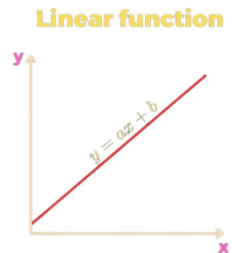
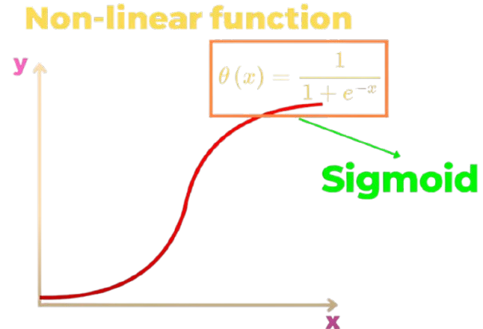
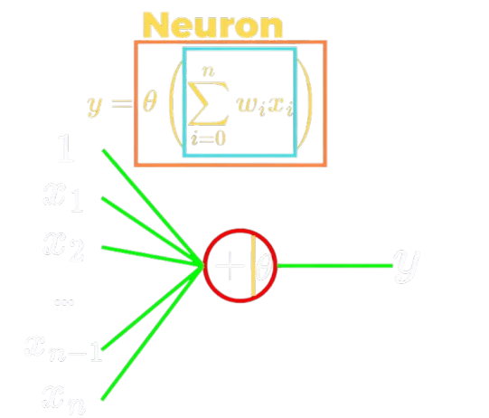
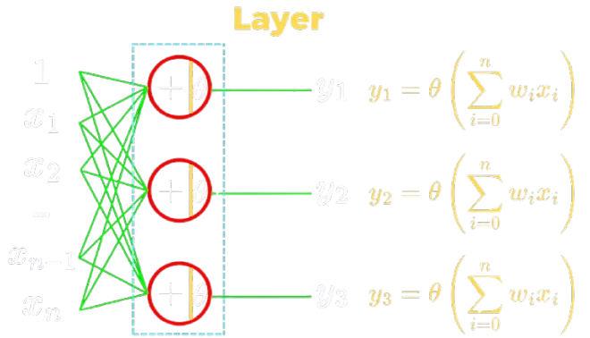
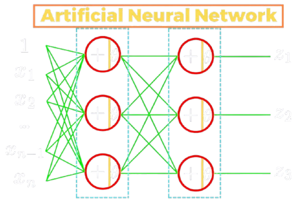
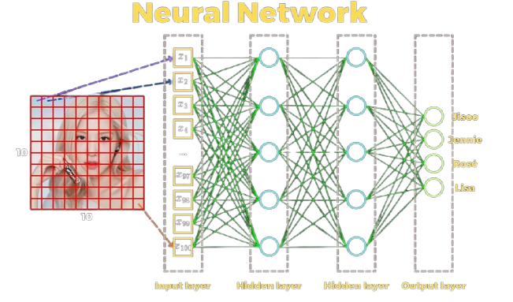
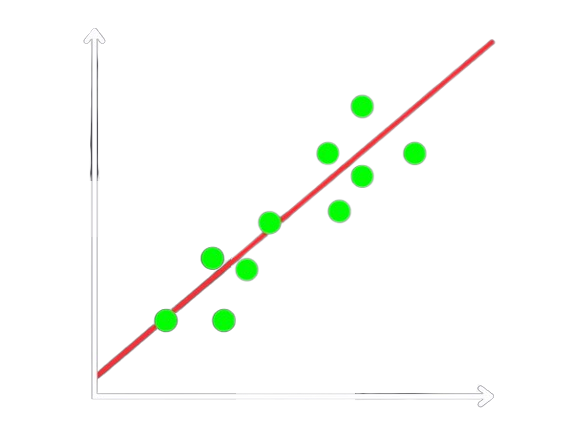
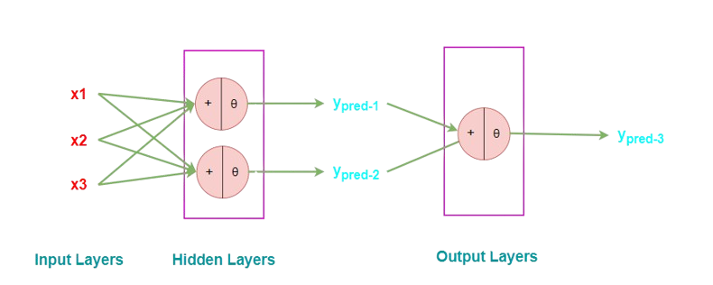
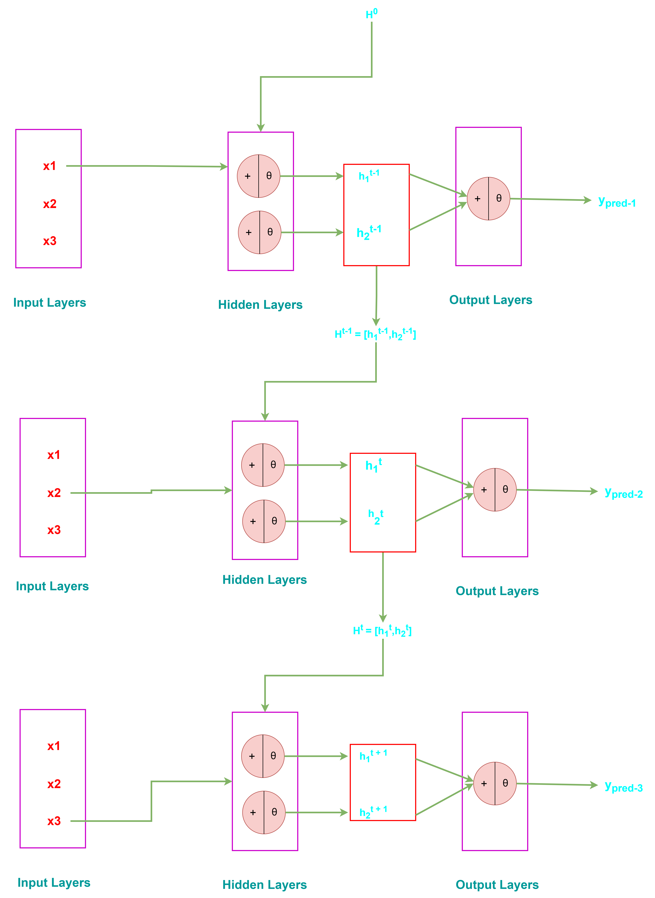

# Mô hình Transformer

## Mục lục

## 1. Sơ lược về Machine Learning và Deep Learning

### 1.1. Machine Learning

- **Khái niệm**

  - Machine Learning là một nhánh của AI, trong đó các máy tính được lập trình để học từ dữ liệu mà không cần lập trình cụ thể cho từng tác vụ.

  - Thường được dùng trong các lĩnh vực dự đoán, phân tích đối với các **dữ liệu có cấu trúc** (dữ liệu được tổ chức dưới dạng bảng).

- **Cách hoạt động**

  - Dựa trên các thuật toán thống kê và mô hình toán học.

  - Các tính năng (features) quan trọng trong dữ liệu phải được trích xuất thủ công bởi con người.

  - Mô hình học từ các đặc trưng này để dự đoán hoặc phân loại.

- **Phân loại**

  - **Học có giám sát (Supervised Learning)**: Dự đoán giá nhà, phân loại email (spam/non-spam).

    - Thuật toán: Hồi quy tuyến tính (Linear Regression), SVM, KNN.

  - **Học không giám sát (Unsupervised Learning)**: Phân cụm khách hàng.

    - Thuật toán: K-Means, DBSCAN.

  - **Học tăng cường (Reinforcement Learning)**: Trò chơi cờ vua, robot học cách di chuyển.

### 1.2. Deep Learning

- **Khái niệm**

  - Deep Learning là **một nhánh con của Machine Learning**, sử dụng mạng nơ-ron nhân tạo (**Artificial Neural Networks**) với nhiều lớp (deep layers), để học trực tiếp từ dữ liệu mà không cần sự can thiệp thủ công của con người.

  - Thường được sử dụng trong các yêu cầu dịch thuật, nhận diện ảnh (video), sinh văn bản, tạo ảnh.

  - Và dữ liệu thường là **dữ liệu không có cấu trúc** (không thể biểu diễn dưới dạng bản; ví dụ sách báo, âm thanh, hình ảnh,.....).

- **Cách hoạt động**

  - Mô hình tự động trích xuất các đặc trưng quan trọng từ dữ liệu.

  - Xây dựng từ các lớp mạng nơ-ron (neural network), trong đó mỗi lớp học các đặc trưng khác nhau của dữ liệu.

- **Phân loại**

  - Nhận diện ảnh, xử lý video: Mạng nơ-ron tích chập (CNN).

  - Xử lý chuỗi, dịch máy: Mạng nơ-ron hồi tiếp (RNN).

  - xử lý ngôn ngữ tự nhiên (NLP): **Transformer**, RNN.

  - Tạo ảnh giả: GAN (Generative Adversarial Networks).

**Như vậy**, ta có thể thấy _Mô hình Transformer_ thuộc lĩnh vực Deep Learning nơi xử dụng các mạng nơ-ron để xử lý dữ liệu.

## 2. Tìm hiểu về cách hoạt động của "Mạng nơ-ron nhân tạo" (Artificial Neural Networks - ANN)

Mạng nơ-ron nhân tạo là một mô hình lấy cảm hứng từ **cấu trúc của bộ não con người**, bao gồm các "nơ-ron" nhân tạo kết nối với nhau để xử lý thông tin.

### 2.1. Cấu trúc của một mạng nơ-ron

Mạng nơ-ron cơ bản thường gồm **ba thành phần chính**:

- **Tầng đầu vào (Input Layer)**: Nhận dữ liệu đầu vào từ bên ngoài (ví dụ: hình ảnh, văn bản, số liệu).

- **Tầng ẩn (Hidden Layers)**: là các lớp nơ-ron được sắp kết tiếp nhau. Xử lý và học các đặc trưng phức tạp từ dữ liệu.

- **Tầng đầu ra (Output Layer)**: là lớp nơ-ron cuối cùng. Tạo ra kết quả cuối cùng (ví dụ: phân loại, dự đoán).

Mỗi tầng bao gồm một tập hợp các "nơ-ron" (neurons) được kết nối với nơ-ron ở tầng trước và sau.

### 2.2. Cơ chế mạng nơ-ron hoạt động:

- **Ý tưởng hàm số**

  - Cấu trúc của mạng nơ-ron được biểu diễn dưới dạng một **hàm số** $\textbf{y = f(x)}$ - nơi một tham số đầu vào $x$ (tầng đầu vào) đi vào một hàm số $f$ (tầng ẩn) nào đó để cho đầu ra là một giá trị $y$ (tầng đầu ra).

  - Hàm số $y = f(x)$ đơn giản nhất là hàm số tuyến tính bậc 1 (**Linear Function**). Khi hàm số ở dạng bậc 1 thì mối quan hệ giữa x và y là mối quan hệ tuyến tính:

    

  - Khi hiểu diễn hàm số $y = ax + b$ ở **dạng đồ thị graph** thay vì không gian tọa độ 2 chiều:

    .png>)

  - Về ý nghĩa của **đồ thị hàm bậc 1** bên trên:

    - Input đầu vào sẽ là tham số $x$ nhân với một hệ số $a$ sau đó cộng với một hạng tử tự do là $b$ để cho Output đầu ra là $y$.

  - Mở rộng vấn đề khi có **nhiều hơn một input đầu vào** và có một output đầu ra:

    .png>)

  - Như hình trên ta thấy có 3 input đầu vào là $x_1,x_2,x_3$ và chỉ có một output đầu ra là $y$. Thì ra sẽ có công thức biểu diễn là: $$y = w_1x_1 + w_2x_2 + w_3x_3 + w_0$$

  - Với $w_1,w_2,w_3$ ($w$ - weight) là các trọng số và $w_0$ là hạng số tự do. $x$ và $y$ có ý nghĩa như hàm bậc 1.

  - $w_0$ được biểu diễn bên trên nhân với 1 do hạng số nào nhân với 1 cũng bằng chính nó.

  - Từ đó ta có tổng thức tổng quát của **hàm có $n$ input đầu vào** là:

    .png>)

  - Công thức $$y = \sum_{i=1}^{n} w_ix_i + w_0$$

  - Với $w_i$ như đã nói ở trên là các trọng số, thể hiện mối liên kết giữa input đầu vào và output đầu ra, **có bao nhiêu input đầu vào $x_i$ thì sẽ có bấy nhiêu trọng số $w_i$**.

  - $w_0$ là một trọng số đặt biệt do không liên kết với bất kỳ input đầu vào nào hết. Và thường được biểu diễn nhân với 1 vì trọng số nào nhân với 1 cũng bằng chính nó. Ngoài ra, $w_0$ còn có tên gọi khác là hệ số **bias**.

  - **$w_i$ và $w_0$ có mối quan hệ trực tiếp đến giá trị input đầu vào. Một giá trị input đầu vào có quan trọng hay không đều phụ thuộc vào trọng số $w$ và hệ số tự do $w_0$.**

  - Trong một số tài liệu, người ta có thể rút gọn công thức tổng quát bên trên bằng cách **thêm một input đầu vào $x_0$ nữa và $x_0$ này sẽ luôn có giá trị bằng 1**. Lúc này công thức tổng quát sẽ được biểu diễn lại là: $$y = \sum_{i=0}^{n} w_ix_i \hspace{0.8cm} với \ x_0 = 1$$

  - **Như vậy**, hàm số tuyến tính bậc 1 là hàm số đơn giản nhất được dùng để biểu diễn mối quan hệ giữa input đầu vào $x$ và output đầu ra $y$. Còn đối với các hàm phi tuyến tính (Non-Linear Function) là các hàm mà mối quan hệ giữa input $x$ và output $y$ không phải là bậc $1$ nữa mà bậc $n+1$ (bậc 2, 3,...).

  - Hoặc là một phân thức mà nó có thể kết hợp với một hàm mũ như ví dụ bên dưới:

    

  - Hàm $$\theta(x) = \frac{1}{1+e^{-x}}$$ được gọi là hàm **Sigmoid**

  - Trong lĩnh vực AI, các hàm phi tuyến như hàm Sigmoid được gọi là hàm kích hoạt (**Activation function**). Thật ra không phải hàm phi tuyến nào cũng là hàm kích hoạt, nhưng **đã là hàm kích hoạt thì chắc chắn nó là một hàm phi tuyến**.

  - Hàm phí tuyến được dùng để biểu diễn mối quan hệ phức tạp giữa input $x$ và output $y$.

  - Và hàm **Sigmoid** là một trong những hàm kích hoạt đời đầu.

- **Như vậy**, hàm tuyến tính (**Linear Function**) là những hàm được dùng để biểu diễn **mối quan hệ đơn giản** giữa input đầu vào và output đầu ra. Trong khi đó hàm phi tuyến tính (**Non-Linear Function**) là những hàm được dùng để **biểu diễn mối quan hệ phức tạp** giữa input đầu vào và output đầu ra.

- Và khi kết hợp giữa hàm tuyến tính và phi tuyến tính vào với nhau, ta sẽ có một nơ-ron.

  

  - Một nơ-ron là sự kết hợp giữa một hàm phi tuyến tính và một hàm tuyến tính. $$y_{pred} = \theta (\sum_{i=0}^{n}w_ix_i)$$

  - Nó có thể vừa xử lý, học hỏi các mối quan hệ đơn giản vừa xử lý học hỏi cả các mối quan hệ phức tạp.

- Vậy giờ bây giờ ta có nhiều hàm số như vậy, các hàm số này nhận cùng các giá trị input đầu vào và cho ra các giá trị output đầu ra khác nhau. Lúc đó ta sẽ có một **Layer**.

  

  - **Layer** về bản chất là tập hợp của nhiều nơ-ron. Các nơ-ron này đều nhận giá trị input đầu vào giống nhau nhưng lại có trọng số ($w_i$) khác nhau dẫn đến output đầu ra của các nơ-ron này cũng sẽ khác nhau.

  - **Lưu ý**: các nơ-ron trong cùng một Layer sẽ không có sự gắn kết (kết nối với nhau) trực tiếp với nhau.

  .png>)

- Giờ ta sẽ sắp thêm các Layer khác nằm song song và kết nối với nhau. Lúc này ta sẽ có một mạng nơ-ron nhân tạo (**Artificial Neural Network**).

  

  - **Lưu ý**: **Artificial Neural Network** (mạng nơ-ron nhân tạo) là tên gọi được dùng để phân biệt với mạng nơ-ron thật sự nằm trong trí óc của con người. Sau này để đơn giản hơn người ta thường lượt bỏ từ "Artificial" đi và chỉ gọi đơn giản là Neural Network.

  - Một Neural Network có bao nhiêu Layer Neural cũng được.

  - Các giá trị output của nơ-ron thuộc layer trước sẽ làm các giá trị input cho các nơ-ron thuộc layer phía sau.

  - Các Layer Neural được xem là tầng ẩn (Hidden Layers).

  - Ví dụ về một mạng nơ-ron được dùng trong bài toán nhận diện ảnh:

    

  - Trong ví dụ trên, ảnh sẽ được lưu dưới dạng dữ liệu mảng với mỗi giá trị trong mảng tượng trưng cho giá trị màu của các pixel. Nếu là ảnh đen trắng thì mỗi pixel sẽ được lưu dưới dạng mảng 2 chiều, còn nếu là ảnh màu thì mỗi pixel sẽ được lưu dưới dạng mảng ba chiều (R,G,B).

  - Và các giá trị đó sẽ là dữ liệu đầu vào cho tầng **Input Layer**.

  - Các hidden layer ban đầu sẽ thực hiện các tính toán đơn giản trước (lấy ra các đặc điểm đặc trưng cơ bản của ảnh). Các Hidden Layer gần cuối Ouput đầu ra sẽ thực hiện các tính toán phức tạp hơn (lấy ra các đặc điểm đặc trưng nhất) để cho ra kết quả đúng.

### 2.3. Tóm lại:

- Mỗi nơ-ron sẽ gồm có **2 phần**:

  - Hàm nhận dữ liệu đầu vào (hàm tuyến tính)

  - Hàm kích hoạt để xem giá trị đó có được truyền sang các nơ-ron kế tiếp hay không (hàm phi tuyến)

- Hàm nhận giá trị đầu vào sẽ được biểu diễn như sau: $$y = \sum_{i=1}^{n} w_ix_i + w_0$$ hoặc $$y = \sum_{i=1}^{n} w_ix_i + b \  (bias)$$

  - Với:

    - $y$: là giá trị hàm số được tính toán dựa trên giá trị $x$ đầu vào.

    - $x_i$: là các giá trị input đầu vào.

    - $w_i$: là trọng số (weight), gắn với mỗi giá trị đầu vào. Có bao nhiêu giá trị $x_i$ đầu vào thì sẽ có bấy nhiêu $w_i$. Và $w_i$ thể hiện mức độ quan trọng đối với giá trị $x_i$ đầu vào ($w_i$ càng lớn thì dữ liệu đó càng quan trọng).

    - $w_0$ (hoặc $b$): là hệ số tự do (trong một số tài liệu gọi là hệ số bias). Được dùng để điều chỉnh đường quyết định để mô hình có thể học được nhiều dữ liệu hơn trước khi qua hàm quyết định.

      

- Sau khi hàm nhận giá trị đầu vào $y$ tính toán xong sẽ được truyền vào hàm quyết định (**Activation function**) để xem giá trị đó có được tiếp tục truyền cho các nơ-ron kế tiếp hay không:

  - Hàm kích hoạt **Sigmoid**: $$\theta(y) = \frac{1}{1+e^{-y}}$$

    hay: $$y_{pred} = \frac{1}{1+e^{-y}}$$

  - Với:

    - $y_{pred}$ hay $\theta(y)$: là giá trị output đầu ra của một nơ-ron. Và có giá trị $y_{pred} \in (0,1)$.

    - $y$: là giá trị của hàm nhận giá trị đầu vào được tính toán theo dữ liệu $x$ đã nhắc đến bên trên.

- Sau khi trải qua hàm nhận giá trị đầu vào và hàm kích hoạt để cho ra $y_{pred}$. Các output $y_{pred}$ của nơ-ron trong cùng layer này sẽ truyền tiếp cho các nơ-ron thuộc layer kế tiếp để tiếp tục thực hiện lại các bước tính toán. Lúc này, các giá trị output $y_{pred}$ của layer nơ-ron trước sẽ là giá trị input cho các layer nơ-ron kế.

- Và các tính toán bên trong nơ-ron kế tiếp cũng được thực hiện y như vậy (trải qua hàm nhận giá trị đầu vào $y$ sau đó đến hàm kích hoạt $y_{pred}$).

- Cho đến khi dữ liệu đến tầng đầu ra (Output Layers).

- **Tầng đầu ra output cũng là một lớp nơ-ron** (cũng có hàm tính đầu vào và hàm kích hoạt) nhưng vì nó là lớp nơ-ron cuối cùng nên được gọi là tầng Output Layers.

## 3. Hàm mất mát (Loss Function)

### 3.1. Khái niệm

- **Hàm mất mát (Loss Function)** là một công cụ đo lường mức độ chênh lệch giữa đầu ra dự đoán của mô hình và giá trị thực tế (ground truth).

- Nói cách khác, **hàm mất mát giúp xác định mô hình của bạn hoạt động tốt hay không**, bằng cách tính toán một con số thể hiện mức lỗi.

- **Giá trị thể hiện mức lỗi có lớn hay không thường phụ thuộc vào các trọng số ($w$) và hệ số tự do ($w_0$) ở input đầu vào**. Do như đã nói bên trên, $w$ và $w_0$ có quan hệ trực tiếp đến giá trị input đầu vào.

- Sau khi có được giá trị thể hiện mức lỗi, ta sẽ thực hiện "**Lan truyền ngược (Backpropagation)**" để điều chỉnh các trọng số và hệ số tự do sau cho mức lỗi thấp nhất có thể.

### 3.2. Cơ sở hình thành hàm mất mát

- **Kiến thức khoảng cách Euclidean**

  - Khoảng cách Euclidean là một cách đo khoảng cách ngắn nhất giữa hai điểm trong không gian Euclidean (không gian thông thường mà chúng ta sống, như 2D hoặc 3D). Nó **được tính dựa trên định lý Pythagoras**.

  - Giả sử chúng ta có 2 điểm $A$ và $B$ trong không gian 2 chiều (tọa độ $x,y$) như sau:

    - $A(3,4)$

    - $B(0,0)$

    - Thì khoảng cách Euclidean được tính bằng công thức: $$d(A,B) = \sqrt{(3-0)^2 + (4-0)^2} = 5$$

  - Đối với trong không gian 3 chiều ($x,y,z$)

    - $A(1,2,3)$

    - $B(4,6,8)$

    - Thì khoảng cách Euclidean được tính bằng công thức: $$d(A,B) = \sqrt{(1-4)^2 + (2-6)^2 + (3-8)^2} \approx 7.07$$

  - Từ đó ta có **công thức tổng quát khoảng cách Euclidean trong $n$ chiều**: $$d(A,B) = \sqrt{ \sum_{i=1}^{n} (x_i-y_i)^2}$$

- **Hàm mất mát MSE - Mean Squared Error**

  - Đây là một trong những hàm mất mát đầu tiên được sử dụng, phổ biến trong các bài toán hồi quy.

  - Hàm MSE dựa trên khoảng cách Euclidean bình phương nhưng **bỏ qua bước lấy căn bậc hai**. Thay vào đó, nó lấy trung bình bình phương độ lệch giữa giá trị thực và giá trị dự đoán.

  - Từng bước xây dựng:

    - Giả sử ta có 2 giá trị output đầu ra $y_{pred}$ và $y_{true}$. Với:

      - $y_{pred}$ - là giá trị output mà mô hình (nơ-ron) ta tính toán được.

      - $y_{true}$ - là giá trị output đúng mà ta mong đợi cho kết quả chạy của mô hình (nơ-ron).

    - Để tính được sai số giữa $y_{pred}$ và $y_{true}$ thì ta thực hiện phép tính trừ:$$Sai \ số = y_{true} - y_{pred}$$

    - Để đảm bảo kết quả sai số là số dương, ta tiến hành bình phương 2 vế: $$(Sai \ số)^2 = (y_{true} - y_{pred})^2$$

    - Mở rộng công thức ra với $n$ giá trị output đầu ra, ta có công thức tổng quát:$$(Sai \ số)^2 = \sum_{i=1}^{n} (y_{true,i} - y_{pred,i})^2$$

    - **Lấy trung bình sai số bình phương**: Để chuẩn hóa mất mát cho toàn bộ tập dữ liệu, lấy trung bình tổng sai số bình phương: $$(Sai \ số)^2 = \frac{1}{n} \sum_{i=1}^{n} (y_{true,i} - y_{pred,i})^2$$

  - Từ đó ta có **công thức hàm mất mát MSE - Mean Squared Error**: $$L (Loss) = \frac{1}{n} \sum_{i=1}^{n} (y_{true,i} - y_{pred,i})^2$$

    - $L$: giá trị của hàm mất mát (Loss).

    - $n$: số lượng dữ liệu trong tập huấn luyện.

    - $y_{pred,i}$: giá trị thực tế của điểm dữ liệu thứ $i$.

    - $y_{true,i}$: giá trị mong muốn của mô hình tại điểm thứ $i$.

    $\rightarrow$ Hàm mất mát là một hàm phi tuyến tính.

## 4. Lan truyền ngược (Backpropagation)

### 4.1. Khái niệm

- **Lan truyền ngược (Backpropagation)** là một thuật toán dùng để tối ưu hóa các mạng nơ-ron nhân tạo bằng cách tính toán và lan truyền ngược độ lỗi (error) từ đầu ra về phía các trọng số đầu vào. Đây là một phần cốt lõi trong quá trình huấn luyện của mạng nơ-ron.

- Nó là việc từ giá trị output $y_{pred}$ ta sẽ thực hiện việc tính ngược lại (đi ngược lại) để tính toán **điều chỉnh các trọng số $w_i$ và hệ số tự do $w_0$ sao cho giá trị của hàm mất mát là thấp nhất** qua các lớp nơ-ron. Sau cho giá trị $y_{pred}$ gần với giá trị mà ta mong muốn $y_{true}$.

### 4.2. Quá trình lan truyền ngược

- Quá trình lan truyền ngược diễn ra theo 2 giai đoạn chính:

  - **Giai đoạn 1**: Lan truyền xuôi (Forward Propagation)

    - Là quá trình mà các dữ liệu $x$ đi từ tầng dữ liệu đầu vào vào các nơ-ron để thực hiện các tính toán thông qua **hàm tính dữ liệu đầu vào và hàm kích hoạt** để cho ra giá trị output $y_{pred}$ như đã nói bên trên: $$y_{pred} = \theta \ \left(\sum_{i=1}^{n} w_ix_i + w_0 \right)$$

    - Sau khi có được giá trị $y_{pred}$, ta tiến hành **tính hàm mất mát $L$** giữa giá trị đầu ra thực tế của mô hình là $y_{pred}$ và giá trị đầu ra mong muốn là $y_{true}$. $$L (Loss) = \frac{1}{n} \sum_{i=1}^{n} (y_{true,i} - y_{pred,i})^2$$

  - **Giai đoạn 2**: Lan truyền ngược (Backpropagation)

    - **Nhắc lại kiến thức đạo hàm**

      - Hồi xưa, để biết được một hàm số $y$ có đồ thị đang đi lên hay đi xuống (đồ thị tăng hay giảm) ta thường dùng đạo hàm $f'(y)$ để xét.

      - Như ví dụ, xét đồ thị hàm số $y=x^2$:

        - Ta có đạo hàm của $f'(y) = 2x$

          - Tại $x=0$ thì $y=0$.

          - Tại $x=1$ thì $y=2$.

          $\rightarrow$ Hàm số $y=x^2$ là một đồ thị hàm số tăng.

    - Đối với hàm số nhiều biến $f(x,y,...)$ thì ta xét đồ thị tăng hay giảm bằng **Gradient**.

    - **Gradient** là tập các vector chứa tất cả các đạo hàm riêng của hàm đó đối với từng biến. Gradient chỉ hướng của độ dốc lớn nhất và độ lớn của nó cho biết tốc độ thay đổi nhanh nhất của hàm.

    - Công thức của **Gradient** theo hàm $f(x,y)$: $$\nabla f(x,y) = \left( \frac{\partial f}{\partial x}, \frac{\partial f}{\partial y} \right)$$

      - $\frac{\partial f}{\partial x}$ là đạo hàm $f$ theo biến $x$.

      - $\frac{\partial f}{\partial y}$ là đạo hàm $f$ theo biến $y$.

    - **Độ dốc** là chỉ điểm mà đồ thị gốc $f(x)$ bắt đầu dốc lên hay dốc xuống. Được xem xét thông qua đạo hàm như sau:

      - Nếu $f'(x) > 0$: Đồ thị $f(x)$ đang đi lên nếu di chuyển theo trục $x$.

      - Nếu $f'(x) < 0$: Đồ thị $f(x)$ đang đi xuống nếu di chuyển theo trục $x$.

      - Nếu $f'(x) = 0$: Đồ thị $f(x)$ có điểm dừng (có thể là điểm cực đại, cực tiểu, hoặc điểm uốn).

    - **Độ dốc trong đồ thị nhiều biến** sẽ phức tạp hơn. Với công thức **Gradient** theo hàm $f(x,y)$: $$\nabla f(x,y) = \left( \frac{\partial f}{\partial x}, \frac{\partial f}{\partial y} \right)$$

      Với giá trị $x,y$ tùy chọn:

      - Nếu $\frac{\partial f}{\partial x} > 0$ thì đồ thị $f(x,y)$ sẽ có chiều đi lên nếu di chuyển theo trục $x$.

      - Nếu $\frac{\partial f}{\partial x} < 0$ thì đồ thị $f(x,y)$ sẽ có chiều đi xuống nếu di chuyển theo trục $x$.

      - Tương tự đối với $\frac{\partial f}{\partial y}$ di chuyển theo trục $y$.

      - Nếu $\nabla f(x,y) = 0$ thì đồ thị $f(x,y)$ có thể đạt giá trị cực đại hoặc cực tiểu.

    - **Hướng của gradient** là hướng mà hàm $f(x,y)$ thay đổi nhanh nhất.

    - **Độ lớn của gradient** là **tốc độ thay đổi của hàm** theo hướng đó. Có công thức tính: $$\left| \nabla f(x,y) \right| = \sqrt{\left(\frac{\partial f}{\partial x}\right)^2 + \left(\frac{\partial f}{\partial y}\right)^2}$$

      - Nếu $\left| \nabla f(x,y) \right|$ càng lớn thì độ dốc của $f(x,y)$ sẽ thay đổi nhanh tại đó.

    - Ví dụ hàm số $f(x,y) = x^2y + y^3$. Tính Gradient: $$\nabla f(x,y) = \left( 2xy, \ x^2 + 3y \right)$$

      - Tại điểm $(1,1)$: $$\nabla f(1,1) = (2,4)$$

        - Ý nghĩa: Tại điểm $(1,1)$, đồ thị sẽ từ từ hướng lên (dốc lên) điểm $(2,4)$ nếu di chuyển theo cả 2 chiều trục $x$ và $y$ (hướng của Gradient là $(2,4)$).

          - $\frac{\partial f}{\partial x} = 2 > 0$: nếu di chuyển theo trục $x$ thì đồ thị $f(x,y)$ sẽ dốc lên.

          - $\frac{\partial f}{\partial y} = 4 > 0$: nếu di chuyển theo trục $y$ thì đồ thị $f(x,y)$ sẽ dốc lên.

        - Độ lớn của Gradient: $$\left| \nabla f(1,1) \right| = \sqrt{2^2 + 4^2} \approx 4.47$$

          - $4.47$ biểu thị rằng nếu ta di chuyển theo hướng gradient từ $(1,1)$ đến $(2,4)$ thì giá trị của hàm $f(x,y)$ sẽ tăng nhanh nhất (dốc lên nhanh nhất) với tốc độ $4.47$ đơn vị mỗi bước.

      - Ví dụ hàm số $f(x) = x^2$. Tính Gradient: $$\nabla f(x) = \left(2x\right)$$

        - Tại điểm $x=0$: $$\nabla f(0) = (0)$$

          thì đồ thị $f(x)$ sẽ đạt giá trị cực tiểu hoặc cực đại.

        - Tại điểm $x=1$: $$\nabla f(1) = (2)$$

          thì đồ thị $f(x)$ sẽ dốc lên nếu di chuyển theo trục $x$.

        - Và độ lớn Gradient sẽ là $$\left| \nabla f(1) \right| = \sqrt{2^2} = 2$$

          - Với $\left| \nabla f(1) \right| = 2$ thì độ dốc của hàm $f(x)$ thay đổi là tương đối nhỏ (với tốc độ khoảng $2$ đơn vị mỗi bước).

  - **Tính Gradient của hàm mất mát L(Loss) để biết mức độ thay đổi thông qua từng tham số $w_i$ và $w_0$**

    - Khi huấn luyện mạng nơ-ron, mục tiêu của chúng ta là **tối ưu hóa các tham số (trọng số và bias) sao cho hàm mất mát $L$ trở nên nhỏ nhất (giảm độ dốc và tốc độ thay đổi độ dóc của hàm $L$)**. Để làm được điều này, chúng ta cần tính gradient của L đối với từng tham số và sử dụng gradient descent để điều chỉnh các tham số.

    - Ta xem các trọng số và bias là các biến $x,y$ cần xem xét tùy chỉnh sao cho độ dốc của hàm mất mát là nhỏ nhất: $$\nabla f(w_i,w_0) = \left( \frac{\partial L}{\partial w_i},\frac{\partial L}{\partial w_0} \right)$$

    - Do $L$ phụ thuộc vào $w_i$ thông qua nhiều lớp trung gian, ta sử dụng quy tắc chuỗi (chain Rule): $$\frac{\partial L}{\partial w_i} = \frac{\partial L}{\partial y_{pred}} \times \frac{\partial y_{pred}}{\partial y} \times \frac{\partial y}{\partial w_i}$$

    - Tương tự với $w_0$: $$\frac{\partial L}{\partial w_0} = \frac{\partial L}{\partial y_{pred}} \times \frac{\partial y_{pred}}{\partial y} \times \frac{\partial y}{\partial w_0}$$

    - Giả sử ta sử dụng công thức **hàm kích hoạt Sigmoid** và **hàm mất mát MSE**. Công thức $\frac{\partial L}{\partial w_i}$ sẽ là: $$\frac{\partial L}{\partial w_i} = \frac{2}{n} (y_{pred} - y_{true}) \times y_{pred}(1-y_{pred}) \times x_i$$ và $$\frac{\partial L}{\partial w_0} = \frac{2}{n} (y_{pred} - y_{true}) \times y_{pred}(1-y_{pred})$$

  - **Ý nghĩa khi tính $\frac{\partial L}{\partial w_i}$**

    - Hàm $L(Loss)$ là một hàm phi tuyến, nên khi vẽ ra sẽ có các điểm uống lượng trên đồ thị.

    - Và các điểm uống lượng đó chính là tác động của trọng số và hệ số bias tạo ra.

    - Việc tính đạo hàm giữa hàm mất mát $L$ theo trọng số $w$ sẽ giúp ta **thấy được mức độ uống lượng của hàm mất mát tại điểm đó có lớn hay không**. Từ đó thực hiện việc tối ưu các trọng số và hệ số bias phù hợp để giúp mô hình dự đoán chính xác hơn (giảm giá trị của hàm mất mát về mức thấp nhất có thể).

  - **Cập nhật trọng số và bias**

    - Sử dụng thuật toán **Gradient Descent** - một thuật toán tối ưu hóa các trọng số $w_i$ và bias $w_0$, các tham số được cập nhật bằng cách di chuyển theo hướng ngược lại của gradient để giảm giá trị hàm mất mát $L$:

    - Cập nhật trọng số $w_i$: $$w_i^{new} = w_i^{old} - \eta . \frac{\partial L}{\partial w_i}$$

    - Cập nhật trọng số $w_0$: $$w_0^{new} = w_0^{old} - \eta . \frac{\partial L}{\partial w_0}$$

    - Trong đó, **$\eta$ là tốc độ học (Learning Rate)**.

      - Tốc độ học $\eta$ là một hệ số quyết định mức độ thay đổi của trọng số $w_i$ trong mỗi bước cập nhật trong quá trình huấn luyện.

      - Nếu tốc độ học quá lớn, mô hình có thể vượt quá điểm tối ưu và không hội tụ (convergence). Nếu tốc độ học quá nhỏ, quá trình huấn luyện sẽ rất chậm và có thể dừng lại trước khi đạt được kết quả tối ưu.

      - Cách hoạt động của tốc độ học:

        - Nếu độ dốc $\frac{\partial L}{\partial w_i}$ lớn:

          - Khi gradient lớn, mô hình cần phải thay đổi mạnh mẽ để đạt được sự cải thiện nhanh chóng.

          - Tuy nhiên, nếu tốc độ học $\eta$ quá lớn, mô hình có thể "nhảy" qua các giá trị tối ưu và không hội tụ, hoặc đi đến một điểm không tối ưu.

        - Nếu độ dốc $\frac{\partial L}{\partial w_i}$ nhỏ:

          - Khi gradient nhỏ, sự thay đổi cần thiết là rất nhỏ, và nếu tốc độ học quá lớn, mô hình sẽ di chuyển quá nhanh, bỏ qua các điểm tối ưu tiềm năng.

          - Nếu tốc độ học quá nhỏ, mô hình sẽ hội tụ rất chậm.

      - Khi nào nên tăng hay giảm tốc độ học ($\eta$)?

        - Khi độ dốc $\frac{\partial L}{\partial w_i}$ lớn:

          - Nếu gradient lớn, mô hình có thể cập nhật trọng số nhanh chóng. Nếu tốc độ học $\eta$ vẫn ở mức hợp lý, việc cập nhật sẽ tiến nhanh về điểm tối ưu.

          - Tăng tốc độ học có thể hữu ích nếu mô hình đang chậm cập nhật và cần di chuyển nhanh hơn để hội tụ.

        - Khi độ dốc $\frac{\partial L}{\partial w_i}$ nhỏ:

          - Khi gradient nhỏ, mô hình chỉ cần thay đổi một chút để tối ưu hóa. Nếu $\eta$ quá lớn, mô hình có thể nhảy qua điểm tối ưu.

          - Giảm tốc độ học có thể là cần thiết khi mô hình đang quá nhạy với các cập nhật, và cần di chuyển chậm lại để tìm được điểm tối ưu tốt hơn.

      - **Điểm tối ưu (Optimal Point)** là giá trị của các tham số mô hình (trọng số $w_i$, bias $w_0$...) **sao cho hàm mất mát $L$ đạt giá trị thấp nhất (tối thiểu)**.

      - Khi hàm mất mát $L$ đạt giá trị thấp nhất và không thể thấp hơn được nữa qua các bước huấn luyện, ta gọi đó là **hội tụ**. Là thứ mà ta mong muốn đạt được trong việc huấn luyện mô hình.

      - Đôi khi hàm mất mát $L$ trải qua các điểm có giá trị thấp nhưng lại không phải là điểm hội tụ (tức là giá trị của hàm mất mát tại điểm đó không phải là nhỏ nhất) thì cái đó được gọi là các **điểm cực tiểu cục bộ**.

      - Nơi có nhiều điểm cực tiểu cục bộ nằm cách nhau một khoảng nhỏ được gọi **là thung lũng**.

## 5. Cơ chế hoạt động của mạng nơ-ron nhiều lớp

### 5.1. Khái niệm

- Như đã đề cập ở ["Cấu trúc của một mạng nơ-ron"](#21-cấu-trúc-của-một-mạng-nơ-ron), một lớp nơ-ron là tập hợp các nơ-ron riêng lẻ nằm cùng một lớp với nhau và cùng thực hiện một tính toán gì đó giống nhau, nhưng các nơ-ron trong lớp đó không có sự liên kết với nhau mà sự liên kết đó chỉ diễn ra giữa lớp nơ-ron này và lớp nơ-ron khác.

  

- Các lớp nơ-ron được xem là các tầng ẩn (Hidden Layers): Xử lý và học các đặc trưng phức tạp từ dữ liệu.

- Và giá trị đầu ra của lớp này lại là giá trị đầu vào của lớp sau nó.

### 5.2. Cơ chế hoạt động và sự kết nối giữa các lớp nơ-ron

- **Cơ chế hoạt động của một lớp nơ-ron**

  - Về bản chất, các nơ-ron trong cùng một lớp không có sự kết nối với nhau (mỗi nơ-ron hoạt động riêng lẻ và không liên quan gì đến nhau).

  - Giả sử ta có mô hình bên dưới:

    

    - Trong hình trên ta có 3 dữ liệu đầu vào $x_1,x_2,x_3$ và ta có công thức của dữ liệu đầu ra $y_{pred}$ là:

      $$y_{pred-1} = \theta \left( w_1x_1 + w_2x_2 + w_3x_3  + b_1 \right)$$

      $$y_{pred-2} = \theta \left( w_5x_1 + w_6x_2 + w_7x_3 + b_2   \right)$$

      - Và 2 giá trị output đầu ra là $y_{pred-1},y_{pred-2}$ sẽ là giá trị input đầu vào của tầng output:

      $$y_{pred-3} = \theta \left( w_8.y_{pred-1} + w_8.y_{pred-2} + b_3   \right)$$

      - **Lưu ý**: **trọng số và bias ở các nơ-ron là khác nhau** thì mô hình mới tìm được các đặc trưng.

    - Vậy, từ 3 dữ liệu đầu vào $x_1,x_2,x_3$ qua lớp layer nơ-ron đã cho ra 2 giá trị đầu ra $y_{pred-1},y_{pred-2}$.

- **Sự kết nối giữa các lớp nơ-ron**

  - Như ta thấy bên trên, 2 lớp nơ-ron (một lớp thuộc Hidden Layer và một lớp thuộc Output Layers) sẽ liên kết với nhau như sau.

    .png>)

    - Như ta thấy, kết quả ouput đầu ra $y_{pred-1}$ và $y_{pred-2}$ của nơ-ron phía trước sẽ là giá trị input đầu vào của lớp nơ-ron phía sau. Và mọi tính toán trong nơ-ron phía sau tương tự như các nơ-ron trước nó.

    $$y_{pred-3} = \theta \left( w_4 . y_{pred-1} + w_5 . y_{pred2} + b_2 \right)$$

### 5.3. Tóm lại

- Trong mô hình nếu có nhiều lớp mạng nơ-ron thì giá trị đầu ra output của lớp nơ-ron trước đó là giá trị input đầu vào của lớp nơ-ron kết tiếp.

- **Trọng số $w_i$ và hệ số bias $b_i$ ở các nơ-ron là khác nhau** ngay cả khi các nơ-ron đó nằm chung một layer.

## 6. Thuật toán tối ưu từ Gradient Descent

- **Khái niệm**

  - Gradient Descent (GD) là một thuật toán tối ưu cơ bản được sử dụng để tìm các giá trị tối ưu của tham số (trọng số và bias) trong mạng nơ-ron bằng cách giảm thiểu giá trị của hàm mất mát.

  - Từ Gradient Descent, nhiều biến thể và thuật toán tối ưu khác đã được phát triển để tăng hiệu quả và độ chính xác.

  - Và đây là thuật toán Gradient Descent gốc: $$w_i^{new} = w_i^{old} - \eta . \frac{\partial L}{\partial w_i}$$ với $$\frac{\partial L}{\partial w_i} = \frac{2}{n} (y_{pred} - y_{true}) \times y_{pred}(1-y_{pred}) \times x_i$$ $$(n \ là \ số \ tập \ dữ \ liệu)$$

### 6.1. Nhắc lại cơ chế lan truyền ngược

- Như ta đã biết, lan truyền ngược gồm có 2 giai đoạn diễn ra:

  **Giai đoạn 1**: Lan truyền xuôi

  .png>)

  Đây là những gì xảy ra bên trong giữa 2 lớp nơ-ron.

  .png>)

  Với $$y_{pred} = \theta \left( \sum_{i=1}^{n} w_ix_i + w_0 \right) \ với \ \theta \ là \ hàm \ kích \ hoạt \ Sigmoid$$

  Sau khi có được giá trị đầu ra $y_{pred}$ của tầng Output Layers, giả sử $y_{true}$ là giá trị mà ta mong đợi kết quả đầu ra dự đoán mô hình. Ta có công thức tính sự mất mát giữa $y_{pred}$ và $y_{true}$ trên $n$ dữ liệu input đầu vào: $$L (Loss) = \frac{1}{n} \sum_{i=1}^{n} (y_{true,i} - y_{pred,i})^2$$

  **Giai đoạn 2**: Lan truyền ngược (cập nhật trọng số và bias)

  - Sau khi có được giá trị của hàm mất mát $L$. Ta tiến hành tính Gradient giữa hàm mất mát $L$ và các trọng số $w$: $$\frac{\partial L}{\partial w_i} = \frac{2}{n} (y_{pred} - y_{true}) \times y_{pred}(1-y_{pred}) \times x_i$$ và $$\frac{\partial L}{\partial w_0} = \frac{2}{n} (y_{pred} - y_{true}) \times y_{pred}(1-y_{pred})$$

  - Sau đó áp dụng thuật toán tối ưu **Gradient Descent** để tiến hành cập nhật các trọng số:

    $$w_i^{new} = w_i^{old} - \eta . \frac{\partial L}{\partial w_i}$$

- Trong một lần học của mô hình sẽ diễn ra 2 giai đoạn như trên. Số lần học càng nhiều thì việc tối ưu các trọng số sẽ càng tốt với mục đích làm giảm giá trị mất mát đầu ra cho đến khi không giảm được nữa.

### 6.2. Thuật toán tối ưu Stochastic Gradient Descent (SGD)

- Đối với Gradient Descent thông thường, việc cập nhật trọng số sẽ diễn ra cho toàn bộ n giá trị input đầu vào. Nhưng đối với SGD, cập nhật chỉ diễn ra cho 1 giá trị input đầu vào (truyền lần lượt các giá trị input vào mô hình huấn luyện).

- Đây là thông thường:

  .png>)

  - Tất cả dữ liệu input đầu vào $x$ sẽ được truyền đồng thời vào mô hình huấn luyện.

  - Nên khi xong, ta phải cập nhật toàn bộ trọng số của các giá trị input đầu vào ở các lớp.

- Khi sử dụng thuật toán SGD:

  .png>)

  - Ta truyền lần lượt các giá trị input $x_{i}$ vào mô hình. Sau khi trải qua 2 giai đoạn lan truyền xuôi và lan truyền ngược (cập nhật trọng số) trên dữ liệu $x_{i}$ thì ta lại tiếp tục truyền giá trị input $x_{i+1}$ vào mô hình để tiếp tục huấn luyện.

  .png>)

  - Và cứ như thế cho đến hết tập dữ liệu input $x$ là xong một lần học của mô hình.

- Trong thuật toán SGD, do mỗi lần chỉ huấn luyện trên một tập dữ liệu input đơn lẻ $x$ nên các công thức hàm mất mát $L$ hay tính Gradient không cần phải chia cho $n$ tập dữ liệu vì lúc này $n = 1$. $$L (Loss) =  (y_{true} - y_{pred})^2$$ và tính Gradient của hàm $L$ so với $w$: $$\frac{\partial L}{\partial w_i} = 2 \times (y_{pred} - y_{true}) \times y_{pred}(1-y_{pred}) \times x$$ và $$\frac{\partial L}{\partial w_0} = 2 \times (y_{pred} - y_{true}) \times y_{pred}(1-y_{pred})$$

- Thuật toán tối ưu SGD cập nhật trọng số **trong mỗi lớp nơ-ron** $$w_i^{new} = w_i^{old} - \eta . \frac{\partial L}{\partial w_i}$$

- **Lưu ý**:

  - **SGD chỉ cập nhật trọng số cho một dữ liệu input $x$ đơn lẻ** chứ không phải là toàn tập dữ liệu input.

  - Giả sử có tập dữ liệu input đầu vào $x_{1}, x_{2}, ...x_{i},x_{i+1}$ thì khi áp dụng SGD, mỗi dữ liệu đơn lẻ $x_i$ sẽ phải trải qua 2 giai đoạn đoạn (Lan truyền xuôi và Lan truyền ngược - cập nhật trọng số) hoàn tất xong mới tới dữ liệu $x_{i+1}$ kế tiếp.

  - SGD giúp tăng khả năng thoát khỏi các điểm cực tiểu cục bộ và nhanh vì chỉ cần một mẫu dữ liệu trong tập. Nhưng điều đó cũng khiến Gradient dễ bị dao động lớn.

### 6.3. Thuật toán tối ưu Mini-Batch Gradient Descent

- Thực ra thuật toán này nằm giữa Gradient Descent thông thường và SGD để thể hiện sự cân bằng.

- Nó thực hiện tối ưu trên nguyên tắc chia tập dữ liệu input đầu vào thành các nhóm dữ liệu nhỏ hơn (batch).

- Thay vì SGD có $batch = 1$ (tức chỉ có từng dữ liệu đơn lẻ) thì Mini-Batch có thể có các batch có số lượng khác nhau tùy người lập trình viên chia nhỏ (có thể là $batch = \frac{Tập \ input \ đầu \ vào}{2},\ batch = 2, \ batch = 3,...)$.

- Và các tính toán về việc cập nhật trọng số cũng y như Gradient Descent thông thường, nhưng khác ý nghĩa ngay chỗ $n$ lúc này không phải là số lượng toàn tập dữ liệu input mà là số lượng của batch.

## 7. Ma trận trọng số dữ liệu đầu vào $W_x$ và Ma trận trọng số trạng thái $W_h$

### 7.1. Ma trận trọng số dữ liệu đầu vào $W_x$
- Trong các ví dụ lý thuyết trên ta chỉ đơn giản nói về mối liên tương quan giữa trọng số $w$ và dữ liệu input đầu vào.

- Trọng số $w$ và hệ số bias $b$ thể hiện mức độ quan trọng của dữ liệu input $x$ trong quá trình huấn luyện. Có bao nhiêu dữ liệu input $x$ thì sẽ có bấy nhiêu trọng số $w$ tương ứng. Thể hiện qua công thức dưới đây: $$y_{pred} = \theta \left(\sum_{i=1}^{n} w_ix_i + w_0\right)$$

  - $y_{pred}$ ở trên được xem như là kết quả giá trị đầu ra của một nơ-ron. Sau khi giá trị của hàm tính dữ liệu đầu vào đi qua hàm kích hoạt $\theta$ (có thể Sigmoid, Tanh,....)

  - Trong các kiến trúc mạng RNN, LSMT,... giá trị đầu ra của nơ-ron đó có thể được ký hiệu là $h$ - Tượng trưng cho giá trị trạng thái của hidden layers; nhầm phân biệt với ký hiệu của giá trị dự đoán sau cùng của output layer.

- Ma trận trọng số $W_x$ là gì ?

  - **Ma trận trọng số chính là một ma trận tập hợp các trọng số của hidden layer đối với các biến $x$ đầu vào từng nơ-ron**.

  - Giả sử ma trận $W_x$ có $m \times n$ chiều thì **$m$ thể hiện số no-ron có trong hidden layer hiện tại (hoặc số giá trị đầu ra của hidden layer) và $n$ chính là thể hiện đặc trưng của kiểu dữ liệu đầu vào nơ-ron**.

  - Nói cách khác, ma trận $W_x$ là ma trận mà ta muốn biến đổi (phản chiếu) đặc trưng dữ liệu đầu vào hidden layer thành dữ liệu có đặc trưng khác qua phép nhân ma trận.

    - Giả sử ta có ma trận đầu vào $X$.

    - Công thức tính giá trị đầu ra của hidden layer sẽ được tính như sau: $$H = W_x \times X + W_b$$ với: 
    
      - $W_x$ là ma trận trọng số $w$ 
      
      - $W_b$ là ma trận trọng số bias $b$.

      - $H$ là ma trận chứa các giá trị đầu ra của hidden layer.

  - Để hiểu hơn ta có thể xem sơ đồ dưới đây:

.png)

  - Xem từng ma trận có trong sơ đồ:

  .png)

  - Như ta thấy trong sơ đồ trên, tập dữ liệu đầu vào có dạng $$X = \left[ [a_1,a_2], [a_3,a_4] \right]$$ với $x_1 = [a_1,a_2]$ và $x_2 = [a_3,a_4]$

    $\rightarrow$ Dữ liệu $x_1, x_2$ có đặc trưng là một mảng 1 chiều gồm 2 phần tử bên trong. Và tập $X$ có đặc trưng là một mảng $2 \times 2$.

  - Lớp hidden đầu tiên, ta thiết kế có 3 nơ-ron bên trong nó. Và mỗi nơ-ron trong lớp đó sẽ nhận 2 dữ liệu đầu vào của tập $X$ là $x_1$ và $x_2$.

    - Do $x_1$ và $x_2$ có đặc trưng là một mảng có 2 phần tử nên khi truyền vào nơ-ron cần có 4 trọng số tương ứng với 4 giá trị và một hệ số bias.

    - Giá trị đầu ra của nơ-ron đầu tiên sẽ được tính như sau: $$h_{11} = Sigmoid(w_1a_1 + w_2a_2 + w_3a_3 + w_4a_4 + b_1)$$

    - Tương tự với giá trị đầu ra của nơ-ron 2 và 3: $$h_{12} = Sigmoid(w_5a_1 + w_6a_2 + w_7a_3 + w_8a_4 + b_2)$$ $$h_{13} = Sigmoid(w_9a_1 + w_{10}a_2 + w_{11}a_3 + w_{12}a_4 + b_3)$$

    - Trọng số của các biến đầu vào trong từng nơ-ron là khác nhau.

    - Từ đó ta có được ma trận trọng số $W_x$ của hidden layer đầu tiên là một **mảng $3 \times 4$ với $3$ là tượng trưng số nơ-ron (hoặc số giá trị đầu ra) của hidden layer và $4$ là đặc trưng của dữ liệu biến đầu vào $x$.**

    - Và có thể biểu diễn thành phép nhân ma trận như sau: $$H_{3 \times 1} = W_{3 \times 4} \times X_{4 \times 1} \ + B_{3 \times 1}$$

  - Ý nghĩa tương tự với các ma trận trọng số của các hidden layer sau:

    .png)

    - Như ta thấy giá trị đầu ra của hidden trước là $H=[h_{11},h_{12},h_{13}]$ với đặc trưng các giá trị $h_{1i}$ chỉ là một số đơn lẻ.

    - Lớp hidden thứ 2 gồm có 2 nơ-ron bên trong nó. Và mỗi nơ-ron sẽ nhận 3 giá trị đầu vào từ hidden layer trước cho ra.

    - Các giá trị đầu ra của hidden layer thứ 2 là: $$h_{21} = Sigmoid(w_{13}h_{11} + w_{14}h_{12} + w_{15}h_{13} + b_5)$$ $$h_{22} = Sigmoid(w_{16}h_{11} + w_{17}h_{12} + w_{18}h_{13} + b_6)$$

    - Từ đó ta có được ma trận trọng số $W_x$ của hidden layer thứ 2 là một **mảng $2 \times 3$ với $2$ là tượng trưng số nơ-ron (hoặc số giá trị đầu ra) của hidden layer và $3$ là đặc trưng của dữ liệu biến đầu vào $x$.**

    - Ta cũng có thể biểu diễn thành phép nhân ma trận như sau: $$H_{2 \times 1} = W_{2 \times 3} \times X_{3 \times 1} \ + B_{2 \times 1}$$

### 7.2. Ma trận trọng số trạng thái $W_h$

- Về bản chất, ma trận trọng số trạng thái cũng giống như ma trận trọng số của biến đầu vào, là tập hợp các trọng số được dùng để kết nối các giá trị đầu ra của hidden layer trước $H_{t-1}$ với giá trị đầu ra hidden layer hiện tại $H_t$.

- Cũng như tính chất trọng số $w$ của tập $X$ với mỗi nơ-ron sẽ có các bộ trọng số khác nhau. Thì với mỗi kết nối các trạng thái hidden layers sẽ có các bộ trọng số khác nhau. Như $W_h$ kết nối giữa $H_0$ và $H_1$ có bộ giá trị khác với $W_x$ kết nối giữa $H_1$ và $H_2$.

- Trong các kiến trúc mạng nơ-ron hồi tiếp RNN, LSMT,... thì ma trận trọng số trạng thái mới được nhắc đến nhiều cho cơ chế hoạt động hồi tiếp (xử lý trạng thái mới dựa trên dữ liệu trạng thái cũ kết hợp với dữ liệu đầu vào).

- Đây là công thức được sử dụng trong cấu trúc mạng nơ-ron hồi tiếp RNN: $$H_t = W_x \times X \ + W_h \times H_{t-1} + W_b$$ 

  - $H_t$: Ma trận trạng thái chứa các giá trị đầu ra của nơ-ron trong hidden layee tại thời điểm $t$.

  - $W_x$ là ma trận trọng số $w$ của biến dữ liệu đầu vào. 
      
  - $W_b$ là ma trận trọng số bias $b$.

  - $W_h$: là ma trận trọng số trạng thái kết nối giữa trạng thái đang tính hiện tại $H_t$ với trạng thái trước đó $H_{t-1}$.

  - $H_{t-1}$: là ma trận chứa các giá trị đầu ra của hidden layer tại thời điểm $t-1$.

### 7.3. Phân biệt ký hiệu các giá trị đầu vào hidden layer

- Trong các cấu trúc mạng FNN (Feedforward Neural Network) hay còn gọi là mạng NN thông thường, các giá trị được truyền thẳng từ Input Layer qua các Hidden Layers cho đến khi ra kết quả dự đoán cuối cùng từ Output Layers.

  - Có thể xem các giá trị đầu ra của hidden layer trước là các giá trị $x$ đầu vào của hidden layer sau: 

    .png)

    - Như trong sơ đồ trên, $y_{pred-1}$ và $y_{pred-2}$ là kết quả đầu ra của hidden layer đầu tiên.

    - Về bản chất, $y_{pred-1}$ và $y_{pred-2}$ có thể được xem là biến đầu vào $x$ của hidden layer thứ 2.

    - $pred$ ở đây là viết tắt của $predict \ - \ dự \ đoán$.

    - Trong quá trình vẽ lại luồng hoạt động của FNN, bạn nên sử dụngký hiệu $h$ cho các kết quả đầu ra của các hidden layer, nhằm phân biệt ký hiệu kết quả đầu ra cuối cùng của mô hình.

      .png)

- Trong các cấu trúc mạng hồi tiếp (RNN,LSMT,...). Ký hiệu $h$ cho các kết quả đầu ra của hidden layers được sử dụng nhiều hơn để phần biệt với biến giá trị đầu vào $x$ của tập huấn luyện.

  

## 8. Xây dựng ví dụ cơ bản về mạng nơ-ron bằng ngôn ngữ Python

### 8.1. Đề bài

- Xây dựng một mô hình mạng nơ-ron cơ bản giải quyết bài toán cộng với tập dữ liệu:

  - input = [[1, 1], [2, 2], [2, 3], [3, 3]]

  - ouput_true = [ 2, 4, 5, 6]

- Giải thích: giả sử với giá trị input[0] = [1, 1] thì kết quả output mong muốn mô hình đoán được là output_true = 2. Vì phép toán cộng $1+1 = 2$.

### 8.2. Ý tưởng giải quyết bài toán

- **Các công thức sử dụng:**

  - **Hàm tính giá trị đầu vào**: $$y = \sum_{i=1}^{n} w_ix_i + w_0$$

  - **Hàm kích hoạt**: Sử dụng hàm **Sigmoid** $$\theta(x) = \frac{1}{1+e^{-x}}$$

  - **Hàm mất mát $L (Loss)$**: Sử dụng hàm MSE $$L (Loss) = \frac{1}{n} \sum_{i=1}^{n} (y_{true,i} - y_{pred,i})^2$$

  - **Lan truyền ngược:**

    - Gradient của hàm $L$ với trọng số $w_i$: $$\frac{\partial L}{\partial w_i} = \frac{2}{n} (y_{pred} - y_{true}) \times y_{pred}(1-y_{pred}) \times x_i$$

    - Gradient của hàm $L$ với hệ số bias: $$\frac{\partial L}{\partial w_0} = \frac{2}{n} (y_{pred} - y_{true}) \times y_{pred}(1-y_{pred})$$

    - Cập nhất trọng số và hệ số bias: $$w_i^{new} = w_i^{old} - \eta . \frac{\partial L}{\partial w_i}$$ và $$w_0^{new} = w_0^{old} - \eta . \frac{\partial L}{\partial w_0}$$

  - **Mô hình ta gồm các tầng như sau**:

    - **Input layer**: gồm 4 giá trị ($x_1,x_2,x_3,x_4$) và mỗi giá trị có cấu trúc là một mảng gồm 2 phần tử $x=[value_1,value_2]$.

      $\rightarrow$ Nên các trọng số $w$ cũng phải có dạng mảng 2 phần tử, $w = [w_{value1},w_{value2}]$

    - **Hidden Layers**: 1 layer neural và bên trong layer đó có 1 nơ-ron. (Tùy người lập trình).

    - **Output Layer**: 1 layer neural có một 1 nơ-ron bên trong. Nhận 4 giá trị từ hidden layers.

### 8.3. Code

- Chi tiết code xem tại [ANN_Example](../Documents/ANN_Example.ipynb)

## 9. Xử lý chuỗi và dữ liệu tuần tự

### 9.1. Xử lý dữ liệu tuần tự trong mạng nơ-ron hồi tiếp (RNN)

**Mạng nơ-ron hồi tiếp (RNN)** là một loại mạng nơ-ron nhân tạo dùng để xử lý dữ liệu tuần tự, như văn bản, chuỗi thời gian, âm thanh hoặc video. Khác với mạng nơ-ron thông thường (Feedforward Neural Network - FNN), RNN có các kết nối hồi tiếp, giúp lưu trữ thông tin từ các bước trước đó để sử dụng trong các bước sau.

### 9.1.1. Kiến trúc của RNN

- Trong kiến trúc mạng NN thông thường:

  .png)

- Trong kiến trúc mạng RNN:

  

- So sánh giữa cấu trúc NN thông thường và cấu trúc mạng RNN.

  - Trong cấu trúc mạng NN thông thường
  
    - Các dữ liệu $x_i$ trong tập input đầu vào sẽ được truyền cùng lúc vào các lớp Hidden Layers để huấn luyện và cho ra kết quả cuối cùng thông qua Output Layers.

    - **Các Hidden Layers không có kết nối với nhau**.

    - Không có **sự nhớ về trạng thái đầu ra của Hidden Layers trước đó.**

    - Dữ liệu đầu vào của lớp hidden tại thời điểm $t$ là tập dữ liệu đầu vào của input layer hoặc giá trị đầu ra của lớp nơ-ron trước nó trong cùng một thời điểm $t$.

  - Trong cấu trúc mạng RNN:

    - Các dữ liệu $x_i$ trong tập input đầu vào sẽ được **truyền lần lượt theo thứ tự** vào các lớp Hidden Layers.

    - Các **Hidden Layers được kết nối với nhau để nhớ trạng thái huấn luyện trước đó.**

    - **Dữ liệu đầu vào của lớp hidden tại thời điểm $t$ là dữ liệu $x$ trong tập Input Layer kết hợp với kết quả đầu ra của lớp hidden được xử lý trước đó tại thời điểm $t - 1$.**

### 9.1.2. Cơ chế hoạt động của mạng RNN

- Giả sử ta có tập input đầu vào là $X= \{x_1,x_2,...,x_n\}$ được dùng để huấn luyện cho mô hình.

- **Giả sử trong mô hình RNN chỉ có một Hidden Layer và chỉ có một nơ-ron thuộc hidden layer đó.**

- Trạng thái đầu tiên của mạng RNN là $\bf h_0$.

  - Các trạng thái của huấn luyện của mô hình RNN ở các lớp hidden layer được ký hiệu là trạng thái $h$.

  - Các trạng thái $\bf h_t$ được hình thành tại thời điểm $t$ dựa trên cơ cở các trạng thái huấn luyện của hidden thời điểm $t-1$ trước đó $\bf h_{t-1}$.

  - Bước đầu tiên trong quá trình truyền thông tin qua mạng RNN là khởi tạo trạng thái ẩn $h_0$. Đây có thể là **một vector chứa các giá trị 0 hoặc giá trị ngẫu nhiên**.

- **Tại mỗi thời điểm $t$ chỉ có một dữ liệu $x_i \in X$ được vào xử lý ở hidden layers**, đây cũng là cơ chế khác biệt của cấu trúc mạng RNN so với mạng NN thông thường là có thể truyền cùng lúc nhiều tập dữ liệu $x$.

- Tại thời điểm $t=1$

  - Dữ liệu $x_1$ làm dữ liệu đầu vào cho các Hidden Layers.

  - Trạng thái khởi tạo đầu tiên là $h_0$.

  - Như vậy, nơ-ron sẽ nhận 2 dữ liệu đầu vào $x_1$ và $h_0$.

  - Như đã nói bên trên, một nơ-ron sẽ có 2 thành phần "**Hàm tính toán giá trị đầu vào**" và "**Hàm kích hoạt**":

    - Hàm tính toán giá trị đầu vào sẽ được tính như sau: $$y_1=W_hh_0 + W_xx_1 + b_h$$

      - $W_h$: là ma trận trọng số kết nối trạng thái hidden layer được xử lý trước đó, ở đây là trạng thái được khởi tạo ban đầu $h_0$ với trạng thái hiện tại là $h_1$.

      - $W_x$: là ma trận trọng số của dữ liệu đầu vào $x_1$. 

      - $b_h$: là trọng số bias tại thời điểm $t$.

    - Hàm kích hoạt được sử dụng trong nơ-ron của cấu trúc RNN thường là hàm **Tanh** hoặc **RLeU** là: $$h_1=tanh(y_1)$$ hay $$h_1=tanh(W_hh_0 + W_xx_1 + b_h)$$

    - Và đó cũng là công thức tính trạng thái $h_1$ của hidden layer tại thời điểm $t=1$

- Tại thời điểm $t=2$

  - Dữ liệu $x_2$ làm dữ liệu đầu vào cho các Hidden Layers.

  - Trạng thái hidden trước đó là $h_1$.

  - Như vậy, nơ-ron sẽ nhận 2 dữ liệu đầu vào $x_2$ và $h_1$.

  - Công thức tính $h_2$ là: $$h_2=tanh(W_hh_1 + W_xx_2 + b_h)$$

    - $W_h$: là ma trận trọng số kết nối trạng thái hidden trước đó $h_1$ với trạng thái hiện tại là $h_2$.

    - $W_x$: là ma trận trọng số của biến đầu vào $x_2$.

- Tương tự với thời điểm $t=3$, $t=4$, . . . 

  $$h_3=tanh(W_hh_2 + W_xx_3 + b_h)$$

  $$h_4=tanh(W_hh_3 + W_xx_4 + b_h)$$

  $$...$$

- **Công thức tổng quát để tính giá trị trạng thái $h_t$** của hidden tại thời điểm $t$ $$h_t=tanh(W_hh_{t-1} + W_xx_i + b_h)$$

  - $W_h$: là ma trận trọng số kết nối trạng thái $h_{t-1}$ và $h_t$. (kết nối trạng thái hidden được xử lý trước đó vói trạng thái hiện tại).

  - $W_x$: là ma trận trọng số của dữ liệu đầu vào $x_i$ tại thời điểm t. 

  - $b_h$: là trọng số bias.

- **Lưu ý**:

  - $W_h$ và $W_x$ không khác nhau qua các thời điểm $t$. (giá trị không đổi qua các thời điểm $t$). Trừ khi chúng được cập nhật bởi "**lan truyền ngược**".

  - $W_h$ chỉ khác nhau thông qua các trạng thái ẩn kết nối với nhau.

    - $W_h$ kết nối giữa trạng thái $h_0$ và $h_1$ sẽ khác với $W_h$ kết nối giữa $h_1$ và $h_2$.

### 9.1.3. Mở rộng vấn đề

- **Vấn đề:**

  - Giả sử ta có một tập dữ liệu input $X = [ x_1=[a_1,a_2],\ x_2=[a_3,a_4]]$

  - Ta có cấu trúc mạng RNN được xây dựng bao gồm:

    - 2 Hidden layers và 1 Ouput Layer.

    - Hidden Layer đầu tiên: có 2 nơ-ron bên trong.

    - Hidden Layer thứ hai: có 3 nơ-ron bên trong.

    - Ouput Layer: có 1 nơ-ron bên trong.

  - Sử dụng hàm kích hoạt **tanh**.

- **Phân tích các ma trận trọng số $W_x,W_h,W_b$:**

  - Tập dữ liệu $X$ có dữ liệu $x_1,x_2$. Và mỗi dữ liệu $x_i$ có 2 đặc trưng.

    - $x_1=[a_1,a_2]$

    - $x_2=[a_3,a_4]$

  - Tại mỗi thời điểm $t$, chỉ có một dữ liệu trong tập $X$ vào lớp hidden layer.

  - Hidden Layer đầu tiên có **2 nơ-ron** và là Hidden Layer tiếp nhận các giá trị đầu vào của tập $X$ mà mỗi dữ liệu $x_i$ có **2 đặc trưng**. Nên:

    - $W_x(1)$ là ma trận có $2 \times 2$ chiều.

    - $W_b(1)$ là ma trận có $2 \times 1$ chiều.

    - Ma trận trạng thái $H_0$ được khởi tạo là một mảng $H_0(1) = [0,0]$ để phù hợp với 2 nơ-ron.

    - Ma trận trọng số trạng thái $W_h(1)$ kết nối trạng thái $H_0(1)$ với trạng thái tại thời điểm $t$ là ma trận có dạng $2 \times 2$ chiều. (vì ma trận trạng thái $H_0(1)$ có 2 đặc trưng và lớp hidden có 2 nơ-ron)

    - Công thức tính ma trận trạng thái $H(1)$ tại thời điểm $t$: $$H^{t}(1)_{2 \times 1} = Tanh \left( W_x(1)_{2 \times 2} \times x^i_{2 \times 1} \ + W_h(1)_{2 \times 2} \times H^{t-1}_{2 \times 1} \ + B(1)_{2 \times 1} \right)$$

  - Hidden Layer thứ hai có **3 nơ-ron** và là hidden layer tiếp nhận các giá trị đầu ra của hidden layer phía trước:

    - Hidden layer phía trước cho ra **3 giá trị** $H(1) = [h_1,h_2,h_3]$ và mỗi giá trị chỉ đơn thuần là một số.

    - $W_x(2)$ là ma trận có $3 \times 3$ chiều.

    - $W_b(2)$ là ma trận có $3 \times 1$ chiều.

    - Ma trận trạng thái $H_0$ được khởi tạo là một mảng $H_0(2) = [0,0,0]$ để phù hợp với 3 nơ-ron.

    - Ma trận trọng số trạng thái $W_h(0)$ kết nối trạng thái $H_0(2)$ với trạng thái tại thời điểm $t$ là ma trận có dạng $3 \times 3$ chiều. (vì ma trận trạng thái $H_0(2)$ có 3 đặc trưng và lớp hidden có 3 nơ-ron)

    - Công thức tính ma trận trạng thái $H(2)$ tại thời điểm $t$: $$H^{t}(2)_{3 \times 1} = Tanh \left(W_x(2)_{3 \times 3} \times H(1)_{3 \times 1} \ + W_h(2)_{3 \times 3} \times H^{t-1}_{3 \times 1} \ + B(1)_{3 \times 1}\right)$$

  - Lớp Output Layer có một nơ-ron và là lớp trả kết quả dự đoán của mô hình nên không cần các ma trận trọng số trạng thái $W_h$ nữa:

    - Có 1 nơ-ron trong Output Layer.

    - Lớp output nhận 3 giá trị $H(2)=[h_1,h_2,h_3]$ được trả ra từ hidden layer thứ hai.

    - $W_x(3)$ có dạng $1 \times 3$.

    - $W_b(3)$ có dạng $1 \times 1$.

    - Công thức tính giá trị đầu ra của Output Layer tại thời điểm t: $$y^t_{pred}=W_x(3)_{1 \times 3} \times H(3)_{3 \times 1} + B(3)_{1 \times 1}$$ 

- Dưới đây là mô tả luồng hoạt động mô hình RNN bên trên với tập dữ liệu $X$:

  - Tại thời điểm $t=1$: dữ liệu $x_1$ sẽ đi vào hidden layers.

    .png)

    - Hàm $f_w$ được xem là hàm tính giá trị đầu vào.

    - **Lớp hidden đầu tiên** sẽ nhận 2 input đầu vào là $x_1 = [a_1,a_2]$ và $H_0=[0,0]$.

      - Hàm tính giá trị đầu vào sẽ có dạng như sau: $$fw^{t=1}(1)_{2 \times 1} = W_x(1)_{2 \times 2} \times x^1_{2 \times 1} \ + W_h(1)_{2 \times 2} \times H^{0}_{2 \times 1} \ + B(1)_{2 \times 1}$$

      - Hàm kích hoạt cho giá trị đầu ra sẽ là: $$H^{1}(1)_{2 \times 1} = Tanh \left( fw^{t=1}(1)_{2 \times 1} \right)$$ hay $$H^{1}(1)_{2 \times 1} = Tanh \left( W_x(1)_{2 \times 2} \times x^1_{2 \times 1} \ + W_h(1)_{2 \times 2} \times H^{0}_{2 \times 1} \ + B(1)_{2 \times 1} \right)$$

      - $H^1(1)$ sẽ là ma trận chứa 2 kết quả đầu ra của hidden đầu tiên $H^1(1) = [h_{11},h_{12}]$.

      - Được tính như sau: $$h_{11} = Tanh \left( w_{11}a_{1} \ + w_{12}a_{2} \ + w_{h_{11}} \times 0 \ + w_{h_{12}} \times 0 \ + b_{11} \right)$$ $$h_{12} = Tanh \left( w_{13}a_{1} \ + w_{14}a_{2} \ + w_{h_{13}} \times 0 \ + w_{h_{14}} \times 0 \ + b_{12} \right)$$

    - Lớp hidden layer thứ hai sẽ nhận 2 input đầu vào là $H^1(1) = [h_{11},h_{12}]$ và $H_0$

      - 

  

  

## 1. Sơ lược về Transformer Model

- **Transformer là gì ?**

  - Mô hình Transformer là một kiến trúc mạng thần kinh sâu, được giới thiệu lần đầu tiên trong bài báo "**Attention is All You Need**" của nhóm tác giả Vaswani và cộng sự vào năm **2017**.

  - Đây là một **bước đột phá trong xử lý ngôn ngữ tự nhiên (NLP) và học sâu**, đóng vai trò quan trọng trong sự phát triển của các mô hình ngôn ngữ hiện đại như GPT (bao gồm GPT-4), BERT, và T5.
